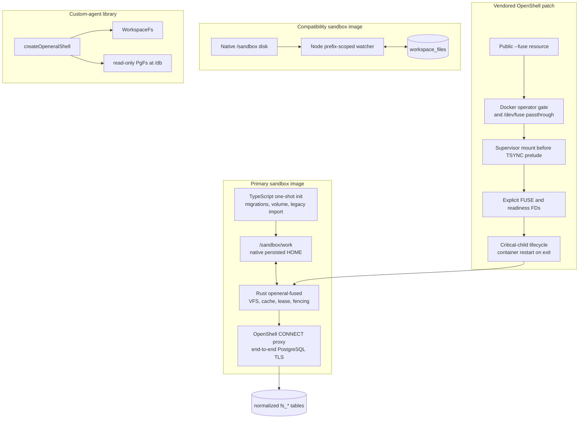

# OpenEral Development

Read `README.md`, `ARCHITECTURE.md`, `BUILD.md`, `FUSE-DESIGN.md`, and the files being
changed before implementation. Keep the primary FUSE, compatibility, and custom-agent
library paths distinct.

## Runtime Architecture



Route a change to exactly one path unless the public contract genuinely spans paths.
Primary FUSE must never start compatibility watchers; sandbox Claude never uses the
custom-agent `WorkspaceFs` or `/db` virtual filesystem.

## Key Files

```text
crates/openeral-fused/src/
  main.rs          inherited FUSE/readiness fds, critical-process lifecycle
  runtime.rs       database coordination, state, lease/fence transitions
  connect.rs       mandatory OpenShell CONNECT + end-to-end PostgreSQL TLS
  store.rs         normalized inode/dirent/chunk transactions and fencing
  cache.rs         bounded coherent dirty cache and durability barriers
  fs.rs            fuser operation implementation
  management.rs    same-UID health and flush socket

openeral-js/src/
  db/migrations.ts       V1-V7 migrations; sole migration owner
  db/fuse-init.ts        volume preparation, marker, legacy import, lease check
  bin/openeral-fuse-init.ts
  sync.ts                compatibility prefix-scoped sync only
  shell.ts               custom-agent just-bash factory
  pg-fs/                 read-only /db virtual filesystem
  workspace-fs/          custom-agent workspace adapter

sandboxes/openeral/
  Dockerfile             primary FUSE image
  Dockerfile.compat      compatibility image
  setup-fuse.sh          one-shot primary initialization
  openeral-claude-fuse.sh primary Claude parent + final flush
  pg-client-fuse.mjs     primary SQL helper
  setup.sh               compatibility initialization
  openeral-bash.mjs      compatibility daemon/watchers
  policy.yaml            primary policy, FUSE declaration, egress

vendor/openshell/
  UPSTREAM               source commit/tree provenance
  proto/                 public + driver FUSE resource requirement
  crates/openshell-driver-docker/
  crates/openshell-supervisor-process/
  crates/openshell-policy/
  crates/openshell-server/

tests/fuse/
  conformance.mjs
  test_openshell_e2e.sh
```

## Non-Negotiable Boundaries

- OpenShell supervisor performs the mount before its TSYNC seccomp prelude.
- Claude receives no `/dev/fuse`, mount syscall, capability, or daemon selection.
- `openeral-fused` launches after hardening through the normal `ProcessHandle` path.
- Explicit inherited descriptors are allocated above the reserved fd floor; never
  assume fd 3 or pass user-controlled fd numbers.
- TypeScript owns V7 migration and import. Rust validates but never migrates.
- Primary persistence uses FUSE only. Do not run compatibility watchers beside it.
- PostgreSQL access must use OpenShell HTTP CONNECT and end-to-end TLS. No direct-dial
  fallback and no TLS-disable mode.
- Lease loss is terminal. Discard old dirty data, report writeback failure, and exit;
  never reacquire a new epoch in-process.
- FUSE loop/daemon exit must terminate the supervisor/container. In-process remount is
  blocked by design.
- Preserve the published compatibility path until rollout gates pass.
- Ignore artifacts only through `.gitignore`; never hide files selectively at commit.

## Build And Test

```bash
cargo fmt --all --check
cargo test -p openeral-fused
cargo clippy -p openeral-fused --all-targets -- -D warnings

cd openeral-js
pnpm install
pnpm check
```

OpenShell patch:

```bash
cd vendor/openshell
cargo fmt --all --check
cargo check --workspace --all-targets
cargo test -p openshell-cli
cargo test -p openshell-driver-docker
cargo test -p openshell-policy
cargo test -p openshell-supervisor-process
```

Primary child image, without rebuilding the NVIDIA base:

```bash
docker pull ghcr.io/nvidia/openshell-community/sandboxes/base:latest
docker build --pull=false -f Dockerfile.openeral -t openeral-fuse:local .
```

Real Docker-driver test against a separately running patched gateway:

```bash
DATABASE_URL='postgresql://...' \
OPENSHELL_GATEWAY_ENDPOINT='http://127.0.0.1:18770' \
OPENERAL_FUSE_E2E_IMAGE='openeral-fuse:local' \
tests/fuse/test_openshell_e2e.sh
```

Compatibility tests:

```bash
DATABASE_URL='postgresql://...' tests/test_sandbox_e2e.sh
DATABASE_URL='postgresql://...' tests/test_setup_e2e.sh
```

## Required FUSE Semantics

- stable inode identity across rename;
- byte-preserving names, symlinks, sparse files, partial/out-of-order writes;
- open-unlinked lifetime and restart-time orphan cleanup;
- bounded shared dirty state across handles;
- `fsync`/`fdatasync` and sync-open durability;
- atomic dirty-source rename replacement;
- existing-file `O_TRUNC` close barrier;
- synchronous namespace/metadata commits;
- uncertain-commit operation deduplication;
- one-writer advisory lock, lease epoch, and terminal fencing.

Do not weaken these contracts to improve a benchmark. Ordinary write buffering is the
selected performance tradeoff; durability barriers remain synchronous.

## Structural Lints

`openeral-js/lint.mjs` currently has 33 numbered checks. Important checks enforce the
explicit FUSE/compat image split, no hardcoded credentials, scoped compatibility sync,
advisory-locked migrations, current OpenShell CLI usage, supervisor-owned FUSE policy,
least-privilege StringCost routes, and safe session environments.

## Source Pin Discipline

Before rebasing `vendor/openshell`, verify the upstream commit and tree from
`UPSTREAM`, export a pristine archive, and compare it with the vendor baseline. Review
changes to mount ordering, seccomp, `ProcessHandle`, lifecycle state, and Docker
restart behavior before replaying the patch. Commit required generated SDK/proto
artifacts and ignore build output only in repository `.gitignore`.
