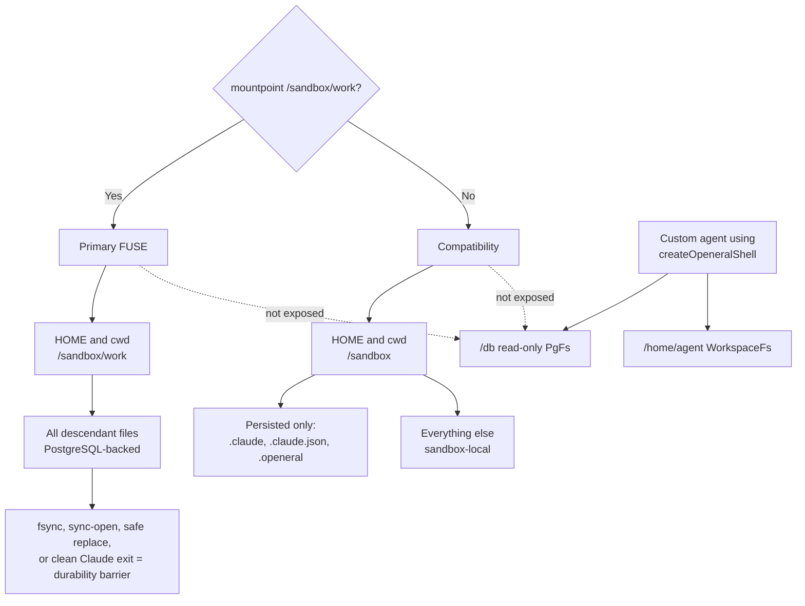

# OpenEral Navigate

First identify the runtime:

```bash
if mountpoint -q /sandbox/work 2>/dev/null; then
  echo "primary-fuse"
else
  echo "compatibility"
fi
```

## Namespace And Persistence Map



Do not infer FUSE mode from an image tag or environment variable. The kernel
mountpoint check is the authoritative runtime distinction inside the sandbox.

## PostgreSQL Queries

Use the `pg` helper in either sandbox runtime:

```bash
pg "SELECT table_name FROM information_schema.tables WHERE table_schema = 'public'"
pg "SELECT * FROM public.users LIMIT 5"
```

Quote the complete SQL string. The helper prints a JSON array and exits nonzero on a
database or policy error. PostgreSQL endpoints must be authorized by the image policy.

## Primary FUSE Workspace

The primary runtime uses:

```text
HOME=/sandbox/work
cwd=/sandbox/work
```

All files below `/sandbox/work` share one PostgreSQL-backed native namespace. Use
normal tools (`find`, `git`, `cat`, editors, compilers). `fsync` is the explicit
durability barrier; clean Claude exit also flushes pending dirty data.

```bash
openeral-fused health
openeral-fused flush-all
```

Only one writable sandbox may mount a given `WORKSPACE_ID`. If health is not
`writable`, stop mutating files and diagnose the database/lease before continuing.

## Compatibility Workspace

Compatibility mode uses `HOME=/sandbox`. PostgreSQL sync covers only:

```text
/sandbox/.claude/**
/sandbox/.claude.json
/sandbox/.openeral/**
```

Other files are sandbox-local. PGlite, when used, lasts only for that sandbox.

## Claude Memory

Run from the relevant project directory:

```bash
openeral memory refresh --query "current project"
claude -c
```

In primary FUSE mode, memory files and backups are ordinary persisted files under
`/sandbox/work`. In compatibility mode, Claude memory persists because it is under the
scoped `.claude` prefix.

## `/db` Virtual Filesystem

`/db` is not mounted in Claude Code's native shell. It exists only when a custom agent
uses `createOpeneralShell()` and just-bash:

```bash
ls /db
cat /db/public/users/.info/columns.json
cat /db/public/users/.info/schema.sql
cat /db/public/users/.info/count
cat /db/public/users/page_1/1/row.json
ls /db/public/users/.filter/status/active/
```

That custom-agent `/db` path is read-only. Prefer `.filter/` and `.info/count` over
scanning page trees.

## Security Facts

- Provider keys remain OpenShell placeholders and are resolved at approved egress.
- The PostgreSQL URL is raw-protocol runtime state, not a provider placeholder.
- Primary v1 runs Claude and `openeral-fused` as the same UID; do not claim secret
  isolation between them.
- `/tmp` and `/var/lib/openeral/runtime` are operational state, not the persisted FUSE
  namespace.
