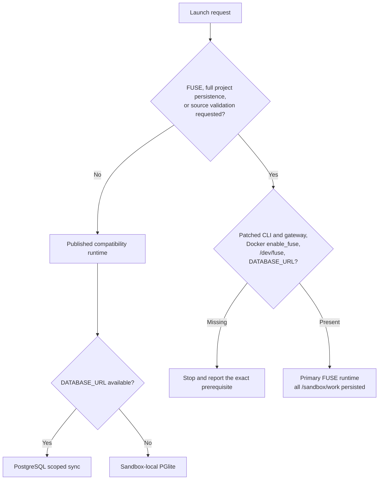
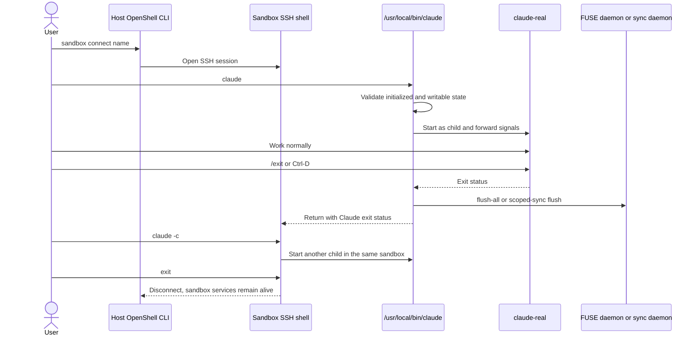

# OpenEral Shell

Execute the requested flow rather than only printing commands. Never rebuild NVIDIA's
Community base. Never pass provider API keys through `--env` or print database URLs.

## Choose The Runtime

Use the published compatibility runtime unless the user explicitly requests FUSE,
full project persistence, or source validation.

| Runtime | Image/source | Database | Persisted files |
|---|---|---|---|
| Published compatibility | `ghcr.io/sandys/openeral/sandbox:just-bash` | Optional | `.claude`, `.claude.json`, `.openeral` |
| Primary FUSE | local `Dockerfile.openeral` or built tag | Required | all `/sandbox/work` |

The primary path requires the vendored patched OpenShell Docker gateway. Stock
OpenShell does not yet implement this repository's `--fuse` capability.



## Validate OpenShell

For compatibility mode:

```bash
command -v openshell
openshell --version
openshell gateway info
```

For FUSE mode, prefer the explicit binary and gateway endpoint:

```bash
OPENSHELL_BIN="${OPENSHELL_BIN:-$PWD/vendor/openshell/target/debug/openshell}"
OPENSHELL_GATEWAY_ENDPOINT="${OPENSHELL_GATEWAY_ENDPOINT:?patched gateway endpoint required}"
test -x "$OPENSHELL_BIN"
"$OPENSHELL_BIN" --gateway-endpoint "$OPENSHELL_GATEWAY_ENDPOINT" gateway info
"$OPENSHELL_BIN" --gateway-endpoint "$OPENSHELL_GATEWAY_ENDPOINT" \
  sandbox create --help | grep -- --fuse
test -e /dev/fuse
```

If the FUSE check fails, stop and report the missing patched CLI, Docker operator gate,
or host device. Do not work around it by granting mount capability to the workload.

## Providers

Attach an existing `claude` provider or let OpenShell create it from the host
environment:

```bash
providers=(--provider claude --auto-providers)
```

When `STRINGCOST_API_KEY` is set, create/update a generic provider and attach it:

```bash
if openshell provider get stringcost >/dev/null 2>&1; then
  openshell provider update stringcost --credential STRINGCOST_API_KEY
else
  openshell provider create \
    --name stringcost \
    --type generic \
    --credential STRINGCOST_API_KEY
fi
providers+=(--provider stringcost)
```

StringCost presign creation happens inside the sandbox through constrained HTTPS
credential rewriting. Do not create the presign on the host.

## Database Upload

Use a mode-0600 temporary file. PostgreSQL's native protocol cannot consume an
OpenShell provider placeholder.

```bash
DATABASE_URL="${DATABASE_URL:-${POSTGRES_URL:-}}"
db_file=""
uploads=()

cleanup_openeral_input() {
  [ -z "$db_file" ] || rm -f "$db_file"
}
trap cleanup_openeral_input EXIT

if [ -n "$DATABASE_URL" ]; then
  db_file="$(mktemp /tmp/openeral-db-url-XXXXXX)"
  printf '%s' "$DATABASE_URL" > "$db_file"
  chmod 600 "$db_file"
  uploads+=(--upload "$db_file:/sandbox/db-url")
fi
```

FUSE mode must fail if `DATABASE_URL` is empty. Compatibility mode may use PGlite.

## Published Compatibility Flow

```bash
OPENERAL_WORKSPACE="${OPENERAL_WORKSPACE:-openeral-demo}"

openshell sandbox create \
  --name "$OPENERAL_WORKSPACE" \
  --from ghcr.io/sandys/openeral/sandbox:just-bash \
  "${uploads[@]}" \
  "${providers[@]}" \
  --env "WORKSPACE_ID=$OPENERAL_WORKSPACE" \
  -- openeral-init

cleanup_openeral_input
trap - EXIT
openshell sandbox connect "$OPENERAL_WORKSPACE"
```

## Primary FUSE Flow

Build only the OpenEral child image when no current local tag exists:

```bash
docker pull ghcr.io/nvidia/openshell-community/sandboxes/base:latest
docker build --pull=false -f Dockerfile.openeral -t openeral-fuse:local .
```

Then create with the patched CLI:

```bash
[ -n "$DATABASE_URL" ] || { echo "DATABASE_URL is required" >&2; exit 1; }
OPENERAL_WORKSPACE="${OPENERAL_WORKSPACE:-openeral-demo}"

"$OPENSHELL_BIN" \
  --gateway-endpoint "$OPENSHELL_GATEWAY_ENDPOINT" \
  sandbox create \
  --name "$OPENERAL_WORKSPACE" \
  --from openeral-fuse:local \
  --fuse \
  "${uploads[@]}" \
  "${providers[@]}" \
  --env "WORKSPACE_ID=$OPENERAL_WORKSPACE" \
  --no-tty \
  -- openeral-init

cleanup_openeral_input
trap - EXIT
"$OPENSHELL_BIN" \
  --gateway-endpoint "$OPENSHELL_GATEWAY_ENDPOINT" \
  sandbox connect "$OPENERAL_WORKSPACE"
```

The local tag works when the selected patched gateway uses the same Docker daemon.
Use `--from Dockerfile.openeral` instead when OpenShell should perform the child-image
build from the repository context.

## Start, Stop, And Resume Claude

Inside the connected sandbox:

```bash
claude
```

Use `/exit` or `Ctrl+D` to stop Claude and return to the shell. Then:

```bash
claude       # new invocation
claude -c    # continue the latest conversation
exit         # disconnect; sandbox remains alive
```

Reconnect later with `openshell sandbox connect <name>` using the same CLI/gateway
selection used during creation.



In FUSE mode, clean Claude exit performs `openeral-fused flush-all`. In compatibility
mode it performs the scoped-sync flush. Exit Claude cleanly before sandbox deletion.

## One-Off Commands

```bash
openshell sandbox exec -n <name> -- pg "SELECT 1"
openshell sandbox exec -n <name> -- claude -p "Reply exactly: ok"
openshell sandbox exec -n <name> -- \
  openeral memory refresh --query "current project"
```

For FUSE mode, prepend the configured `"$OPENSHELL_BIN" --gateway-endpoint
"$OPENSHELL_GATEWAY_ENDPOINT"` instead of the stock `openshell` command.

## Runtime Facts

- Primary FUSE: `HOME=/sandbox/work`; all mounted files persist; PostgreSQL/TLS is
  mandatory; only one writable sandbox may mount a workspace.
- Compatibility: `HOME=/sandbox`; only scoped Claude/OpenEral state persists with
  PostgreSQL; PGlite is sandbox-lifetime state.
- `/db` is not a Claude Code mount. It exists only in the custom-agent just-bash
  library path.
- Provider credentials remain OpenShell placeholders. The PostgreSQL URL is same-UID
  runtime state in v1 and is not isolated from Claude.

Use `BUILD.md` and the `openeral-dev` skill for source changes and fault tests.
