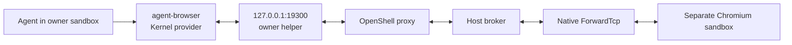

# Browser Pods

## Scope And Route

Run these commands **inside the owner sandbox**, not on the host. The host must
already have enabled browser pods. Normal Desktop setup does not enable them.
For host setup or a fresh-checkout test, use the repository's `openrind-dev`
skill and `BUILD.md`; do not try to provision infrastructure from this skill.
For the supplied Argide application, use that development skill and its private
fixture guide. These agent-browser commands do not launch Argide's backend.

The installed CLI uses agent-browser's built-in `kernel` provider against our
Kernel-compatible API. Only the API is emulated; the browser is real headless
Chromium in a separate OpenShell sandbox. No Kernel cloud account is needed.



Do not use a local executable path, plugin, `--cdp`, `--auto-connect`, or vendor
domain interception. Do not register a replacement browser MCP server.

## Preflight

Before a web task, run these checks through Bash:

```bash
command -v agent-browser
agent-browser --version
node /opt/openrind-browser-pods/bin/helper-probe.mjs
```

Expect version `0.38.2`. The helper probe succeeds with exit code 0 and normally
prints nothing. A version check alone does not prove the broker or browser works.

If a check fails, report it. Do not install a browser, start a different provider,
change the endpoint, or weaken the website policy. Ordinary Claude tasks do not
need browser activation.

The installed launcher supplies Kernel defaults for each invocation. Do not rely
on image environment variables; OpenShell exec sessions do not inherit them.
It sets `AGENT_BROWSER_PROVIDER=kernel`, `KERNEL_ENDPOINT=http://127.0.0.1:19300`,
and a non-secret compatibility key. Never put a real broker token in
`KERNEL_API_KEY`. Native OpenShell provider injection supplies the real credential
outside the agent. Explicit conflicting client settings fail validation.

## Browser Task

Use the installed CLI. Use a distinct session name
for each concurrent task. Reuse that name for all commands in the same task. The
name `web-task` below is an example, not a shared session for all agents.
Keep the chosen name in every command, including commands in separate Bash calls.
Websites including `amazon.com`, `amazon.in`, and `example.com` are supported.

```bash
agent-browser --session web-task open https://example.com
agent-browser --session web-task snapshot -i
agent-browser --session web-task get title
```

Use the element references from the snapshot for `click` and `fill`. Take another
snapshot after navigation. Ask for approval before a purchase, submission, or
other action that needs user consent. These instructions are not a server-side
action approval system.

```bash
agent-browser --session web-task screenshot /sandbox/work/page.png
agent-browser --session web-task close
```

Before writing a screenshot, choose a new filename or obtain approval to replace
an existing file. In the primary owner, check that FUSE is writable if storage
reports an error. Never redirect output to another path and claim it persisted.
After a screenshot that must be durable, run `openrind-shell-fused flush-all` and
check its exit status. That step applies to a FUSE owner, not the browser-only
test image. Screenshot bytes reaching local disk do not prove PostgreSQL durability.

Close only your task's browser session. `agent-browser close` does not stop Claude
or delete its FUSE workspace. Closing Claude does not prove that browser cleanup
completed. The broker enforces browser expiry and resource cleanup separately.

## Files And Recovery

Screenshots return image bytes to the agent. Website downloads stay in the browser
pod. The managed action policy denies `upload`, `download`, and `wait --download`;
the last command uses the policy action `waitfordownload`. The agent's local
paths do not exist in that pod. Do not enable these native client commands.
A separate configured Hyperbrowser SDK path supports explicit pod-side upload and
ZIP retrieval. It is not part of this agent-browser command flow. Do not switch
providers without host setup or claim that an archive reached `/sandbox/work`.

A failed health probe can make agent-browser delete the old browser and create
a new one. The page state is then lost. Inspect the current page before you act.
Do not repeat a purchase or submission after a connection error unless you first
check whether it completed. Website access is allowlist-only. Report a denied
destination instead of changing the policy.

Broker, helper, or pod failure can end a session. The helper's current lifecycle
does not reconnect and replay actions automatically. Report a stopped helper to
the host operator. Do not end other tasks' sessions as a repair.

Report the session name, last confirmed page, completed actions, artifact path,
and close result. Distinguish a confirmed action from an uncertain result. The
17-check Linux fixture proved this client path. Separate fixtures test the
configured Hyperbrowser SDK and the supplied Argide code. None proves a
browser-enabled Claude/FUSE run or a complete Desktop release.
