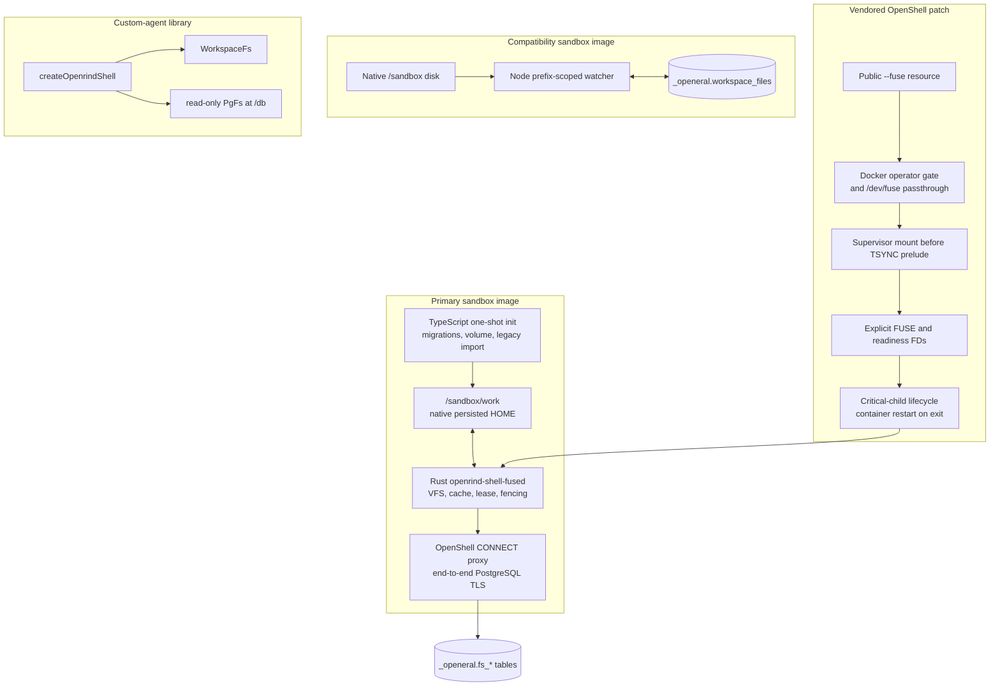

# Openrind Shell Development

Read `README.md`, `ARCHITECTURE.md`, `BUILD.md`, `FUSE-DESIGN.md`, and the files
being changed before implementation. Keep the primary FUSE, compatibility, and
custom-agent library paths distinct.

## Runtime Architecture



Route a change to exactly one path unless the public contract genuinely spans paths.
Primary FUSE must never start compatibility watchers; sandbox Claude never uses the
custom-agent `WorkspaceFs` or `/db` virtual filesystem.

## Key Files

The source directories and `_openeral` database schema retain their historical names
for upgrade compatibility. Public commands and images use `openrind-shell`.

```text
crates/openeral-fused/src/
  main.rs          inherited FUSE/readiness fds, critical-process lifecycle
  runtime.rs       database coordination, state, lease/fence transitions
  connect.rs       mandatory OpenShell CONNECT + PostgreSQL TLS
  store.rs         normalized inode/dirent/chunk transactions and fencing
  cache.rs         bounded coherent dirty cache and durability barriers
  fs.rs            fuser operation implementation
  management.rs    same-UID health and flush socket

openeral-js/src/
  db/migrations.ts       V1-V8 migrations; sole migration owner and rename bridge
  db/fuse-init.ts        volume preparation, marker, legacy import, lease check
  sync.ts                compatibility prefix-scoped sync only
  shell.ts               custom-agent just-bash factory
  pg-fs/                 read-only /db virtual filesystem
  workspace-fs/          custom-agent workspace adapter

sandboxes/openeral/
  Dockerfile             primary FUSE image source
  Dockerfile.compat      compatibility image source
  setup-fuse.sh          one-shot primary initialization
  openeral-claude-fuse.sh primary Claude parent + final flush
  setup.sh               compatibility initialization
  openeral-bash.mjs      compatibility daemon/watchers
  policy.yaml            FUSE declaration and egress policy

vendor/openshell/
  UPSTREAM               source commit/tree provenance
  crates/openshell-driver-docker/
  crates/openshell-supervisor-process/
  crates/openshell-policy/
  crates/openshell-server/
```

## Non-Negotiable Boundaries

- OpenShell supervisor performs the mount before its TSYNC seccomp prelude.
- Claude receives no `/dev/fuse`, mount syscall, capability, or daemon selection.
- TypeScript owns V7 FUSE migration, V8 compatibility bridge, and import. Rust
  validates but never migrates.
- Primary persistence uses FUSE only. Never start `watchAndSync` for `/sandbox/work`.
- PostgreSQL uses OpenShell HTTP CONNECT with end-to-end TLS and no direct fallback.
- Lease loss is terminal. A fenced process never reacquires in-process.
- FUSE loop/daemon exit terminates the supervisor/container; remount is impossible.
- `_openeral` remains the storage schema until an explicit data migration exists.
- Preserve old executable and environment aliases during the public rename window.
- Ignore artifacts through `.gitignore`, never through selective commit omission.

## Build And Test

```bash
cargo fmt --all --check
cargo test -p openeral-fused
cargo clippy -p openeral-fused --all-targets -- -D warnings

cd openeral-js
pnpm install
pnpm check
```

Vendored OpenShell patch:

```bash
cd vendor/openshell
cargo fmt --all --check
cargo check -p openshell-cli -p openshell-driver-docker \
  -p openshell-policy -p openshell-supervisor-process
```

Build only the child image; do not rebuild NVIDIA's base image:

```bash
docker pull ghcr.io/nvidia/openshell-community/sandboxes/base:latest
docker build --pull=false -f Dockerfile.openrind-shell -t openrind-shell-fuse:local .
docker build --pull=false -f Dockerfile.openrind-shell-compat -t openrind-shell-compat:local .
```

Real FUSE E2E:

```bash
DATABASE_URL='postgresql://...' \
OPENSHELL_GATEWAY_ENDPOINT='http://127.0.0.1:18770' \
OPENRIND_SHELL_FUSE_E2E_IMAGE='openrind-shell-fuse:local' \
tests/fuse/test_openshell_e2e.sh
```

## Required FUSE Semantics

- stable inode identity across rename;
- byte-preserving names, symlinks, sparse files, and partial writes;
- open-unlinked lifetime and restart-time orphan cleanup;
- bounded shared dirty state across handles;
- `fsync`/`fdatasync` and sync-open durability;
- atomic dirty-source rename replacement;
- existing-file `O_TRUNC` close barrier;
- synchronous namespace/metadata commits;
- uncertain-commit operation deduplication;
- one-writer advisory lock, lease epoch, and terminal fencing.

## Source Pin Discipline

Before rebasing `vendor/openshell`, verify its `UPSTREAM` commit and tree, compare a
pristine archive, and review mount ordering, seccomp, `ProcessHandle`, lifecycle state,
and Docker restart behavior before replaying the patch.
