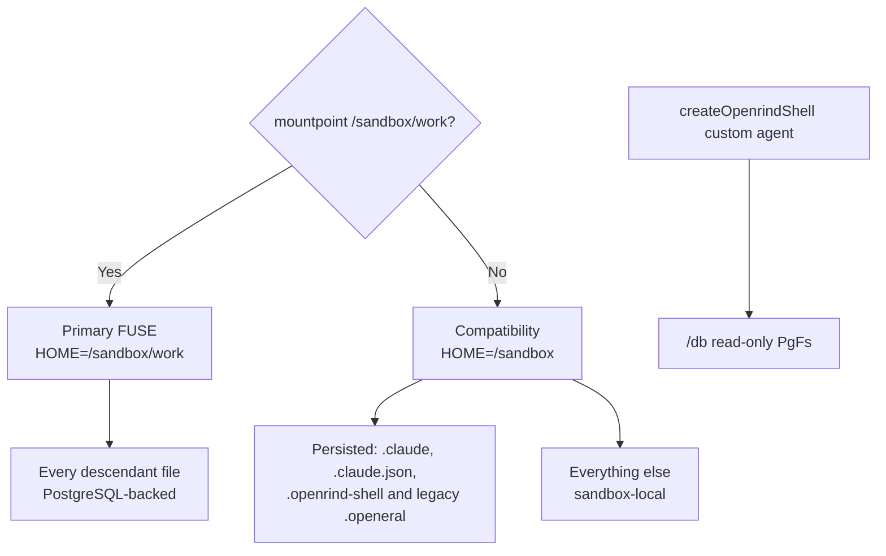

# Openrind Shell Navigate

Identify the runtime from the kernel mount, not an image tag:

```bash
if mountpoint -q /sandbox/work 2>/dev/null; then
  echo primary-fuse
else
  echo compatibility
fi
```

## Persistence Map



## PostgreSQL Queries

Use the `pg` helper in either runtime and quote the complete SQL string:

```bash
pg "SELECT table_name FROM information_schema.tables WHERE table_schema = 'public'"
pg "SELECT * FROM public.users LIMIT 5"
```

The helper prints a JSON array and exits nonzero on database or policy failure.

## Primary FUSE Workspace

Use normal tools below `/sandbox/work`. `fsync` is an explicit durability barrier;
clean Claude exit also flushes pending dirty data.

```bash
openrind-shell-fused health
openrind-shell-fused flush-all
```

Only one writable sandbox may mount a given workspace ID. Stop mutating files if
health is not `writable`. Operations return `EIO` while the daemon reconnects to
PostgreSQL; a daemon exit or lease loss restarts the whole container and ends the
current shell or Claude session, so `fsync` anything you cannot afford to lose.

## Compatibility Workspace

Compatibility synchronization covers only:

```text
/sandbox/.claude/**
/sandbox/.claude.json
/sandbox/.openrind-shell/**
/sandbox/.openeral/**    # legacy state during migration
```

PGlite, when used, lasts only for that sandbox. Other files are not persisted.

## Claude Memory

Run from the relevant project directory:

```bash
openrind-shell memory refresh --query "current project"
claude -c
```

## `/db` Virtual Filesystem

`/db` is not mounted in Claude Code's native shell. It exists only when a custom agent
uses `createOpenrindShell()` and just-bash:

```bash
ls /db
cat /db/public/users/.info/columns.json
cat /db/public/users/.info/schema.sql
cat /db/public/users/.info/count
cat /db/public/users/page_1/1/row.json
```

The custom-agent path is read-only. Prefer `.filter/` and `.info/count` over scanning
page trees.

## Security Facts

- Provider keys remain OpenShell placeholders resolved only at approved egress.
- The PostgreSQL URL is raw-protocol runtime state, not a provider placeholder.
- Primary v1 runs Claude and the FUSE daemon as the same UID; do not claim secret
  isolation between them.
- `/tmp` and `/var/lib/openrind-shell/runtime` are operational, not persisted FUSE
  namespace paths.
