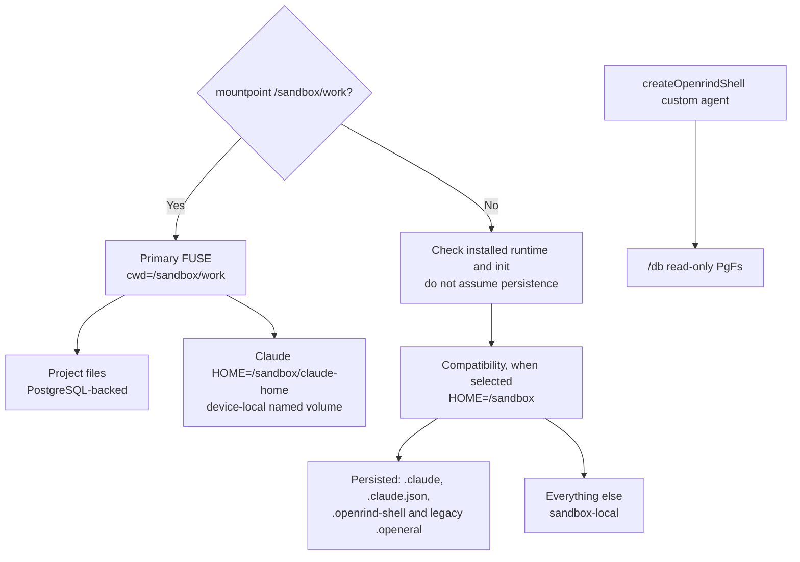

# Openrind Shell Navigate

First identify whether this is an owner sandbox. Browser pods contain no FUSE
mount, owner home, or `pg` helper. The separate browser-only test owner also has
no persistence. Absence of FUSE alone does not identify compatibility mode.

Check the kernel mount and installed runtime, not an image tag:

```bash
if mountpoint -q /sandbox/work 2>/dev/null; then
  echo primary-fuse
elif command -v openrind-shell-fused >/dev/null 2>&1; then
  echo primary-fuse-not-mounted
elif command -v openrind-shell >/dev/null 2>&1; then
  echo compatibility-check-init-and-datasource
else
  echo no-openrind-storage-runtime
fi
```

## Persistence Map


```mermaid
flowchart TB
  detect{"mountpoint /sandbox/work?"}
  detect -->|Yes| primary["Primary FUSE<br/>cwd=/sandbox/work"]
  primary --> all["Project files<br/>PostgreSQL-backed"]
  primary --> home["Claude HOME=/sandbox/claude-home<br/>device-local named volume"]
  detect -->|No| check["Check installed runtime and init<br/>do not assume persistence"]
  check --> compat["Compatibility, when selected<br/>HOME=/sandbox"]
  compat --> scoped["Persisted: .claude, .claude.json,<br/>.openrind-shell and legacy .openeral"]
  compat --> ephemeral["Everything else<br/>sandbox-local"]
  custom["createOpenrindShell custom agent"] --> db["/db read-only PgFs"]
```

## PostgreSQL Queries

Use the `pg` helper in either runtime and quote the complete SQL string:

```bash
pg "SELECT table_name FROM information_schema.tables WHERE table_schema = 'public'"
pg "SELECT * FROM public.users LIMIT 5"
```

The helper prints a JSON array and exits nonzero on database or policy failure.

## Primary FUSE Workspace

Use normal tools below `/sandbox/work`. `fsync` is an explicit durability barrier;
clean Claude exit also flushes pending dirty data.
Claude's settings and history are in `/sandbox/claude-home`, not on FUSE.
They survive only while the device-local named volume is retained.

```bash
openrind-shell-fused health
openrind-shell-fused flush-all
```

Only one writable sandbox may mount a given workspace ID. Stop mutating files if
health is not `writable`. Operations return `EIO` while the daemon reconnects to
PostgreSQL; a daemon exit or lease loss restarts the whole container and ends the
current shell or Claude session, so `fsync` anything you cannot afford to lose.

## Compatibility Workspace

Compatibility synchronization covers only:

```text
/sandbox/.claude/**
/sandbox/.claude.json
/sandbox/.openrind-shell/**
/sandbox/.openeral/**    # legacy state during migration
```

PGlite, when used, lasts only for that sandbox. Other files are not persisted.

## Claude Memory

Run from the relevant project directory:

```bash
openrind-shell memory refresh --query "current project"
```

In primary Desktop sessions, use Desktop **Reconnect** for the next signed Claude
launch. Do not run an unsigned `claude -c` as recovery. That command is an option
only in the separately configured compatibility runtime.

## Browser Results

Use the `openrind-browser` skill only in an already enabled owner. It uses the
Kernel-compatible service with a separate real Chromium sandbox. Screenshots can
return to the owner and be written under `/sandbox/work`. Check the file and run
`openrind-shell-fused flush-all` before claiming durability. Browser downloads,
profiles, and cookies do not appear on FUSE automatically. File artifact APIs
are not implemented; native client `upload` and `download` are denied.

## `/db` Virtual Filesystem

`/db` is not mounted in Claude Code's native shell. It exists only when a custom agent
uses `createOpenrindShell()` and just-bash:

```bash
ls /db
cat /db/public/users/.info/columns.json
cat /db/public/users/.info/schema.sql
cat /db/public/users/.info/count
cat /db/public/users/page_1/1/row.json
```

The custom-agent path is read-only. Prefer `.filter/` and `.info/count` over scanning
page trees.

## Security Facts

- Provider keys remain OpenShell placeholders resolved only at approved egress.
- The PostgreSQL URL is raw-protocol runtime state, not a provider placeholder.
- Primary v1 runs Claude and the FUSE daemon as the same UID; do not claim secret
  isolation between them.
- `/tmp` and `/var/lib/openrind-shell/runtime` are operational, not persisted FUSE
  namespace paths.
