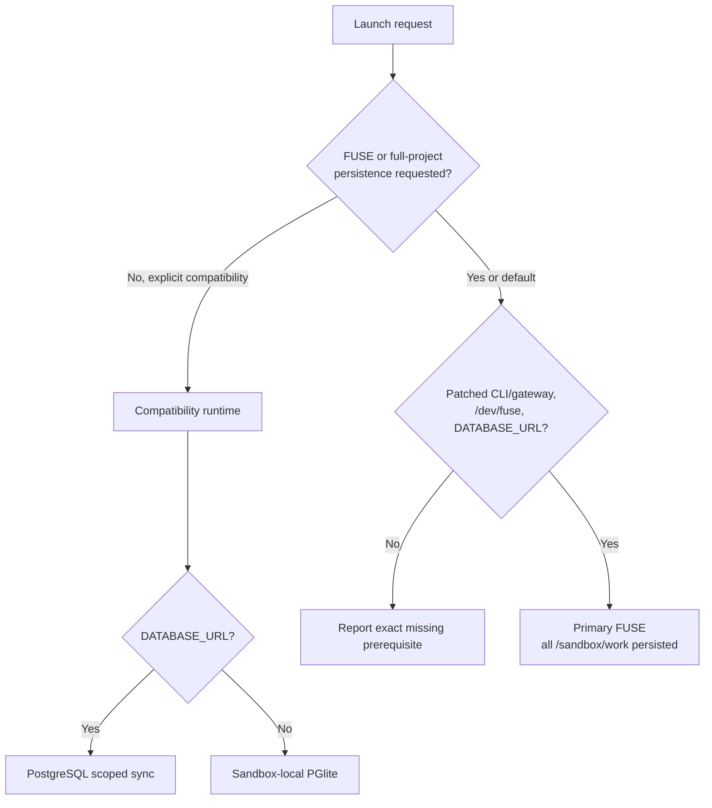
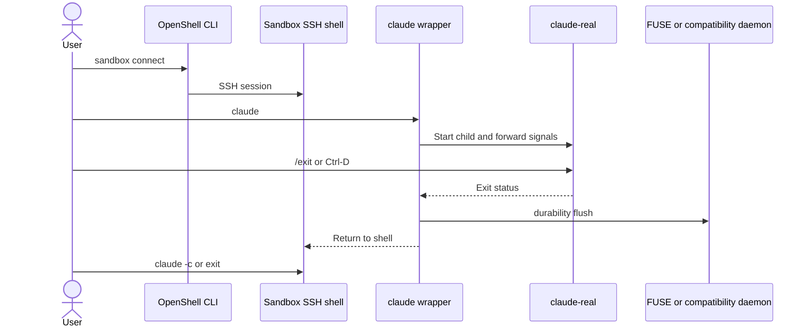

# Openrind Shell

Execute the requested flow rather than only printing commands. Never rebuild NVIDIA's
Community base. Never pass provider API keys through `--env` or print database URLs.

## Choose The Runtime

Use the primary FUSE runtime by default on this branch. Use compatibility only when
the user explicitly requests stock OpenShell/PGlite or when a required FUSE
prerequisite is unavailable and the user accepts scoped rather than full-project
persistence. Never silently downgrade a FUSE request to the watcher runtime.

| Runtime | Image/source | Database | Persisted files |
|---|---|---|---|
| GHCR compatibility | `ghcr.io/openrind/openrind-shell/sandbox:just-bash` | Optional | `.claude`, `.claude.json`, `.openrind-shell`, legacy `.openeral`; requires registry pull access |
| Primary FUSE | `Dockerfile.openrind-shell` or a built `:fuse` tag | Required | all `/sandbox/work` |

The primary path requires this repository's patched OpenShell Docker gateway. Stock
OpenShell does not yet implement the required `--fuse` capability.
The compatibility runtime is the supported stock-OpenShell fallback.



## Validate OpenShell

```bash
command -v openshell
openshell --version
openshell gateway info
```

For FUSE mode:

```bash
OPENSHELL_BIN="${OPENSHELL_BIN:-$PWD/vendor/openshell/target/debug/openshell}"
OPENSHELL_GATEWAY_ENDPOINT="${OPENSHELL_GATEWAY_ENDPOINT:?patched gateway required}"
test -x "$OPENSHELL_BIN"
"$OPENSHELL_BIN" --gateway-endpoint "$OPENSHELL_GATEWAY_ENDPOINT" \
  sandbox create --help | grep -- --fuse
test -e /dev/fuse
```

Use `$OPENSHELL_BIN` for every FUSE-mode command; a stock `openshell` on `PATH` may be
an older upstream build without `--fuse`. Do not work around a failed check by
granting mount capability to Claude.

## Provider And Upload Setup

Attach Claude with `--provider claude --auto-providers`. If
`OPENRIND_GATEWAY_API_KEY` is set, create/update a generic `openrind-gateway` provider
with that credential and attach it. `STRINGCOST_API_KEY` and provider `stringcost`
remain accepted legacy aliases.

Initialization calls the presign endpoint inside the sandbox so OpenShell can apply
its method/path/body-rewrite policy; do not mint a presign on the host.

Upload PostgreSQL as a mode-0600 file because the native protocol cannot consume a
provider placeholder:

```bash
DATABASE_URL="${DATABASE_URL:-${POSTGRES_URL:-}}"
db_file=""
uploads=()
cleanup_openrind_input() { [ -z "$db_file" ] || rm -f "$db_file"; }
trap cleanup_openrind_input EXIT

if [ -n "$DATABASE_URL" ]; then
  db_file="$(mktemp /tmp/openrind-shell-db-url-XXXXXX)"
  printf '%s' "$DATABASE_URL" > "$db_file"
  chmod 600 "$db_file"
  uploads+=(--upload "$db_file:/sandbox/db-url")
fi
```

## Compatibility Flow

The workflow's GHCR target currently requires registry pull access. For an
anonymous/customer run, build the child image from NVIDIA's public base:

```bash
docker pull ghcr.io/nvidia/openshell-community/sandboxes/base:latest
docker build --pull=false -f Dockerfile.openrind-shell-compat \
  -t openrind-shell-compat:local .
```

```bash
OPENRIND_SHELL_WORKSPACE_ID="${OPENRIND_SHELL_WORKSPACE_ID:-openrind-shell-demo}"

openshell sandbox create \
  --name "$OPENRIND_SHELL_WORKSPACE_ID" \
  --from openrind-shell-compat:local \
  "${uploads[@]}" \
  --provider claude --auto-providers \
  --env "OPENRIND_SHELL_WORKSPACE_ID=$OPENRIND_SHELL_WORKSPACE_ID" \
  -- openrind-shell-init

cleanup_openrind_input
trap - EXIT
openshell sandbox connect "$OPENRIND_SHELL_WORKSPACE_ID"
```

## Primary FUSE Flow

Build only the child image when needed:

```bash
docker pull ghcr.io/nvidia/openshell-community/sandboxes/base:latest
docker build --pull=false -f Dockerfile.openrind-shell -t openrind-shell-fuse:local .
```

Then create with the patched CLI:

```bash
[ -n "$DATABASE_URL" ] || { echo "DATABASE_URL is required" >&2; exit 1; }
OPENRIND_SHELL_WORKSPACE_ID="${OPENRIND_SHELL_WORKSPACE_ID:-openrind-shell-demo}"

"$OPENSHELL_BIN" --gateway-endpoint "$OPENSHELL_GATEWAY_ENDPOINT" \
  sandbox create \
  --name "$OPENRIND_SHELL_WORKSPACE_ID" \
  --from openrind-shell-fuse:local \
  --fuse \
  "${uploads[@]}" \
  --provider claude --auto-providers \
  --env "OPENRIND_SHELL_WORKSPACE_ID=$OPENRIND_SHELL_WORKSPACE_ID" \
  --no-tty \
  -- openrind-shell-init

cleanup_openrind_input
trap - EXIT
"$OPENSHELL_BIN" --gateway-endpoint "$OPENSHELL_GATEWAY_ENDPOINT" \
  sandbox connect "$OPENRIND_SHELL_WORKSPACE_ID"
```

`--from Dockerfile.openrind-shell` is also supported when OpenShell should build and
transfer the child image through the selected driver.

Check the create command's exit status: a sandbox whose `openrind-shell-init` failed
still lists as `Ready`. Verify the volume before handing it to Claude:

```bash
"$OPENSHELL_BIN" --gateway-endpoint "$OPENSHELL_GATEWAY_ENDPOINT" \
  sandbox exec -n "$OPENRIND_SHELL_WORKSPACE_ID" -- openrind-shell-fused health
```

`state` must be `writable`. Common init failures: `already has an active filesystem
writer` (another live sandbox mounts the same workspace ID), `did not become writable
within 60 seconds` with `database.ready identity or schema does not match` (workspace
ID mismatch; set `OPENRIND_SHELL_WORKSPACE_ID` explicitly), and `port 6543
(transaction pooling)` (use the Supabase session-mode pooler on 5432).

## Start, Stop, And Resume Claude

Inside the sandbox:

```bash
claude
```

Use `/exit` or `Ctrl+D` to stop Claude and return to the shell. Then use `claude` for
a new invocation, `claude -c` to continue the latest conversation, and `exit` to
disconnect while leaving the sandbox alive.



Exit Claude cleanly before deleting a sandbox.

## One-Off Commands

```bash
openshell sandbox exec -n "$OPENRIND_SHELL_WORKSPACE_ID" -- pg "SELECT 1"
openshell sandbox exec -n "$OPENRIND_SHELL_WORKSPACE_ID" -- \
  openrind-shell memory refresh --query "current project"
```

For FUSE mode, invoke those subcommands through the configured patched
`$OPENSHELL_BIN --gateway-endpoint "$OPENSHELL_GATEWAY_ENDPOINT"` prefix.

## Runtime Facts

- Primary FUSE uses `HOME=/sandbox/work` (the login home is `/sandbox`; a `.bashrc`
  hook and the `claude` wrapper apply the session environment), requires
  PostgreSQL/TLS in session mode, and allows one writable mount per workspace.
- A FUSE daemon exit or lease loss restarts the container, which ends every SSH shell
  and Claude session in the sandbox; a lost PostgreSQL connection alone is recovered
  in place. A sandbox in the `Error` phase (retry budget exhausted) must be deleted and
  recreated with the same workspace ID; `sandbox start` only works from `Stopped`.
- Compatibility uses `HOME=/sandbox` and only synchronizes documented state prefixes.
- `/db` exists only in the custom-agent just-bash library path, not Claude's shell.
- Provider credentials remain OpenShell placeholders. The PostgreSQL URL is same-UID
  runtime state in v1 and is not isolated from Claude.
