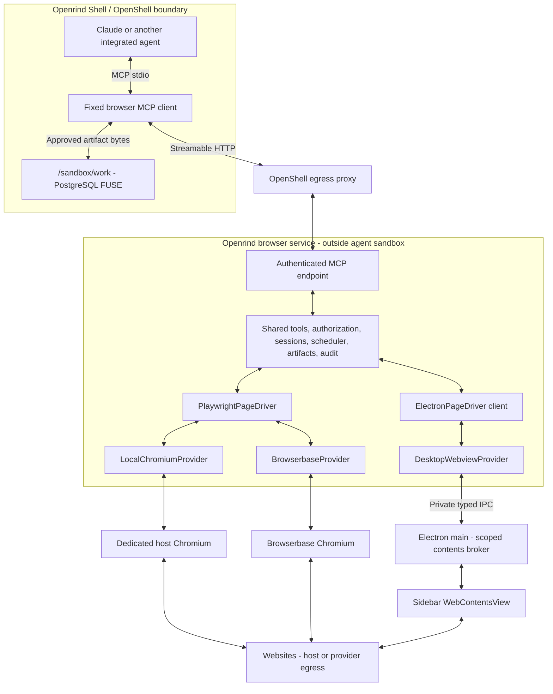
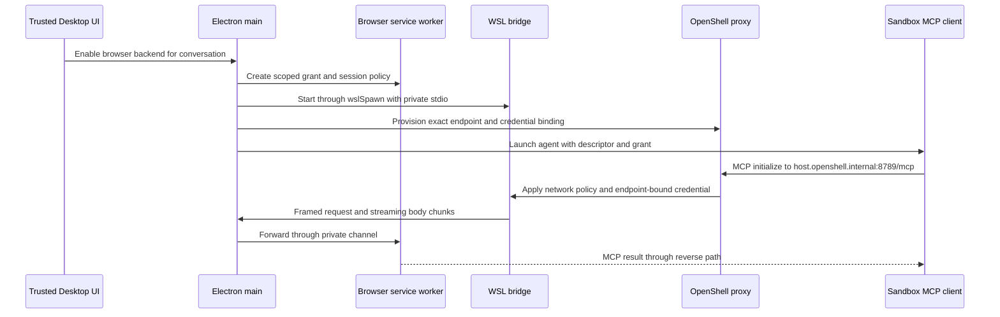
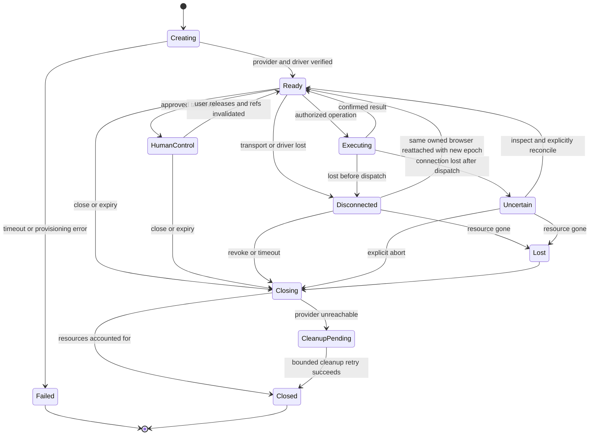
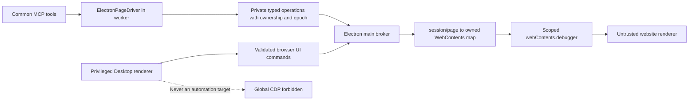
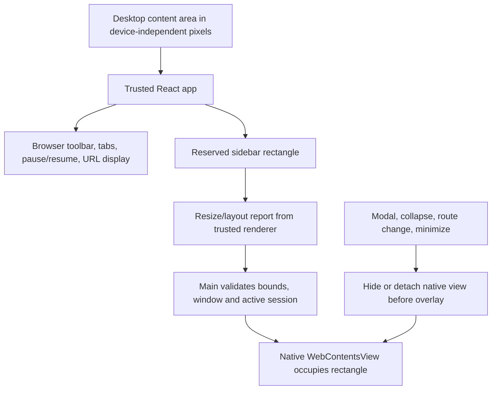
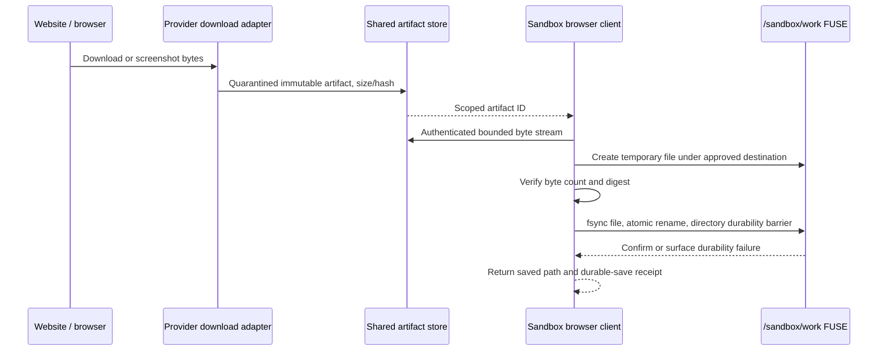

# Browser Agents Through MCP

Status: implementation specification, not shipped or runtime-verified.

Revision 2, 2026-09-12. Repository baseline: `nemo` at `48ed92a`.
This revision supersedes the earlier two-backend proposal.

## Reading Guide

- [Decisions and reuse boundaries](#1-decisions-and-scope)
- [Current implementation baseline](#2-source-grounded-baseline)
- [Architecture and Windows transport](#3-architecture)
- [Packages and TypeScript interfaces](#4-package-boundaries-and-interfaces)
- [Agent tools and page semantics](#5-public-agent-contract)
- [Authorization and network boundaries](#6-authorization-policy-and-credentials)
- [Lifecycle, ordering, and recovery](#7-shared-lifecycle-and-reliability)
- [Host Chromium](#8-local-chromium-provider)
- [Browserbase](#9-browserbase-provider)
- [Embedded Desktop sidebar](#10-embedded-desktop-sidebar-provider)
- [Artifacts and FUSE durability](#11-artifact-transfer-and-fuse)
- [Storage, telemetry, and UX](#12-storage-telemetry-and-product-ux)
- [Implementation phases](#13-implementation-work-and-ordering)
- [Acceptance tests](#14-verification-and-acceptance)
- [Risks](#15-open-risks-and-deliberate-tradeoffs)
- [Source pins](#16-evidence-and-source-pins)

## 1. Decisions And Scope

Openrind Shell runs the agent. A browser outside its OpenShell sandbox performs
browser operations, reached through MCP. Implement three browser providers:

| Provider ID | Browser location | Automation implementation | Desktop required? |
|---|---|---|---|
| `local-chromium` | Dedicated Chromium process on the service host | Shared Playwright driver | No for a headless service deployment; yes for the Desktop-managed visible-browser experience |
| `browserbase` | Browserbase infrastructure | The same Playwright driver, attached over CDP | No, if a separately hosted Openrind browser service is provisioned |
| `desktop-webview` | A real embedded Chromium page in the Desktop sidebar | Scoped Electron `webContents.debugger` driver | Yes |

The sidebar is a real browsing surface. Agent actions change the same page the
user sees and can take over. It is not a screenshot viewer, an iframe displaying
Browserbase, or a mirror of a separate Chrome window.

**One Openrind MCP service implements the product. Providers supply browser
lifecycle and platform operations; they do not define three different products.**

The canonical cloud provider uses Browserbase's session API and its CDP connection
URL. It does not forward the agent to Browserbase's hosted Stagehand MCP service.
That earlier approach shares transport conventions but not our tool implementation,
authorization, artifact handling, or action semantics. An arbitrary third-party
MCP endpoint can remain a separately labeled interoperability feature, outside the
three-provider parity contract.

This specification requires:

- One agent configuration and tool vocabulary across the three providers.
- The same authorization, approvals, scheduling, errors, artifacts, and audit model.
- One Playwright implementation for host Chromium and Browserbase.
- A narrow Electron-specific driver for the sidebar, not global access to Desktop.
- No browser inside the agent sandbox, no new browser-related supervisor patch,
  and no new Hyper-V/vsock application service.
- No browser credentials, host paths, raw CDP endpoints, or personal Chrome profile
  exposed to the model.
- Explicit export of results into `/sandbox/work` using the existing FUSE path.
- No silent provider switching, security downgrades, or automatic replay of
  potentially completed website actions.

The following are not v1 promises: personal-browser extension control, arbitrary
browser JavaScript tools, arbitrary Chrome extensions, universal website login
compatibility, transparent browser-session migration between providers, browser
availability through Desktop shutdown, or OpenShell enforcement of host/cloud
website traffic.

### 1.1 What is actually common

Do not attach a percentage to code reuse before implementing and measuring it.
The useful constraint is dependency direction, not a speculative line-count ratio.

| Layer | All three providers | Local Chromium and Browserbase only | Provider-specific |
|---|---|---|---|
| Agent MCP registration and sandbox adapter | Entire implementation | None | Provisioned service endpoint |
| Tool names, JSON schemas, result/error schemas | Entire implementation | None | Explicit capability availability |
| Auth, conversation ownership, approvals | Entire implementation | None | Credential acquisition |
| Session registry, operation journal, scheduling | Entire implementation | None | Launch/attach/close behavior |
| Snapshot format, reference registry, redaction | Entire implementation | None | Collecting page/frame data |
| Navigation/action orchestration | Common validation and semantics | Playwright page action implementation | Electron input/frame adapter |
| Upload/download protocol and FUSE save | Entire implementation | Playwright input-file attachment where supported | Provider download collection and Electron download events |
| UI status, history, stop/pause/resume | Entire implementation | None | Local window, cloud viewer, embedded view |
| Browser renderer and website networking | Not shared infrastructure | Chromium family, not necessarily matching versions | Host, Browserbase, Electron networking |
| Conformance/security fixtures | Same tests and expectations | Same driver suite | Lifecycle/platform tests |

Enforce these boundaries with imports and tests. `browser-core` must not import
Electron or the Browserbase SDK. Tool handlers must not contain
`if (provider === "browserbase")` branches; ask the provider/driver for a capability.

Some browser behavior cannot honestly be unified: cloud expiry and recordings,
native Electron view placement, user profile persistence, provider-specific
downloads, and CDP frame attachment. Keep those differences behind typed adapters
and show unsupported capabilities explicitly.

### 1.2 Why not force Playwright onto the embedded view?

Electron's supported `WebContentsView` displays a `WebContents`. Its debugger API
attaches to that particular contents. This gives us a target-scoped control surface.
Electron recommends alternatives to the literal `<webview>` tag, including
`WebContentsView`. [WebContentsView API](https://www.electronjs.org/docs/latest/api/web-contents-view),
[webview guidance](https://www.electronjs.org/docs/latest/api/webview-tag)

The existing Desktop can enable a process-wide remote debugging port. Do not use
that port for browser agents: it makes privileged application targets reachable as
well as the sidebar. Do not pass an Electron application automation handle into
the untrusted MCP tool layer either.

There is no verified public Playwright adapter here that converts one
`WebContentsView` into a safely isolated `BrowserContext`. A synthetic browser-level
CDP server or private Playwright patch would create another compatibility/security
project. Instead, implement `ElectronPageDriver` against the owned contents, sharing
the product logic above it. If a future supported integration passes the same
target-isolation tests, it can replace that driver without changing the agent API.

This is an intentional limit to reuse. Reimplementing every Playwright behavior
in a universal CDP engine solely to avoid one adapter would also be a poor trade:
actionability, frame handling, and navigation races are substantial machinery.

## 2. Source-Grounded Baseline

### 2.1 Existing Openrind integration points

| Existing file | Relevant behavior and change boundary |
|---|---|
| [Primary image](sandboxes/openeral/Dockerfile) | Package a small, fixed browser MCP client. Do not install browser engines in the sandbox or rebuild NVIDIA base images. |
| [Primary policy](sandboxes/openeral/policy.yaml) | Add narrowly bound browser-service destinations and client identity. Preserve FUSE/DB restrictions. |
| [Claude wrapper](sandboxes/openeral/openeral-claude-fuse.sh) | Preserve FUSE health and final flush. Merge/select the managed browser MCP entry for the actual Claude process. |
| [Desktop agent launch](sandboxes/openeral/openrind-desktop-claude-launch.sh) | Associate the browser grant with the launched conversation. Keep Haloop's signed inference context separate. |
| [Sandbox provisioning](openrind-desktop/apps/desktop/electron/openshell/fuse-sandbox.mjs) | Provision route/provider and grant before the browser-enabled agent starts. Preserve the existing Claude home volume. |
| [WSL helpers](openrind-desktop/apps/desktop/electron/openshell/wsl.mjs) | Use `wslSpawn` for a long-lived byte stream. `wslRun` buffers short command output and is not a streaming transport. |
| [Electron main](openrind-desktop/apps/desktop/electron/main.mjs) | Own embedded views and narrow privileged IPC. Do not reuse the app window's web preferences or global debugging port. |
| [Electron preload](openrind-desktop/apps/desktop/electron/preload.mjs) | Add trusted browser controls only to the app UI. Never install this preload in website contents. |
| [Workspace layout](openrind-desktop/apps/app/src/react-app/shell/workspace-shell-layout.ts) | Integrate sidebar size/collapse state with native view bounds and visibility. |
| [Connections store](openrind-desktop/apps/app/src/react-app/domains/connections/store.ts) | Existing MCP settings target OpenCode. Saving them does not establish Claude's effective MCP configuration. |
| [Existing browser command](openrind-desktop/apps/app/src/app/data/commands/browser-setup.md) | Replace the current Chrome DevTools-specific assumption with the common capability contract when implemented. |

Primary runtime paths at this baseline:

- `HOME=/sandbox/claude-home` is a device-local Docker volume.
- `cwd=/sandbox/work` is the PostgreSQL FUSE workspace.
- Primary FUSE does not use the compatibility watcher or just-bash virtual mounts.
- Browser profiles must not be stored as if all of HOME were PG-backed.
- Haloop already handles Claude inference. This feature does not require replacing
  that with a proprietary Claude Desktop OAuth flow.

The Desktop manifest requests Electron `^35.0.0` and the lock resolves `35.7.5`.
Its transitive Playwright dependency is not a browser-runtime version contract.
Before shipping untrusted web browsing, select a currently supported patched
Electron release and explicitly pin/test the browser automation dependencies.
Electron supports its latest three stable major releases; a successful experiment
on the existing lock is not a security-support decision.
[Electron release policy](https://www.electronjs.org/docs/latest/tutorial/electron-timelines)

### 2.2 Relevant research, and claims not adopted

The supplied Cowork research is relevant to the separation of agent and browser.
We do not depend on undocumented `sdk` MCP entries, proprietary token-injection
RPCs, cloud Chrome pairing, or a specific vsock port.

Three capabilities in that research are distinct:

1. Authentication of the agent's model requests.
2. Asking the host to open a URL.
3. Automating a browser and returning observations.

Only the third is this feature. A host URL opener does not provide browser tools,
and a browser MCP service does not repair an unrelated OAuth callback.

Our source inspection does not establish that a browser inside OpenShell is
universally impossible. The current seccomp policy conflicts with normal Chromium
sandbox setup; disabling browser sandboxing is a different, undesirable tradeoff.
The chosen external-browser architecture does not need to resolve that question.

Also do not publish stock Playwright MCP tools without review. The inspected
implementation includes `browser_run_code_unsafe`, which can execute code in the
server process. Hiding a tool from discovery without rejecting direct invocation
is not access control. Our public API deliberately excludes that class of tool.
[Inspected implementation](https://github.com/microsoft/playwright/blob/d1ead3ecca23182f2d06d761c28e3d4edafb6595/packages/playwright-core/src/tools/backend/runCode.ts)

## 3. Architecture

### 3.1 Common service and three providers



The shared service is a trusted host application component. Running it in a worker
reduces accidental Electron-main coupling; it does not by itself constitute an OS
sandbox for that worker. No untrusted scripts or user-selected executables run there.

Local Chromium and Browserbase return Playwright-backed driver objects. Embedded
operations are small typed messages to Electron main, which alone holds the actual
`WebContents`. Main is not a general MCP server and does not accept arbitrary
debugger commands from the network.

### 3.2 Deployment shapes

| Deployment | Service host | Available providers | Availability condition |
|---|---|---|---|
| Desktop on Windows | Packaged worker controlled by Electron | All three | Desktop and its bridge must remain alive |
| Desktop on other supported OS | Same worker with OS-specific route bridge | All three after OS E2E | Packaged integration must be tested, not inferred |
| Standalone Shell with remote service | Operator-run Node service outside the agent sandbox | Browserbase; optionally service-host Chromium | Service endpoint, credentials, and storage must be provisioned |
| Shell with no external browser service | None | None | Fail visibly; never silently launch a sandbox browser |

Browserbase being cloud-hosted does not eliminate our common service. Desktop can
host that service while using Browserbase, but that session then depends on Desktop.
For operation after Desktop exits, provision an independent service and configure
Shell to use it. Do not silently migrate a live session between the two hosts.

A standalone service runs without importing Electron. It owns credentials, session
state, and artifact staging on its host, and serves authenticated HTTPS. Ship this
as an independently deployable package/container, with resource limits and service
health checks. It is not a child process inside the restricted agent sandbox.

### 3.3 Windows and WSL bridge

The current Desktop uses `wsl.exe`, a dedicated WSL distro, Docker, and OpenShell.
It has no Cowork-style application-owned Hyper-V RPC channel to reuse.



`host.openshell.internal` identifies the OpenShell/Docker host-side route; it is not
automatically the Windows loopback interface. Bind the WSL edge to the actual
permitted bridge address in the dedicated distro, not a guessed Windows IP or a
LAN-wide listener. Verify connectivity in the real Docker-in-WSL topology.

The edge only serves configured `/mcp`, health, and artifact routes for this service.
It must not become a TCP forwarder, arbitrary URL fetcher, or general HTTP proxy.
Health reveals no grants, profiles, or browser endpoints.

Use raw pipes from `wslSpawn`. Do not pass streaming data through the UTF-16/text
decoding or whole-output buffering used by short WSL commands. Proposed bridge
framing:

```typescript
type BridgeFrame =
  | { type: "request"; requestId: string; method: string;
      route: string; headers: Record<string, string> }
  | { type: "response"; requestId: string; status: number;
      headers: Record<string, string> }
  | { type: "data"; requestId: string; sequence: number; bytes: Uint8Array }
  | { type: "credit"; requestId: string; bytes: number }
  | { type: "end" | "cancel"; requestId: string }
  | { type: "error"; requestId: string; code: string };
```

Encode each frame as a four-byte big-endian length plus a versioned CBOR envelope;
pin the codec and reject indefinite-length structures and duplicate map keys.
Do not stringify file bytes through Electron's
ordinary application renderer IPC. Enforce frame and aggregate stream limits before
allocation, require sequence continuity, and propagate backpressure using credits.
Reject unknown routes/headers, invalid lengths, duplicated open IDs, and payload
after end. Keep logs on stderr, never in the protocol stream.

Main forwards frames between owned subprocess handles without parsing page bodies.
A private startup handshake binds the bridge to this worker instance. EOF revokes
the bridge instance and marks sessions disconnected; a replacement must obtain
fresh authorization. It must not continue using grants recovered from public logs.

For HTTP, preserve MCP-relevant authorization, protocol/session headers, content
types, accepted response types, cancellation, and SSE boundaries. Strip hop-by-hop
headers and never accept a model-selected upstream Host. Test `POST`, optional
`GET` SSE, `DELETE` session close, JSON responses, and long-lived streams.

Validate Host and Origin at the edge/service, deny arbitrary browser origins, and
do not enable credentialed wildcard CORS. An authenticated MCP session ID is not a
replacement for request authentication: bind it to the caller principal and check
the grant on subsequent requests. If SSE event replay is supported, persist/replay
only the scoped event stream; a reconnect or `Last-Event-ID` never authorizes
re-executing a tool. Apply body/decompression limits before SDK parsing. Use HTTPS
for remote service deployments; the private WSL bridge is not a public HTTP
deployment template.

OpenShell `service expose` serves a different direction: access to a service inside
a sandbox. This design needs sandbox egress to a host service. It should use the
existing policy-controlled egress route rather than introducing an inverted relay.

## 4. Package Boundaries And Interfaces

### 4.1 Proposed packages

Use the existing `openrind-desktop` workspace for shared packages; bundle the
Electron-free client artifact into the sandbox image during the build.

```text
openrind-desktop/packages/
  browser-contract/
    tool-schemas.ts         public schemas and protocol version
    capabilities.ts        provider capability vocabulary
    errors.ts              stable error/result types
    transport.ts           private bridge envelope schemas
  browser-core/
    service.ts             MCP registration and request dispatch
    authorization.ts       principal/grant/ownership checks
    sessions.ts            lifecycle state machine
    operations.ts          operation journal and result cache
    scheduler.ts           per-session ordering and budgets
    approvals.ts           authorization-bound approval state
    snapshot.ts            common normalized page representation
    references.ts          opaque node/frame reference registry
    artifacts.ts           scoped immutable artifact registry
    audit.ts               redacted event sink
  browser-drivers/
    playwright.ts          used by local and Browserbase
    electron-client.ts     typed private RPC to the Desktop broker
    inspection/            fixed, reviewed DOM inspection helpers
  browser-providers/
    local-chromium.ts       process/profile lifecycle
    browserbase.ts         session API/CDP/provider downloads
    desktop-webview.ts     embedded lifecycle broker client
  browser-service/
    standalone.ts          Electron-free service entrypoint
    desktop-worker.ts      packaged worker entrypoint
  browser-client/
    mcp-client.ts          sandbox-facing stdio server and remote client
    transfers.ts           workspace artifact import/export

openrind-desktop/apps/desktop/electron/browser/
  manager.mjs              worker/bridge ownership
  webcontents-broker.mjs   owned views and fixed debugger operations
  sidebar-layout.mjs      bounds, visibility, focus, overlay rules

sandboxes/openeral/
  openrind-browser-client.c
  browser-client/          built client bundle and manifest
```

These paths are proposed, not existing commands or packages. Keep the core packages
independent of Desktop app imports, primary FUSE code, and the legacy OpenCode store.
One build consumes the same contract/core versions for Desktop and standalone.
Do not copy the core into `openeral-js` and create a second implementation.

### 4.2 Service principal and capability types

The following TypeScript is an interface sketch, not a complete implementation:

```typescript
type ProviderKind = "local-chromium" | "browserbase" | "desktop-webview";

type BrowserPrincipal = {
  tenantId: string;
  workspaceId: string;
  sandboxId: string;
  conversationId: string;
  grantId: string;
  expiresAt: number;
};

type BrowserCapabilities = {
  protocol: 1;
  provider: ProviderKind;
  driver: "playwright" | "electron-debugger";
  browserVersion: string;
  navigation: boolean;
  semanticSnapshot: boolean;
  elementActions: boolean;
  crossOriginFrames: boolean;
  screenshots: boolean;
  fileUpload: boolean;
  fileDownload: boolean;
  managedPopups: boolean;
  backgroundAutomation: boolean;
  manualControl: "local-window" | "provider-viewer" | "sidebar" | "none";
  profiles: "ephemeral" | "host-retained" | "provider-context";
  reconnect: "existing-session" | "new-session-only";
  networkEnforcement: "application-guardrails" | "enforced-backend-policy";
};

type OperationContext = {
  principal: BrowserPrincipal; // Derived from authentication, never tool args.
  operationId: string;
  sessionId: string;
  sessionEpoch: number;
  deadline: number;
  signal: AbortSignal;
};
```

Capabilities reflect the tested provider configuration, not theoretical API support.
The user can select only providers enabled by the operator. A tool call cannot
escalate an ephemeral profile into retained credentials or a restricted route into
an unrestricted browser network.

### 4.3 Provider and page-driver contracts

```typescript
interface BrowserProvider {
  readonly kind: ProviderKind;
  create(input: ApprovedSessionSpec, ctx: OperationContext):
    Promise<ProviderSession>;
  recover(record: RecoverableSessionRecord, ctx: OperationContext):
    Promise<ProviderSession | { lost: true; reason: string }>;
  close(session: ProviderSession, reason: CloseReason): Promise<CleanupResult>;
}

interface ProviderSession {
  readonly handle: string; // Internal opaque handle, not a websocket URL.
  readonly capabilities: BrowserCapabilities;
  pages(): Promise<PageDescriptor[]>;
  openPage(url: ValidatedUrl, ctx: OperationContext): Promise<PageDriver>;
  page(pageId: string): PageDriver;
  present(mode: "show" | "hide" | "focus"): Promise<void>;
  collectDownload(downloadId: string): Promise<ArtifactSource>;
}

interface PageDriver {
  readonly pageId: string;
  navigate(url: ValidatedUrl, ctx: OperationContext): Promise<NavigationResult>;
  snapshot(options: SnapshotOptions, ctx: OperationContext): Promise<RawSnapshot>;
  act(action: ResolvedPageAction, ctx: OperationContext): Promise<ActionResult>;
  screenshot(options: ScreenshotOptions, ctx: OperationContext):
    Promise<ArtifactSource>;
  attachUpload(target: ResolvedNode, file: ApprovedUpload, ctx: OperationContext):
    Promise<void>;
  close(ctx: OperationContext): Promise<void>;
}
```

All parameters named `Approved*`, `Validated*`, or `Resolved*` are constructed by core
validation; they are not aliases for accepting raw agent objects. Providers enforce
their own ownership boundary too. Never serialize `Page`, `BrowserContext`,
`WebContents`, host file descriptors, or debugger session handles to the renderer
or sandbox.

`act` is a closed discriminated union: click, fill, select, press, scroll. It has no
`evaluate`, `script`, `methodName`, launch-arguments, or arbitrary-file-path variant.
Provider-specific methods live behind typed optional capabilities, not an
unrestricted escape hatch.

### 4.4 Why not reuse a whole MCP server?

Reuse the maintained Playwright browser library, MCP SDK, and inspected utilities
where their licenses/API boundaries permit. Do not adopt an upstream tool surface
and then try to subtract dangerous tools through prompt instructions.

The inspected Playwright MCP exposes a public connection factory with a
`BrowserContext` callback, but that does not solve safe Electron target attachment,
our artifact model, or common cloud/host authorization. It also does not establish
that its separately inspected main branch matches the dependency version in the
MCP package. A thin first-party MCP surface over a restricted driver is the chosen
implementation, not an unmaintained fork of all Playwright internals.

## 5. Public Agent Contract

### 5.1 Agent configuration and fixed client

For Claude, install one managed entry into the effective MCP configuration:

```json
{
  "mcpServers": {
    "openrind-browser": {
      "type": "stdio",
      "command": "/usr/local/bin/openrind-browser-client",
      "args": []
    }
  }
}
```

This command does not exist yet. Package it; do not require users or agents to run
`npx` or download latest packages at launch.

A fixed native launcher starts a fixed, bundled Node client, using the existing
native OpenClaw launcher as the identity pattern. Keep the parent alive, sanitize
`NODE_OPTIONS`/`NODE_PATH` and other injection settings, and pass a minimal child
environment containing proxy/CA settings and browser-specific launch metadata.
Do not forward the PostgreSQL URL, Haloop secret, or unrelated credentials.

A root-owned descriptor fixes the service endpoint, protocol, and allowed provider
set. Per-launch scoped grants are separate. The model cannot supply a service URL,
executable, script path, raw browser endpoint, or browser profile path.

The client is a local MCP server and a remote MCP client. It forwards common tools
and adds two explicitly local artifact-transfer tools described below. It is not a
byte-transparent proxy. Use the MCP SDK for protocol negotiation, cancellation,
notifications, session teardown, and JSON/SSE handling. Test the native Claude HTTP
client against the same fixture during the spike to distinguish transport bugs.

Merge the managed entry without deleting user servers. A conflicting user entry
must produce a clear remediation, not silent takeover. Verify the actual
`claude-real` launch and `tools/list`; configuring an old OpenCode settings object
does not count. [Claude MCP configuration](https://code.claude.com/docs/en/mcp)

### 5.2 Tool inventory

All existing-session operations require `sessionId` and the last observed
`sessionEpoch`; page operations also require `pageId`. Reject a stale epoch before
queueing, and check it again before dispatch. `browser_status` may omit the epoch
to discover current state without changing it. Creation reserves a session ID
internally and requires a caller operation ID for deduplication.
There is no shared implicit current browser/tab across conversations.

The table lists tool-specific fields in addition to that common envelope. Every
side-effecting call, including session creation, tab open/close, and file transfer
finalization, requires an operation ID. It is not just a click-specific option.

| Tool | Essential inputs | Result/semantics |
|---|---|---|
| `browser_capabilities` | Optional session ID | Available providers and tested capabilities; no credentials |
| `browser_start` | Provider, approved profile mode, optional initial HTTPS URL | Session/page IDs, epoch, capabilities |
| `browser_status` | Session ID | State, pages, pending approval/action, safe error summary |
| `browser_tabs` | Session ID; list/open/close operation | Owned page IDs; opening validates destination |
| `browser_navigate` | Session/page, URL, operation ID | Final URL, navigation status, fresh document generation |
| `browser_snapshot` | Session/page, bounded depth/text budget | Normalized semantic snapshot and opaque refs |
| `browser_click` | Session/page, ref, operation ID | Dispatch outcome and optional navigation event |
| `browser_fill` | Session/page, ref, text or approved secret handle, operation ID | Input event result; values excluded from logs |
| `browser_select` | Session/page, ref, values, operation ID | Selection result |
| `browser_press` | Session/page, approved key/chord, operation ID | Input result; no OS-wide shortcuts |
| `browser_scroll` | Session/page, bounded direction/distance | Scroll result and updated snapshot availability |
| `browser_screenshot` | Session/page, viewport or bounded region | Artifact ID; optional bounded MCP image preview |
| `browser_upload_file` | Session/page, input ref, staged artifact ID, operation ID | Attaches only previously authorized bytes |
| `browser_downloads` | Session ID | Owned download states and completed artifact IDs |
| `browser_take_control` | Session ID | Requests human handoff; pauses agent mutations |
| `browser_resume` | Session ID, handoff ID | Resumes only after trusted user release |
| `browser_close` | Session ID, operation ID | Idempotent close state and cleanup outcome |
| `browser_import_file` | Session ID, approved workspace-relative path | Client-local: stages bytes, returns artifact ID |
| `browser_save_artifact` | Session ID, artifact ID, workspace-relative destination | Client-local: verified FUSE save receipt |

The last two tools exist only in the sandbox client. The server exposes private
authenticated byte-transfer routes, not tools that open arbitrary server paths.
Keep local and remote names distinct in discovery and enforce the same shared
schemas in both client and service.

Unknown fields are rejected. Set JSON schema bounds for URL lengths, text, ref
counts, file size, timeouts, and action arguments. Public tools are not arbitrary
HTTP requests, SQL, OS input, or JavaScript execution.

Representative action and result:

```json
{
  "sessionId": "bs_example",
  "sessionEpoch": 1,
  "pageId": "bp_example",
  "ref": "br_opaque_reference",
  "operationId": "op_unique_request"
}
```

```typescript
type BrowserToolResult<T> =
  | { ok: true; sessionId: string; sessionEpoch: number;
      operationId?: string; data: T; warnings: string[] }
  | { ok: false; code: BrowserErrorCode; message: string;
      operationId?: string;
      outcome: "not-started" | "completed" | "unknown";
      retry: "safe" | "inspect-first" | "never" };
```

Use MCP `structuredContent` plus short textual summaries where supported. Tool
failures use the SDK's tool-error mechanism and this stable envelope; protocol
errors remain protocol errors. Never encode a browser failure as a successful empty
snapshot. No raw stack, connect URL, authorization header, or sensitive form value
in user-facing errors.

### 5.3 Common page semantics

Normalize snapshots into a versioned semantic representation, not provider-specific
Playwright YAML for two backends and raw CDP JSON for the third:

```typescript
type SnapshotNode = {
  ref?: string;
  frameId: string;
  role?: string;
  name?: string;
  text?: string;
  kind: "element" | "text" | "frame-boundary";
  editable?: boolean;
  checked?: boolean;
  disabled?: boolean;
  children?: SnapshotNode[];
};
```

Share normalization, truncation, redaction, and reference issuance. Use a reviewed,
fixed inspection implementation with a documented subset of accessibility-name
semantics. Do not claim a custom DOM walk exactly reproduces Chromium's complete
accessibility tree. Prefer maintained accessibility helpers where appropriate;
test labels, roles, shadow DOM, and frames against the same fixtures.

Driver-private refs map to actual nodes in an owned frame/document, not to arbitrary
selectors supplied by the model. Each public ref is bound to session epoch, page,
frame, document generation, and an expiring registry entry. Detect detached/replaced
nodes; never retarget by coincidental text or reused DOM ID. A navigation,
reconnect, renderer replacement, or human takeover invalidates refs.

Playwright can retain driver-private element handles and use their action methods.
Electron can retain scoped backend-node IDs in its private registry. Share the
public ref contract; do not force those native handles to have identical shapes.
Release handles when snapshots expire, navigation happens, or sessions close.

For actionability, both drivers must check connectedness, visibility, enabled/
editable state where relevant, stable geometry, scroll position, and hit testing.
An obscured button must fail, not receive a fabricated successful click. Validate
again immediately before dispatch. Avoid `HTMLElement.click()` as a shortcut for
trusted pointer interaction. Run fixed page inspection in an isolated world where
supported, with ordinary argument serialization rather than string interpolation.

Default navigation completion is DOM readiness plus explicit waits requested by
the task. Never equate `networkidle` with readiness on every site. A redirect is a
navigation requiring policy checks. Do not wait forever for a page's analytics or
streaming connections to stop.

Common errors include `UNAUTHORIZED`, `FORBIDDEN`, `SESSION_LOST`,
`CAPABILITY_UNAVAILABLE`, `STALE_REF`, `POLICY_DENIED`, `APPROVAL_REQUIRED`,
`ACTION_NOT_POSSIBLE`, `OUTCOME_UNKNOWN`, `TIMEOUT`, `RATE_LIMITED`,
`ARTIFACT_EXPIRED`, and `BACKEND_UNAVAILABLE`.

### 5.4 Explicit capability gaps

The initial parity gate covers navigation, semantic inspection, ordinary element
actions, screenshots, one upload, and one download. Until each provider passes it,
mark it experimental rather than advertising full interchangeability.

Cross-origin out-of-process iframes, popup authentication, drag/drop, clipboard,
PDF viewing, native dialogs, WebAuthn, DRM, browser extensions, and service workers
need their own tests/capability decisions. Failure on an embedded login flow must
not trigger `webSecurity: false` or an automatic switch to a logged-in personal
browser. Offer an explicit new session in another approved provider instead.

## 6. Authorization, Policy, And Credentials

### 6.1 Ownership model

A trusted provisioning path creates a browser grant for an authenticated tenant,
workspace, sandbox, and conversation. The service derives this principal from
credentials and server-side grant state, not from the model's request fields.

Every session, page, operation, approval, artifact, profile, and viewer handle
belongs to that principal or an explicit operator-approved shared scope. Check
ownership on every operation, including status/list/read and cleanup. Opaque IDs
are not authorization.

Proposed defaults: grants expire after 15 minutes and can be refreshed only while
the trusted controller considers the agent launch active. Refreshing a transport
token does not renew a website action approval or turn a lost browser into a live
one. On conversation deletion, revoke grants first, then close sessions and reap
artifacts. UI must show failed remote cleanup.

Same-UID sandbox processes can generally inspect the same user's state. This
feature must not claim kernel-enforced isolation between mutually hostile agents
inside one sandbox. Use separate sandboxes/principals for that threat model.
Application conversation scoping still prevents accidental cross-routing and
cross-sandbox/tenant access.

### 6.2 Keep three credential classes separate

| Credential | Owner | Never sent to |
|---|---|---|
| Haloop/model-provider credential | Existing inference control plane | Browser provider, website, browser worker logs |
| Browser-service caller credential and conversation grant | Provisioner/service; placeholder binding at OpenShell where applicable | Web page, artifacts, ordinary renderer storage |
| Browserbase API key, website cookies, retained profile secrets | Browser service/provider profile store | Sandbox agent, MCP results, FUSE report by default |

The Browserbase API key stays on the service host. The sandbox connects only to the
Openrind endpoint, not directly to Browserbase's API/CDP with an account-wide key.

Use a separate non-inference OpenShell provider/credential binding for the browser
service. The existing Haloop provider is a pattern, not a token to reuse. Bind the
placeholder to the exact endpoint and fixed client executable ancestry. No general
`/usr/bin/node` egress grant to arbitrary hosts, broad target rewriting, or
user-selected credential header destination.

A conversation assertion can supplement the endpoint credential. Sign/issue it
from the trusted launcher and validate tenant, audience, expiry, revocation, and
active launch association. Do not trust a model-supplied conversation string.
Tokens are not passed in command-line URLs or query parameters.

### 6.3 Network boundary, stated honestly

OpenShell enforces the agent-client connection to the MCP service. It does not
enforce the browser's subsequent DNS, HTTP, WebSocket, WebRTC, or website uploads
on the host or in Browserbase. The third sidebar provider has this same property.

Our application destination rules cover navigation and observable browser requests.
They are defense-in-depth guardrails, not equivalent to a network sandbox. Some
browser features and private-address paths require lower-level enforcement.
[Playwright guardrail warning](https://playwright.dev/mcp/configuration/options)

Define two explicit deployment policy levels:

- `application-guardrails`: normalize URLs; restrict approved origins; handle
  redirects, popups, subresources, downloads, and external protocols; disclose
  that native browser networking is not fully confined.
- `enforced-backend-policy`: the browser environment itself has an enforced egress
  firewall/proxy with DNS/private-address protection and no alternate transport
  bypass. Require provider evidence and negative tests before advertising this.

Reject requests for the second level if the chosen provider cannot meet it.
Setting Electron `session.setProxy` alone does not prove bypass prevention.
A signed MCP connection also does not make prompt-injected page instructions safe.

Deny top-level `file:`, arbitrary `data:`, `javascript:`, `devtools:`, app-internal
schemes, and external executable handlers. Allow an internally generated
`about:blank` only as controlled initialization. Treat `blob:` URLs and downloads
as owned page resources, not arbitrary host open commands. Validate normalized
schemes, ports, credentials-in-URL, IDNA hostnames, and redirect chains.

Block private/link-local/metadata destinations by default in host-browser policy.
Application checks alone do not fully prevent DNS rebinding; enforce this at the
browser network layer when the stronger policy is required.

### 6.4 Local development websites

A website's `localhost` means the browser host, not `/sandbox/work` or the agent
sandbox. A dev server started by Claude is not automatically reachable by any of
the three backends.

Make access an explicit, separately authorized forward: sandbox/service/port,
expiry, allowed conversation, and generated URL. For local/sidebar providers,
use an existing OpenShell forwarding mechanism only after checking its auth and
lifetime. Browserbase needs a reachable approved ingress/tunnel; do not publish a
development server to the internet silently. Never give the browser generic host
loopback access to make this convenient.

### 6.5 Approvals and website login

Before allowing a provider, disclose where browsing occurs, what may leave the
machine, and whether sessions/recordings persist. Starting Browserbase is an explicit
cloud-processing choice, not a hidden performance fallback.

For sensitive workflows, support approvals bound to the principal, session epoch,
page/origin, operation ID, normalized action arguments, expiry, and policy revision.
Consume approval once when dispatch begins. A model-generated `approved: true` is
meaningless. Do not promise to perfectly infer "purchase" from arbitrary DOM; use
coarse write-action restrictions or human takeover for workflows requiring that
assurance.

Humans log into websites in the dedicated window, approved cloud viewer, or sidebar
while automation is paused. Login state may subsequently authorize the agent to
read sensitive content or act as the user; a pause does not hide the resulting
account from the agent. Password fields, cookie stores, authorization URLs, and
tokens are excluded from routine snapshots/logs. Secret autofill, if added, uses
host-owned handles and explicit origin authorization rather than prompt text.

## 7. Shared Lifecycle And Reliability

### 7.1 Session state machine



Transport state, browser state, and human-control state are separate fields even if
the UI renders one dominant status. An SSE stream closing does not prove the
browser process ended. A browser process existing does not prove its driver works.

At creation, verify auth, provider configuration, profile lease, browser connection,
initial page, and required capabilities before reporting ready. Record provider
resource identity privately for reconciliation. Do not label a queued launch ready.

### 7.2 Ordering and action outcomes

Use a per-session serialized operation queue in v1, including observations that
must have a defined relation to actions. Different sessions can proceed in parallel.
This sacrifices some intra-session throughput to prevent two agents or a human and
agent from concurrently changing a page.

The shared operation journal records:

```typescript
type OperationRecord = {
  principalKey: string;
  sessionId: string;
  sessionEpoch: number;
  operationId: string;
  canonicalInputHash: string;
  state: "accepted" | "dispatching" | "completed" | "failed" | "unknown";
  result?: BrowserToolResult<unknown>;
  createdAt: number;
  expiresAt: number;
};
```

A repeated operation ID with the same inputs returns the recorded outcome while
retained. Different inputs with the same ID fail. Persist a dispatching record
before a side-effecting call if crash reconciliation is promised.

This is deduplication at our boundary, not exactly-once execution on websites.
A worker can crash after submitting a form but before recording its result.
Such operations become `OUTCOME_UNKNOWN`, and the agent must inspect/reconcile.
Never claim that a journal allows blindly replaying clicks, purchases, messages,
uploads, or JavaScript-driven navigation.

Retry transport setup and clearly undispatched reads within deadlines. Even a
navigation GET may have application effects; do not automatically reissue it after
ambiguous dispatch. Cancellation stops pending work, but cannot undo an already
submitted website action. Report whether cancellation happened before or after
the dispatch boundary.

### 7.3 Budgets and defaults

These are initial configurable limits, not performance measurements:

| Resource | Proposed default |
|---|---|
| Active browser sessions | 2 per conversation, 4 per Desktop instance |
| Pages per session | 8, including owned popups |
| Queued operations | 32 per session; reject overflow |
| Provider creation timeout | 60 seconds |
| Ordinary action/navigation deadline | 30 seconds; operator cap 120 seconds |
| Snapshot budget | 2,000 nodes and 64 KiB text |
| MCP JSON body | 1 MiB; artifact bytes use separate streaming |
| Bridge frame | At most 256 KiB payload |
| In-flight artifact buffer | At most 4 MiB per stream |
| Screenshot artifact | 16 MiB maximum |
| General artifact | 100 MiB maximum; deployment can lower |
| Artifact staging | 1 GiB per principal and a host-wide disk quota |
| Idle session expiry | 15 minutes, visibly renewed during approved human control |
| Maximum session lifetime | 2 hours or a lower provider limit |
| Completed operation retention | 24 hours; unknown outcomes retained for review |

An operation deadline does not necessarily interrupt an underlying API. After a
timeout, do not free the queue and run a conflicting action while the old action
may still execute. Await confirmed cancellation, fence the driver/session, or
close the resource. An epoch change causes late responses to be discarded.

Enforce limits across all providers in core and recheck host/provider limits during
creation. Electron pages share app resources; a browser memory cap is not obtained
merely by putting service code in a worker.

### 7.4 Recovery and cleanup

Reconnect only to an authenticated, owned, still-live resource. Increase the session
epoch, discard stale refs, inspect current pages, and require reconciliation of
unknown actions. Do not silently create a fresh empty browser and call it resumed.

Browserbase session creation can time out after the provider allocated a resource.
Unless the tested API supplies suitable idempotency, record creation intent and
reconcile using provider-supported metadata/listing; otherwise show an orphan
cleanup condition. A retry must not conceal additional billable sessions.

The baseline deployment has one authoritative worker per registry. Do not run two
service replicas against the same live session store without executor leases and
fencing. That distributed extension is separate from a reconnect-capable v1.

On shutdown: stop accepting grants, reject queued work, report active ambiguous
actions, close browser resources, then clear temporary profiles and artifacts.
Use Windows job/process ownership for dedicated Chromium cleanup where available.
Do not kill arbitrary Chrome processes by executable name. Remote cleanup failures
remain visible and retry with bounded backoff; provider lifetime limits are a final
containment mechanism, not a substitute for close.

Browser recovery is independent of FUSE durability. FUSE can preserve completed
saved artifacts while the browser session is lost; it cannot persist an in-memory
Electron renderer or a Browserbase session.

## 8. Local Chromium Provider

### 8.1 Launch

Launch only a packaged, version-pinned Chromium executable from the browser worker.
Use a dedicated profile outside the user's personal browser directories. Default
to ephemeral context/profile; retained login state requires an explicit user choice
and host-owned profile registry.

Representative internal configuration:

```typescript
const browser = await chromium.launch({
  executablePath: verifiedPackagedChromiumPath,
  headless: approvedSpec.presentation === "headless",
  chromiumSandbox: true
});
const context = await browser.newContext({
  acceptDownloads: true,
  serviceWorkers: "block"
});
```

This is an example of the ephemeral path, not the retained-profile implementation.
Retained profiles use the appropriate persistent-context API and a per-profile
exclusive lease. Do not allow two processes to write the same profile.

The inspected Playwright Chromium launcher adds `--no-sandbox` unless
`chromiumSandbox` is explicitly true. Set it and test the resulting process sandbox
in the packaged OS environment; a launch success alone is insufficient evidence.
Prefer its private pipe transport over opening a debugging TCP port.
[Launcher source](https://github.com/microsoft/playwright/blob/d1ead3ecca23182f2d06d761c28e3d4edafb6595/packages/playwright-core/src/server/chromium/chromium.ts)

No model-controlled executable path, extension directory, proxy bypass list,
`ignoreDefaultArgs`, environment, browser channel, user-data directory, or launch
arguments. Do not fall back to the user's existing Chrome if the packaged browser
is missing. Report `BACKEND_UNAVAILABLE` with a repair path.

### 8.2 Shared Playwright behavior

The same `PlaywrightPageDriver` used by Browserbase implements actions, snapshots,
screenshots, and ordinary file-input attachment. Provider lifecycle supplies the
existing context and page mapping; the driver does not independently launch browsers.

Install page/console/crash/popup/download/navigation listeners before initial
navigation. Deny unapproved popups by default. Any supported popup becomes an owned
page in the same session, with a page limit and fresh authorization checks.

Browser output and console messages are untrusted page content, not instructions.
Do not forward unbounded console streams or execute "repair" commands suggested by
a page. If service workers are enabled for a required site, record the capability
and re-run network-policy tests; do not silently relax policy to make a site work.

### 8.3 Profiles and presentation

Retained profile IDs map to host-owned directories. Paths are never accepted from
MCP or returned to the agent. Keep profiles separate by authorized account/workspace
scope, encrypt sensitive host configuration where the OS supports it, and document
that Chromium profile storage still contains sensitive website state.

`show`/`focus` target only the owned window. Manual takeover pauses all agent
mutations before enabling human control. Closing the visible browser is session
loss, not merely hiding a panel. Host automation remains operational only while the
owned browser/worker processes survive.

## 9. Browserbase Provider

### 9.1 Connection and reuse boundary

Use Browserbase as browser infrastructure, with our service running the tools:

```typescript
const allocated = await browserbase.sessions.create(approvedProviderOptions);
const browser = await chromium.connectOverCDP(allocated.connectUrl);
const context = browser.contexts()[0];
if (!context) throw new Error("provider default context unavailable");
// Register the provider-owned context with the shared PlaywrightPageDriver.
```

Browserbase documents the sessions API plus `connectOverCDP` and using the default
context. Keep the returned endpoint secret; it may carry control credentials.
Do not log it, return it through MCP, or allow the model to replace it.
[Browserbase Playwright quickstart](https://docs.browserbase.com/welcome/quickstarts/playwright)

CDP attachment is Chromium-specific and lower fidelity than Playwright's native
protocol. The same TypeScript driver is not proof that every feature behaves
identically remotely. Version compatibility, downloads, popup/frame handling, and
timeouts must pass the provider conformance suite.
[Playwright CDP contract](https://playwright.dev/docs/api/class-browsertype#browser-type-connect-over-cdp)

### 9.2 What remains provider-specific

The provider owns credential lookup, project/region selection, session create/
retrieve/close, configured lifetime, reconnect eligibility, retained context IDs,
recording policy, download collection, and live-view acquisition.

Project, proxies, region, recording, and persistence settings come from approved
operator configuration. Do not expose arbitrary Browserbase API parameters as
model tool arguments. Capability responses should distinguish a fresh session from
a reattached live session and a new session using a retained login context.

Closing the CDP client is not our abstract guarantee of remote resource release.
Implement the documented lifecycle for the pinned SDK/API and verify the provider
session status. Make keep-alive/retention choices explicit to avoid leaked billing.

Cloud viewer URLs are sensitive capabilities. Return a short-lived internal viewer
handle to the trusted UI, not a raw URL to the agent. The UI can open a validated
provider viewer after consent. A provider viewer embedded in a separate UI surface
is still Browserbase, not the `desktop-webview` provider.

### 9.3 Files and secondary inference

For modest uploads, transfer approved bytes to service staging and use the shared
Playwright file-input path. Large uploads can use Browserbase's upload API plus
provider-private file attachment. Never translate `/sandbox/work/foo` into a cloud
path by string substitution.
[Browserbase uploads](https://docs.browserbase.com/platform/browser/files/uploads)

Downloads need a Browserbase-specific collector. Its documented storage flow uses
download behavior configuration and a downloads API; do not assume a remote
Playwright `download.path()` names a service-host file.
[Browserbase downloads](https://docs.browserbase.com/platform/browser/files/downloads)

Canonical tools use deterministic Playwright operations and introduce no secondary
planning model. If hosted Stagehand MCP is later added, label its tool/model/data
flow separately. Its provider-side model calls are not automatically captured by
our Haloop inference chain.

## 10. Embedded Desktop Sidebar Provider

### 10.1 Real WebContentsView, not the app renderer

Create one owned browser partition per session/profile and one `WebContentsView`
per page. Tabs in one browser session share the approved partition; unrelated
sessions do not. Use an in-memory partition by default. A `persist:` partition
requires an explicit retained-profile decision and deletion lifecycle.

Acquire an exclusive retained-profile lease before creating its partition. Two
simultaneous conversations must not reuse a partition name and thereby share the
same Electron session. Centralize request/permission/download dispatch per partition;
do not install competing per-tab listeners that replace each other's enforcement.

Illustrative construction, after Electron app readiness:

```typescript
const browserSession = session.fromPartition(
  retained ? "persist:openrind-browser-" + profileId
           : "openrind-browser-" + randomSessionId
);

installBrowserSessionGuards(browserSession, approvedPolicy);

const view = new WebContentsView({
  webPreferences: {
    session: browserSession,
    nodeIntegration: false,
    nodeIntegrationInWorker: false,
    nodeIntegrationInSubFrames: false,
    contextIsolation: true,
    sandbox: true,
    webSecurity: true,
    allowRunningInsecureContent: false,
    backgroundThrottling: false,
    webviewTag: false,
    devTools: false
  }
});

installOwnedContentsGuards(view.webContents, ownership);
await view.webContents.loadURL("about:blank");
// Attach to the exact contents, with bounded startup checks.
view.webContents.debugger.attach();
await installOwnedDebuggerGuards(view.webContents, ownership);
await verifyOwnedTargetReadiness(view.webContents, ownership);
```

This sketch omits necessary error cleanup and handler implementations; it is not a
paste-ready safe browser implementation. No preload is installed. In particular,
never reuse Desktop's app preload, which exposes filesystem, credentials, PTY,
network, and shell operations. Do not inherit the main BrowserWindow's current
`sandbox: false` preference.

Install permission request and permission check handlers on the browser session,
both deny-by-default. Any later camera/microphone/clipboard/geolocation grant
requires an explicit feature and origin-scoped approval. Deny device access,
filesystem pickers, external-protocol launch, unsolicited file selection, and
certificate-error bypass. Download requests use our guarded download pipeline,
not the host's ordinary Downloads folder.

Permission handlers alone do not intercept ordinary HTML file-input dialogs.
Before any website navigation, install owned-page CDP
`Page.setInterceptFileChooserDialog` and handle `Page.fileChooserOpened`.
Suppress the native dialog; complete selection only through an authorized upload
handle, or cancel. Test the pinned protocol's cancellation behavior rather than
assuming an experimental parameter exists. Reinstall guards for new owned targets
before input is enabled.
[CDP file chooser interception](https://chromedevtools.github.io/devtools-protocol/tot/Page/#method-setInterceptFileChooserDialog)

The inspected Electron `RunFileChooser` delegates to its native file-select helper;
there is no security guarantee from merely installing generic permission callbacks.
Modern File System Access pickers, directory selection, native drag/drop, and
clipboard file paths need separate negative tests. If any cannot be mediated with
the supported APIs, keep the affected feature disabled and block the release claim
rather than pretending a DOM event hook confines host file access.
[Electron native chooser source](https://github.com/electron/electron/blob/1cf98129e42ca3bff2b9ca13c78b65f10a156718/shell/browser/api/electron_api_web_contents.cc)

Set navigation/redirect guards and a deny-default `setWindowOpenHandler` before
loading a website. Main-frame, frame, and request-level guards are distinct; using
only `will-navigate` does not implement subresource policy. Any popup support must
create a managed page under the same ownership/partition with appropriate opener
semantics, not call the host's default browser.

A website login using popups or special auth APIs may fail under v1's restrictions.
Report that limitation. Do not enable Node, disable web security, or reuse the app
session to make it pass. Follow Electron's remote-content security guidance.
[Electron security](https://www.electronjs.org/docs/latest/tutorial/security)

### 10.2 Broker and debugger isolation



Main owns the session/page-to-contents map. Only pages it created for this provider
are eligible targets. The worker requests `snapshot`, `click`, `fill`, etc.; main
does not accept a general `sendCommand(method, params)` RPC.

Internally, the broker uses a closed, reviewed set of CDP operations such as:

| Purpose | Internal mechanisms, subject to pinned-version tests |
|---|---|
| Document/frame tracking | Page lifecycle/frame events, execution-context tracking |
| Inspection | DOM and Accessibility reads, fixed isolated-world inspection functions |
| Element identity | Frame/document-scoped backend-node and object handles |
| Actionability | Layout/box queries, fixed visibility/hit-test checks |
| Pointer/keyboard input | Bounded `Input.dispatchMouseEvent`, `Input.dispatchKeyEvent`, `Input.insertText` |
| Screenshots | Owned-page screenshot/capture API with bounded dimensions |
| File input | `DOM.setFileInputFiles` with a broker-generated staging path |
| Navigation | Validated `loadURL`/owned page navigation, not arbitrary debugger targets |

Do not forward arbitrary `Runtime.evaluate` source from the agent. If fixed helpers
need Runtime calls, the broker selects a bundled function ID and serializes values
as arguments in the intended owned context. Main-process Node execution and
page-world JavaScript are not interchangeable.

Disallow browser-global `Target.getTargets`, arbitrary target attach/create,
`Browser.close`, unrestricted download destinations, extension loading, debugger
endpoint exposure, and generic runtime evaluation on Desktop's main frame.

Cross-origin out-of-process iframes need an explicit implementation spike. Attached
child sessions must be proven descendants of the owned page, tracked with their
frame ancestry and execution contexts, and revoked on detach/navigation. A
`sessionId` received from the worker or sandbox is not sufficient authority.
If scoped OOPIF handling cannot be proven with the pinned Electron API, return
`CAPABILITY_UNAVAILABLE` for affected actions and disable that capability. Do not
fall back to app-wide target discovery.

The Electron source obtains a DevTools agent host for the specific contents, and
its API transports commands/events including attached-session IDs. That supports
the scoped design, but does not enforce our method/ownership restrictions for us.
[Debugger source](https://github.com/electron/electron/blob/1cf98129e42ca3bff2b9ca13c78b65f10a156718/shell/browser/api/electron_api_debugger.cc)

On debugger detach, renderer crash, destroyed contents, or unexpected target
replacement: fail pending operations, mark uncertain dispatch where necessary,
invalidate refs, and reconcile before reuse. Electron documents debugger detachment
when DevTools takes over. Keep DevTools unavailable to normal browser sessions;
diagnostic mode must pause automation and be explicitly separate.
[Debugger lifecycle](https://www.electronjs.org/docs/latest/api/debugger)

Losing the debugger can also remove file-chooser/request guards. Immediately fence
input and hide the view; destroy the page unless guards can be re-established and
verified before it is used again. Merely reconnecting later while leaving a live
unguarded website interactive is not acceptable.

### 10.3 Privileged IPC prerequisite

The existing app has broad IPC operations. A new untrusted browser contents must
not inherit access merely because it lives in the same Electron process.

For each privileged browser UI message:

1. Require the known trusted app `WebContents` as `event.sender`.
2. Require the expected main frame, not an arbitrary subframe.
3. Validate the exact loaded trusted app origin/URL for the environment.
4. Validate the requested conversation/page belongs to that window's active scope.
5. Parse bounded payloads and reject unknown fields before dispatch.

Audit existing generic desktop, filesystem, shell, credential, fetch, and PTY
handlers too. Do not treat `BrowserWindow.fromWebContents(sender) || mainWindow`
as authorization, and do not trust every `file:` URL as the app. The website view
gets no app preload and no generic bridge object.

Worker-to-main messages travel on an owned private process channel with a startup
nonce and strict schemas. Private transport authenticates the component; it does
not make arbitrary message parameters safe. Keep the broker's operation surface
narrow even if the worker is trusted.

This prerequisite is a small security integration project, not simply adding a
React component. An arbitrary-page renderer exploit is also a different threat
from a malicious page using normal JS; process sandboxing and patched Electron
remain necessary alongside IPC validation.

### 10.4 Sidebar layout and visibility

`WebContentsView` is a native child view, not a DOM element. React renders a browser
toolbar/tab strip and a reserved rectangle. The trusted renderer reports that
rectangle, and main validates/clamps it before calling `setBounds` and attaching
the active child view to `mainWindow.contentView`.



Required layout behavior:

- Integrate the existing right-panel width/collapse state, not the left
  sessions/sandboxes navigation state.
- Convert renderer coordinates to Electron content-area DIP correctly; account
  for app zoom and test multiple Windows DPI/display scales. Do not multiply by
  `devicePixelRatio` blindly.
- Coalesce layout reports with resize observation/animation frames; clamp to the
  current window content bounds and reject negative, NaN, or excessive dimensions.
- Attach only the active conversation's selected page; hidden sessions retain
  their browser lifecycle state but receive no accidental user input.
- Hide/detach the native view before app modals, permission dialogs, menus that
  need to cover it, collapsed panels, route teardown, and minimized windows.
  HTML `z-index` cannot be assumed to overlay a native child view.
- Keep origin and automation/human status in trusted app chrome above/outside the
  website rectangle. Never display website-provided text as a trusted address bar.
- On switching conversations, update both visible target and authorization scope;
  no one-frame flash of another conversation's sensitive page.
- Define focus explicitly. Keyboard shortcuts for app controls and page controls
  must not leak into each other. A hidden view cannot retain interactive focus.
- An in-page fullscreen request or popup cannot cover the app's trust indicators
  without a separately implemented, approved mode; deny in v1.

Automated embedded sessions initially use a stable viewport. Sidebar resizing
changes page layout, so invalidate geometry-based assumptions and snapshots as
needed. Do not resize between actionability check and input dispatch without
detecting/retrying the pre-dispatch check.

Disable background throttling deliberately for an automation-owned view, subject
to the session/resource limits. That setting is not proof that hidden/detached/
minimized rendering works identically. Test timers, DOM readiness, input, and
screenshots in each visibility state. Expose `backgroundAutomation` only after
those tests pass; otherwise pause new embedded operations while not presentable
and show `browser must be visible`, rather than timing out silently or substituting
a different provider.

### 10.5 Human control and lifecycle

While the agent owns control, block direct human input to the website through an
appropriate native input shield/focus policy. A DOM-only transparent overlay is not
sufficient over a native view. Toolbar `Take control` requests an ordered handoff,
not just a UI toggle.

The preferred layout spike uses a native sibling shield above the website rectangle
during automation, with a fixed local document, no app preload, no network, and no
privileged IPC. Keep keyboard focus on the trusted app/shield; CDP inputs address
the owned page directly. Prove that native mouse, wheel, touch, drag/drop, and
keyboard input cannot reach the website while the shield is active. The shield
must leave the browser visible, not substitute a screenshot for it.

Current Electron also exposes cancellable `before-input-event` and
`before-mouse-event` hooks. These may supplement the shield, but verify whether they
also intercept automation-generated input on the pinned release. Do not temporarily
unblock all input around a CDP call: that permits a human-input race. If the public
APIs cannot enforce the required handoff on a platform, keep embedded automation
experimental there until the input design is fixed.
[Electron input hooks](https://www.electronjs.org/docs/latest/api/web-contents#event-before-mouse-event)

Once that input boundary is available, handoff proceeds:

1. Stop dequeuing mutations and wait for the active action to finish or become
   explicitly uncertain.
2. Mark `HumanControl`, invalidate refs, and enable website input.
3. Suspend automatic observations/screenshots during manual credential entry.
4. Let the user log in or perform an unsupported operation.
5. On explicit release, disable manual input, inspect the current page, advance
   document/reference state, and resume with a fresh snapshot.

While `HumanControl` is active, reject agent-requested snapshots, screenshots,
uploads, and other page observations as well as mutations. Suspending only periodic
capture would still let an explicit tool call observe manual credential entry.
Status, close, and the handoff protocol remain available.

A user can always stop the session. "Pause" keeps browser state; "close" destroys
the resource and follows the chosen profile-retention policy. Closing the sidebar
panel hides it, not necessarily closes the session; display this distinction.
Idle expiry still applies to hidden sessions, with an explicit human-control rule.

On tab close or app shutdown, explicitly detach and destroy/close owned contents
with a bounded cleanup path. Do not let a site's `beforeunload` block shutdown
indefinitely. Removing a child view alone does not release its contents.
Electron documents that `BaseWindow` child contents require explicit cleanup.
[View lifetime](https://www.electronjs.org/docs/latest/api/base-window#resource-management)

Do not promise live-session recovery after Desktop exits. A retained partition can
restore some website login state in a new session; it is not restoration of JS heap,
unsent forms, or exact tab history. Partition names/paths remain internal.
Profile deletion clears the owned storage and handles, without touching the app's
session or another browser provider's profiles.

### 10.6 Packaging and browser limits

The sidebar uses Electron's Chromium, not the bundled Playwright browser binary.
Test a pinned Electron/Chromium/driver tuple on the installed Desktop package.
Desktop's current Electron lock must be reviewed/upgraded before this is a
production arbitrary-website feature.

Embedded Chromium is not identical to full Google Chrome. Some identity providers,
passkeys, media/DRM, native file dialogs, extensions, and enterprise integrations may
not work. Document verified cases and explicit unsupported ones.

Never enable `OPENRIND_DESKTOP_ELECTRON_REMOTE_DEBUG_PORT` as part of the production
browser configuration. Existing diagnostic support is not the browser API.
Disable/reject that combination for normal embedded sessions.

## 11. Artifact Transfer And FUSE

### 11.1 One artifact model

All providers produce/consume immutable scoped artifacts:

```typescript
type BrowserArtifact = {
  artifactId: string;
  ownerKey: string;         // Server-side only.
  sessionId: string;
  origin: "screenshot" | "download" | "workspace-upload";
  displayName: string;      // Sanitized label, never a filesystem path.
  mimeType: string;         // Untrusted unless independently validated.
  size: number;
  sha256: string;
  state: "staging" | "ready" | "failed" | "expired";
  expiresAt: number;
};
```

No provider returns a host absolute path or treats `/sandbox/work` as a mounted host
path. No service writes directly to FUSE's PostgreSQL tables. Browser state remains
outside the workspace; explicit artifact bytes cross the boundary.

Private `/artifacts` routes use the same endpoint/principal authorization as MCP,
one-use or short-lived transfer IDs, bounded streams, byte counts, and checksums.
Resume an interrupted transfer only when offset and immutable content identity are
verified. Never report a partially received artifact ready.

### 11.2 Download into the workspace



`browser_save_artifact` opens paths relative to an approved root inside the sandbox,
not with host path translation. Defend against traversal, symlinks, and TOCTOU using
a descriptor-relative native helper, for example `openat2` confinement where
available. Do not implement this as `realpath` followed by an unrelated later open.

Use exclusive temporary creation in the destination directory. Require explicit
overwrite behavior. Verify bytes/hash before replacing the final name, then use
the existing FUSE durability contract, including required fsync/rename/directory
barriers. Surface any failure rather than returning "saved" solely because a file
is visible. Cross-sandbox replacement tests must verify the bytes in a fresh mount.

Do not automatically extract archives or open downloaded executables. Extension,
MIME, and filename supplied by the site are untrusted. Strip path components and
use generated staging names. Keep malware scanning/retention capabilities explicit;
a checksum proves transfer integrity, not safety.

### 11.3 Upload from the workspace

`browser_import_file` requires an approved workspace-relative source and size limit.
Open it with the same confinement rules, stream actual bytes to service staging,
hash them, and return an artifact ID. `browser_upload_file` then binds those bytes
to an owned file-input ref after the relevant destination/approval checks.

The service's transfer token never authorizes reading arbitrary host files. Uploads
can exfiltrate workspace data to websites; destination and user approval policy
must account for this, rather than treating file-input automation as harmless.

| Provider | Upload attachment | Download collection |
|---|---|---|
| Local Chromium | Playwright bytes or service-generated staging file | Owned download event; copy bytes into artifact store |
| Browserbase | Shared Playwright attachment for supported sizes; provider upload API for large files | Provider download storage/API with verified completion |
| Embedded sidebar | Broker-generated staging path attached through owned DOM input handle | Session `will-download`; generated quarantine path and byte validation |

Electron `DOM.setFileInputFiles` operates on host paths, so the broker must accept
only a registered upload handle and resolve the generated staging path itself.
Neither MCP nor worker input can substitute a raw host path. Restrict permissions
on staging and defend against symlink replacement before attachment.

Electron manual file chooser and cloud viewer upload flows are not free exceptions.
Either block them or implement an explicit trusted file picker with its own user
authorization and import into this artifact pipeline. Do not let a website request
a host file and automatically satisfy the chooser.

## 12. Storage, Telemetry, And Product UX

### 12.1 Persistence boundaries

| Data | Location | Lifetime |
|---|---|---|
| Reports and explicitly saved files | `/sandbox/work` through FUSE | Existing PG workspace durability |
| Claude config/session home | Existing `/sandbox/claude-home` volume | Existing device-local contract |
| Browser session metadata/journal | Service-owned local state store | Bounded retention; recovery metadata, not live browser state |
| Ephemeral profiles/download staging | Service-owned temporary storage | Session/TTL and quota cleanup |
| Retained local Chromium profile | Host profile registry | Explicit user retention/deletion |
| Retained Electron partition | Desktop profile registry | Explicit user retention/deletion |
| Browserbase session/context/recording | Provider infrastructure | Operator/provider retention settings |
| API keys and encryption material | Host/operator secret store | Never FUSE reports or ordinary renderer storage |

Use a service-owned transactional state store, initially SQLite on local host
storage, behind a repository interface. It is not the embedded PGlite database in
the agent sandbox and not a second FUSE persistence authority. Protect file
permissions, journal crash behavior, schema versioning, and disk quota. Secret
material lives in an OS/operator secret facility or encrypted secret store, not
plain session JSON.

Do not put browser profiles on PG FUSE: browser SQLite locks, caches, crash files,
and secrets do not belong in the report-export path. Do not copy profile directories
between Electron, packaged Chromium, and Browserbase as a compatibility feature.

### 12.2 Common UI

Each conversation gets a browser panel with provider selection, Start, status,
tabs, origin, pause/take-control/resume, Close, and an artifact list. UI reflects
server state instead of optimistic "connected" after a configuration save.

Provider selection describes:

- Host browser: separate browser window, host network, dedicated profile.
- Browserbase: remote browser, cloud processing/retention/cost, optional viewer.
- Desktop sidebar: integrated page, Desktop network, isolated browser partition.

These are browser providers, not three MCP connections users must configure
separately. Advanced standalone service setup is distinct from everyday session
selection. Show unsupported capabilities before a task fails.

Errors need actionable states: service unreachable, bridge lost, credentials
expired, browser missing, provider quota, page closed, action outcome unknown,
artifact unavailable, and unsupported embedded-site feature. Do not suggest
`--no-sandbox`, broad network allowlists, or switching to personal Chrome as repairs.

### 12.3 Audit and observability

Record principal association, provider, internal session ID, tool name, operation
ID, timings, outcome class, policy/approval decision, artifact size/hash, and cleanup
result. Distinguish browser creation latency, driver latency, transport time, and
FUSE save time.

Do not routinely log URL query strings, provider endpoints, page text, screenshots,
cookies, input values, auth headers, or cloud viewer URLs. Redact before events
cross process boundaries or reach crash-reporting systems. A screenshot is sensitive
content even when represented by a harmless-looking artifact ID.

Use host-owned correlation with Haloop conversation/session IDs. Do not reuse
inference credentials, trust model-supplied telemetry identity, or label Browserbase
recordings as Haloop-captured inference. The canonical browser service itself runs
no secondary model.

Track orphan resources, repeated driver detach, queue pressure, unknown-action
outcomes, expired artifacts, profile lease conflicts, and authorization failures.
Health means the service can authenticate and serve its control plane; readiness
for a provider requires its separate launch/connect probe.

## 13. Implementation Work And Ordering

### 13.1 Phase 0: Risk-reduction spikes

Do these before committing to production parity. Store scripts, exact dependency
versions, environment, logs with secrets removed, and pass/fail observations.

1. **Transport:** real Claude through the existing OpenShell proxy to an
   authenticated fixture MCP service. Exercise JSON and SSE, auth injection,
   TLS/CA trust, cancellation, client/server close, and denied destinations.
2. **Windows topology:** packaged Electron worker through raw `wslSpawn` framing
   to the WSL edge and Docker sandbox. Test partial frames, backpressure, EOF,
   Desktop restart, and no accidental LAN listener.
3. **Shared Playwright driver:** run the same navigate/snapshot/click/form fixture
   against sandbox-enabled local Chromium and a disposable Browserbase session.
   Test the cloud default context and provider cleanup.
4. **Embedded scope:** create a sidebar view with the hardened settings; drive
   an owned page through its debugger; prove the privileged app target and another
   session are unreachable. Test same-origin and OOPIF content independently.
5. **Native UI behavior:** resize, DPI change, hidden/collapsed sidebar, modal
   overlay, focus, and manual takeover on a real Windows build.
6. **Artifacts:** one real upload/download/screenshot per provider, followed by a
   verified FUSE save and sandbox replacement.
7. **Packaging/security:** pin a supported Electron and browser tuple; test
   Chromium sandboxing and missing-binary behavior from the installed package.

The embedded target-isolation spike is early, not deferred until after building
the entire UI. If it requires global CDP or disabling browser sandboxing, reject
that implementation and revise the driver/capability scope.

This document records source research only. These live browser/Windows/Browserbase
experiments have not been completed as part of writing it.

### 13.2 Phase 1: Common foundation

Implement the contract/core/client packages, service authentication, operation
journal, session state machine, quotas, fixed native launcher, and managed Claude
configuration. Start with a deterministic fake provider for protocol/security tests.

Add both Desktop worker and standalone entrypoints using the same core. Define the
configuration/secret bootstrap for standalone explicitly; a URL field in Desktop
is not a deployed external service.

Install a separate browser provider/policy binding through the existing OpenShell
mechanism. Do not add a custom supervisor change as a shortcut around failed
identity/proxy tests. Preserve Haloop launch assertions and FUSE final flush.

### 13.3 Phase 2: Local and cloud provider parity

Implement `PlaywrightPageDriver` once, with local and Browserbase lifecycle
adapters. Add artifact transfers and the conformance suite before adding lots of
tools. No unbounded execute-code escape hatch to fill functional gaps.

Select a stable tested dependency tuple; the inspected alpha upstream MCP package
is research evidence, not a shipping dependency recommendation. Package browser
assets where required, declare supply-chain/build-script policies, and avoid
runtime `@latest` installs.

### 13.4 Phase 3: Embedded provider

Implement the main-process contents broker, existing IPC sender audit, hardened
session/view creation, scoped debugger driver, and private worker protocol.
Then integrate sidebar layout and human-control UI.

Run all core conformance tests against the embedded driver. Add provider-specific
negative tests for app-target access, arbitrary runtime/CDP, profile partitions,
popups, overlays, and process lifetime. Keep unproven capabilities disabled.

### 13.5 Phase 4: Release and documentation

Update README with the customer flow, supported providers, browser start/stop/
resume, website-login handoff, artifact destinations, and network boundary.
Keep dependency installation/build tooling in BUILD.md.

Update ARCHITECTURE with the service/provider/driver diagrams and keep FUSE
persistence distinct. Update `openrind-shell` and `openrind-dev` instructions.
Add a capability-aware browser skill, with one common tool workflow, no personal
Chrome assumptions, no arbitrary code tool, and explicit unknown-action handling.
The navigation skill should describe artifact paths without inventing `/db` or
host browser mounts.

Replace or clearly separate the old Control Chrome/OpenCode configuration path.
A generic MCP settings save must not falsely report Claude integration success.

Publish the client in the primary image and the worker/browser assets in Desktop.
Verify installed-resource paths and image availability from a clean customer
machine. No host npm dependency for the normal Desktop/Shell user flow.
Do not claim this feature is available merely because source tests pass.

### 13.6 Existing-file change map

| Area | Planned edits |
|---|---|
| Sandbox image/build | Bundle fixed client, contract manifest, and native launcher; preserve primary FUSE startup |
| Policy/provider provisioning | Exact service endpoint and launcher identity, separate browser credentials |
| Claude launch | Managed MCP config plus conversation-bound grant; preserve Haloop and FUSE behavior |
| Desktop Electron main/preload | Worker lifetime, trusted browser UI methods, strict sender/ownership validation |
| Desktop WSL orchestration | Bounded streaming edge with authenticated private channel and cleanup |
| App connection settings | Common provider/service configuration wired to real sandbox Claude |
| App workspace layout | Trusted toolbar and native sidebar bounds/visibility lifecycle |
| Browser skill/commands | Common tool contract and capability/error handling |
| Tests | Shared provider fixtures, transport/security tests, Windows installed E2E |
| Documentation | README, BUILD, ARCHITECTURE and affected skills after functionality exists |

No planned changes to Rust FUSE schema, mount lifecycle, PG CONNECT path,
compatibility watcher authority, or NVIDIA base-image builds.

## 14. Verification And Acceptance

### 14.1 Shared conformance suite

Parameterize the same fixtures over all three providers. Record capability skips
explicitly; do not turn a failed required capability into a quiet skipped test.

| Scenario | Required observation |
|---|---|
| Real Claude | Tools discovered on the actual Haloop-backed launch; complete a browser task and save a report |
| Navigation | Validated URL, redirect handling, bounded readiness, accurate final origin |
| Snapshot | Same schema; labels, truncation, frames, shadow DOM, password redaction |
| Actions | Real input/change/pointer events; obscured/disabled/detached targets fail correctly |
| Ref staleness | Replaced node, navigation, takeover, and reconnect never target a different element |
| Tabs/popups | Explicit page ownership, page limits, no global current-tab cross-talk |
| Auth isolation | Forged tenant/conversation/page/artifact IDs and expired/revoked grants rejected |
| Retry ambiguity | Drop after form submission; exactly one fixture submission, or explicit unknown outcome without replay |
| Cancellation | Pending action cancels; dispatched action reports uncertainty rather than a fake rollback |
| Driver timeout | No second mutation runs while a timed-out first operation may still execute |
| Human takeover | No competing automation; fresh refs after release; manual login values not logged |
| Upload/download | Actual bytes match, paths confined, streaming memory bounded |
| Durability | Saved artifact survives primary sandbox deletion/recreation through FUSE |
| Quotas | Predictable rejection and cleanup under page/session/disk/queue pressure |
| Cleanup | Owned browser resources accounted for; no silent billing/process leaks |
| Capability truth | Unsupported operation reports its limitation without privileged fallback |

Use controlled fixtures for form submissions and login; no real purchases, customer
accounts, or privileged website actions are required to prove the protocol.

### 14.2 Embedded-specific gates

- Malicious website cannot call Desktop filesystem, credentials, shell, fetch,
  PTY, or generic IPC methods.
- Browser debugger requests cannot list/control the app renderer, another session,
  unrelated tabs, or browser-global resources.
- No website has Node integration or the app preload; Chromium renderer sandbox
  stays enabled in the installed production build.
- External schemes, host file navigation, certificate errors, popups, downloads,
  device/clipboard permissions, and file choosers follow the declared policy.
- OOPIF fixtures either work with verified descendant ownership or return an
  explicit unsupported capability; no global target fallback.
- DevTools attachment/detachment, renderer crash, unexpected navigation, app
  shutdown, and worker crash produce bounded, truthful state transitions.
- Bounds/focus remain correct at 100%, 125%, 150%, and 200% Windows display scale,
  app zoom changes, monitor changes, collapse, minimize, and modal overlays.
- Switching conversations never displays or controls another session's contents.
- Hidden/destroyed views are cleaned up; retained partitions do not leak into
  ephemeral sessions or the main app session.
- Human control uses native-view-aware input handling, not only a DOM overlay.

### 14.3 Deployment-specific gates

| Deployment | Evidence required |
|---|---|
| Desktop local Chromium | Packaged browser, native sandbox enabled, owned process cleanup, no personal-profile reuse |
| Desktop Browserbase | Common worker/bridge plus real remote session, quotas, reconnect, cleanup, viewer protection |
| Standalone Browserbase | Agent works with Electron absent; operator service/secret bootstrap documented and exercised |
| Desktop sidebar | Real embedded page used by both agent and user; no global debugging endpoint |
| Primary FUSE | Client outputs go through normal fsync/save semantics; no direct DB writes from browser service |
| Windows clean install | Correct packaged paths, WSL bridge binding, policy/provider setup, no npm prerequisite |
| Other OS | Separate installed-package evidence before listing supported platform |

Also run negative OpenShell tests: unapproved service endpoint, wrong executable
identity, direct proxy bypass, invalid credential target, and expired launch grant.
Do not present website traffic logs as OpenShell enforcement evidence.

### 14.4 Definition of done

The implementation is complete only when:

1. All three providers expose the same required agent workflow through one MCP
   entry, with explicit capability differences.
2. Host and Browserbase actions use one Playwright driver; Electron differences
   remain below the shared core and are tested.
3. The sidebar controls its actual displayed page without exposing app-level CDP,
   app preload, broad IPC, host files, or arbitrary server execution.
4. Real Claude completes a task, human handoff, and artifact save with each provider.
5. Standalone cloud operation works without Desktop, with the external service
   dependency visible in customer instructions.
6. Fault/security tests cover ambiguous actions, reconnect, credentials, ownership,
   quotas, and cleanup.
7. FUSE durability is demonstrated in a replacement sandbox, not inferred from a
   visible file in the original mount.
8. Documentation distinguishes application browser guardrails from enforced
   browser-network isolation and lists actual release limitations.

## 15. Open Risks And Deliberate Tradeoffs

- **Embedded driver complexity:** scoped CDP is safer than global app debugging,
  but actionability and frame handling still require substantial implementation.
  Do not characterize this backend as just a UI change.
- **No transparent cross-provider session migration:** cookies, browser versions,
  profiles, provider contexts, and in-memory page state differ.
- **Browser egress is delegated:** keeping MCP behind OpenShell does not keep
  browser website traffic behind OpenShell. Strong network policy needs an
  independently enforced browser environment.
- **Desktop privilege boundary:** the browser renderer is untrusted, the broker/
  worker are trusted host components. Patched Electron and narrow IPC are necessary;
  a worker is not a new OpenShell-equivalent sandbox.
- **Website compatibility:** full Chrome, remote Chromium, and Electron will not
  behave identically on every authentication/media/extension flow.
- **Unknown action outcomes:** no implementation can promise exactly-once effects
  on arbitrary websites after a lost response. User/agent reconciliation is part
  of the API, not a hidden retry policy.
- **Standalone operations cost:** maximizing common code means operating our
  service for Browserbase too. Direct hosted MCP can be simpler for a one-off
  integration, but it is not the maximum-reuse product architecture.
- **Maintenance:** version-pin source evidence separately from shipping
  dependencies; refresh security-sensitive Electron/Chromium versions routinely.
- **Scope:** this is a multi-package feature with Windows transport, browser
  security, and conformance work. It is not a configuration-only change or a
  credible small patch merely because all providers use Chromium.

## 16. Evidence And Source Pins

Read-only research checkouts live under
`/tmp/openrind-browser-review-20260912-*`. Pins document inspected source, not a
guarantee about deployed services or exact compatibility of independently pinned
projects.

| Repository | Inspected commit | Load-bearing evidence |
|---|---|---|
| This repository | `48ed92a` | FUSE/Claude paths, Haloop launch, native launcher, WSL transport, Electron settings/IPC, old MCP UI |
| [OpenShell upstream](https://github.com/NVIDIA/OpenShell/tree/5b9daab9351b1e053f9a5e0ce4c899f5d3f674b0) | `5b9daab9351b1e053f9a5e0ce4c899f5d3f674b0` | Current process restrictions and transport architecture |
| [OpenShell vendored base](https://github.com/NVIDIA/OpenShell/tree/c4b500a7de64d0b66e3ee8098f58d14299092162) | `c4b500a7de64d0b66e3ee8098f58d14299092162` plus our patches | Proxy, child environment, endpoint binding, host alias; primary runtime uses this tree |
| [OpenShell Community](https://github.com/NVIDIA/OpenShell-Community/tree/fffb6b2248ff6ba585f50517f3711b08122089f2) | `fffb6b2248ff6ba585f50517f3711b08122089f2` | Base-image definitions, not an existing browser integration |
| [Playwright MCP](https://github.com/microsoft/playwright-mcp/tree/8a13ef8e9f7385a0f89477922127f31cbfde9761) | `8a13ef8e9f7385a0f89477922127f31cbfde9761` | Public connection factory, CLI delegation, dependency version |
| [Playwright](https://github.com/microsoft/playwright/tree/d1ead3ecca23182f2d06d761c28e3d4edafb6595) | `d1ead3ecca23182f2d06d761c28e3d4edafb6595` | Chromium launch defaults, MCP backend implementation, unsafe server-code tool |
| [Chrome DevTools MCP](https://github.com/ChromeDevTools/chrome-devtools-mcp/tree/d9a8cb6ec22aadf5cb964c5e97a8b047693046e2) | `d9a8cb6ec22aadf5cb964c5e97a8b047693046e2` | Browser connection/profile handling and host output-path surface |
| [Browserbase archived MCP reference](https://github.com/browserbase/mcp-server-browserbase/tree/3e6f53461949037d5e65dd425da3ceb1263f11d6) | `3e6f53461949037d5e65dd425da3ceb1263f11d6` | Archived implementation, Stagehand/model/session behavior; not current hosted-service source |
| [Electron](https://github.com/electron/electron/tree/1cf98129e42ca3bff2b9ca13c78b65f10a156718) | `1cf98129e42ca3bff2b9ca13c78b65f10a156718` | WebContentsView lifecycle and contents-scoped debugger transport; not the Desktop lock's Electron 35 source |

Additional primary references for implementers:

- [MCP transports](https://modelcontextprotocol.io/specification/2025-06-18/basic/transports):
  negotiate the supported protocol version; do not assume plain JSON POST is MCP.
- [Electron session API](https://www.electronjs.org/docs/latest/api/session):
  partition, permissions, request, and download integration.
- [Electron WebContents API](https://www.electronjs.org/docs/latest/api/web-contents):
  navigation, window-open, input, renderer lifecycle, and debugger ownership.
- [Browserbase SDK](https://docs.browserbase.com/reference/sdk/nodejs):
  select/pin the actual SDK and verify lifecycle behavior in a disposable account.
- [Playwright browser contexts](https://playwright.dev/docs/browser-contexts):
  shared context concepts do not imply identical provider profiles or persistence.

The supplied Cowork reverse-engineering is architectural background, not a
dependency or source of verified Openrind implementation details. The design uses
public APIs and our own security boundaries, not proprietary binary patches,
platform spoofing, undocumented OAuth machinery, or a cloud Chrome account-pairing
channel.
