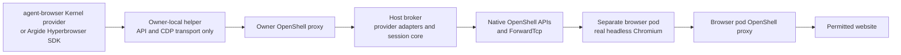
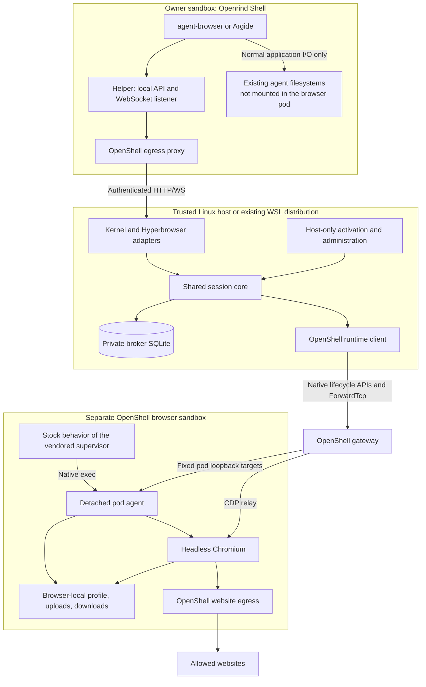
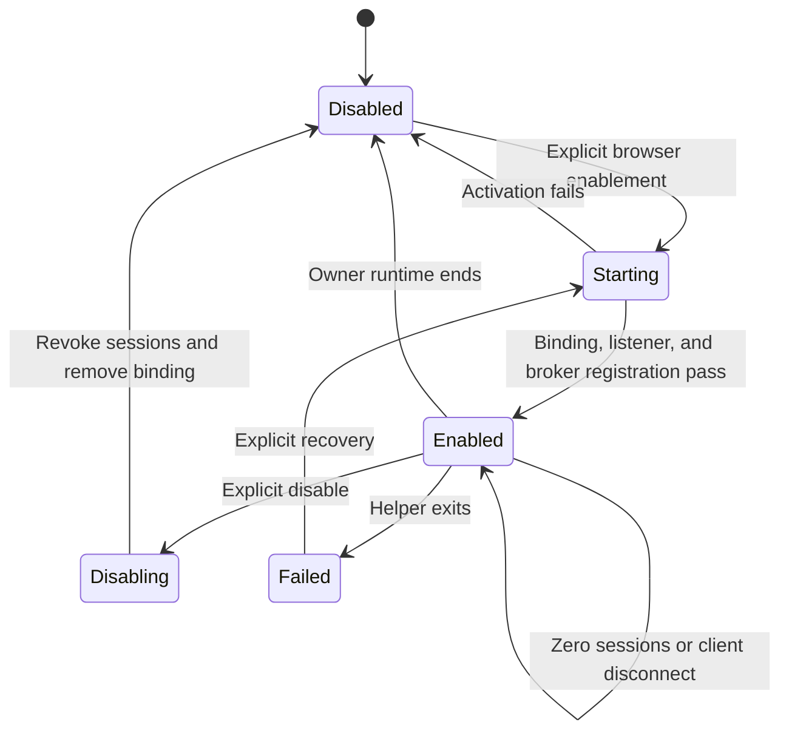
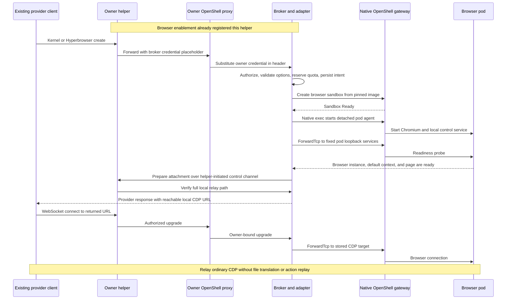
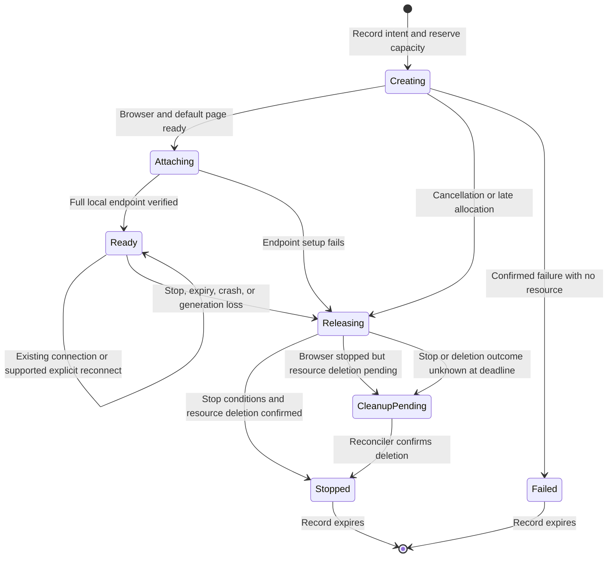
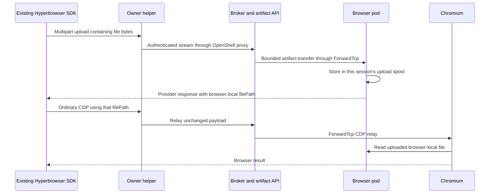
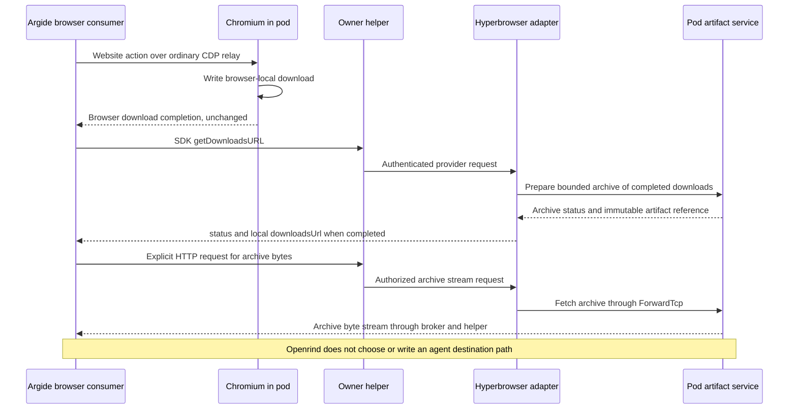

# Browser Pods: Provider-Only Sessions For Openrind

**Status:** Implementation contract with an initial experimental Kernel path.
The full v1 flow is not complete or verified end to end. Examples of the
proposed deployment are not working customer instructions. See
[Implementation Status](openrind-desktop/packages/browser-pods/README.md).

**Revision:** 5.2. Provider APIs only. Required client packaging and migration scope.

**Date:** 2026-10-06.

**Current code:** `packages/browser-pods` now has the SQLite session core,
Kernel routes, fixed-port helper, native OpenShell runtime adapter, and pod agent.
The primary image recipes package the pinned CLI, action policy, and Claude skill.
Desktop no longer starts the old managed MCP controller. The new Claude wrapper
ignores its stale descriptor and credentials. There is no new OpenShell patch or
FUSE contract bump. Existing containers do not receive the new wrapper automatically.

**Release gate:** Normal Desktop browser activation stays disabled. Real
Chromium/OpenShell, provider header injection, unchanged agent-browser, Claude
discovery, and Windows/WSL tests remain required. Hyperbrowser HTTP routes, artifacts,
safe in-place retirement, and the full memory/resource bounds are not complete.
Unit tests do not replace these gates.

**Purpose:** Run browser agents in Openrind Shell. Run Chromium in separate
OpenShell sandboxes. Let existing clients reach those browsers through
provider-compatible APIs and Chrome DevTools Protocol (CDP).

This revision replaces Revision 5.1. It keeps its client recovery, stop,
configuration, and file-command contracts. It adds required agent-browser and
Claude skill packaging. It separates Control Chrome from the managed MCP service
being retired. It also states the limits of direct CDP control and contract
upgrades. It uses relaxed ASD-STE100 language.

## Executive Summary

Build one Openrind browser service, called the **broker**. Implement the receiving
side of provider APIs over one shared session core. A successful create request
starts a real browser pod and returns a working CDP endpoint.

"Mock a provider" means emulate its supported API contract. It does not mean
return canned page results, fake a successful browser action, or contact the
real vendor as a fallback.

The first clients are:

| Client | Selected path | Configuration change |
|---|---|---|
| agent-browser | Its existing Kernel provider | Set `AGENT_BROWSER_PROVIDER=kernel` and `KERNEL_ENDPOINT` |
| Extracted Argide browser consumer | Its existing Hyperbrowser SDK | Set the SDK's supported `baseUrl` constructor option |

The owner image must include the pinned agent-browser CLI and a bundled Claude
skill. The CLI runs in the owner sandbox; Chromium does not. There is no local
Chrome launch path or required agent-browser plugin. There is no automatic file
bridge between the agent and browser filesystems.



**Delivery target: no new browser-specific OpenShell patches.** Keep the existing
FUSE fork. This remains a target until the real runtime tests pass.

| Decision | Revision 5.2 contract |
|---|---|
| Browser location | One separate OpenShell sandbox per browser session |
| Agent integration | Built-in provider or existing provider SDK, not a local Chrome executable |
| Owner assets | Pinned agent-browser CLI, native action policy, and bundled `openrind-browser` Claude skill |
| First adapters | Kernel for agent-browser; Hyperbrowser for the Argide fixture |
| Shared implementation | One session core, runtime backend, authorization model, and artifact service |
| Helper | Loopback API/CDP relay in our agent images; no filesystem-path translation |
| Client address | Fixed `127.0.0.1:19300` in each owner sandbox; no port fallback |
| Helper lifetime | Stays available while browser support is enabled, even with no sessions |
| Client recovery | agent-browser creates a new session after a failed probe; Argide can reconnect to a retained session |
| Stop acknowledgement | Browser stopped and access revoked; container deletion can continue with quota reserved |
| Broker | One trusted host service per gateway, with private SQLite state |
| Pod access | Native lifecycle APIs, native exec, and ForwardTcp |
| Website access | Allowlist by default; HTTPS uses `tls: skip` with normal website certificate checks |
| Files | Explicit provider uploads and archives only; browser paths stay browser-local |
| Unsupported CLI files | Deny agent-browser `upload` and `download` through its native action policy |
| Desktop pod path | Installs and manages the feature; no viewer, sidebar, or host browser |
| Existing Control Chrome | Preserve as a separate opt-in connection; not a pod fallback or a verified OpenShell path |
| Action control | Direct CDP in v1; destination policy is enforced, per-action mediation is not |
| FUSE | Existing agent workspace remains unchanged; no browser export subsystem |
| Later work | Other adapters, vendor-domain interception, and upstream/FUSE migration |

A browser pod is an OpenShell sandbox running Chromium. The name does not add
a Kubernetes requirement.

The broker never replaces a browser behind an existing session ID. The unchanged
agent-browser client can still request a new session after a failed probe or
expiry. These are different behaviors. V1 does not preserve its page state
through that client-driven replacement.

The main work is now provider behavior, session ownership, reachable CDP
endpoints, process lifetime, and tests with real clients. Removing local-file
translation reduces scope. It does not prove that the native transport works.

## Contents

1. [Scope And Reasons](#1-scope-and-reasons)
2. [Evidence Baselines](#2-evidence-baselines)
3. [Architecture](#3-architecture)
4. [Client And Provider Contracts](#4-client-and-provider-contracts)
5. [Helper And Native Transport](#5-helper-and-native-transport)
6. [Session Core And Failure](#6-session-core-and-failure)
7. [Browser Process And Image](#7-browser-process-and-image)
8. [Provider Artifacts And Profiles](#8-provider-artifacts-and-profiles)
9. [Integration And Retirement](#9-integration-and-retirement)
10. [Acceptance Tests](#10-acceptance-tests)
11. [Delivery And Operations](#11-delivery-and-operations)
12. [Sources And Terms](#12-sources-and-terms)

## 1. Scope And Reasons

### 1.1 One Core, Two Initial Adapters

A provider adapter translates HTTP requests and responses. The session core
owns sessions. The runtime backend creates, probes, and stops browser pods.

Do not create one browser service per vendor. Do not copy the outbound provider
code from agent-browser into separate session managers. Implement its receiving
API and return a real, reachable browser connection.

| Adapter | V1 status | Compatibility claim after tests pass |
|---|---|---|
| Kernel | Required first adapter | Pinned, unchanged agent-browser binary using its configured Kernel provider |
| Hyperbrowser | Required second adapter | Extracted Argide browser sequence using configured SDK `0.91.0` |
| Browserless | Later | Configurable built-in provider; not a v1 release requirement |
| Browserbase | Later | Configured SDK and fixed-origin built-in provider are separate targets |
| Browser Use Cloud | Later | Fixed-origin routing and client deadlines need their own tests |

The supported subset is not the complete vendor platform. Do not claim Kernel
profiles, Hyperbrowser recordings, cloud geolocation, or CAPTCHA handling merely
because a create request succeeds.

MCP servers can be consumers of these provider APIs. MCP is not an additional
required transport or product implementation.

### 1.2 Why This Design

| Choice | Reason | Cost or limit |
|---|---|---|
| Kernel first | The pinned client already reads `KERNEL_ENDPOINT` for create and cleanup | Implement the observed API subset and test the real binary |
| Configured Hyperbrowser | Argide's SDK already accepts `baseUrl` | Record the constructor configuration change; this is not vendor-domain interception |
| No local Chrome executable | Provider mode already supplies the browser lifecycle and CDP URL | The agent-browser CLI is still required in the owner image |
| No local-file compatibility | Agent and browser run on different filesystems | Commands that require browser files to exist locally are outside the contract |
| Explicit provider artifacts | SDK calls already send bytes or request an archive | Callers must use those APIs; no automatic workspace publication |
| Keep the helper | Proxy-unaware clients can reach owner loopback on the vendored runtime | Our images contain a small transport process |
| Keep the host broker | Native public APIs can manage browser sandboxes | This is a deliberate extra trusted host service |
| Use ForwardTcp | It already reaches pod loopback in the workload network namespace | Tokens, connection limits, and stream failure still need handling |
| Use native exec and detachment | A browser crash can end the session instead of triggering hidden recovery | The broker must detect failure and delete resources |
| Keep FUSE separate | Browser execution does not need to change agent persistence | The existing fork remains until a separate migration passes |

This explicitly replaces the earlier "no extra host service" goal. The cost of
one broker is accepted to avoid new trusted networking and custom TLS code in
OpenShell.

### 1.3 Removed Requirements

The following are not implementation work for this proposal:

- `AGENT_BROWSER_EXECUTABLE_PATH` or another local Chrome executable override.
- A Chrome stand-in that emulates launch flags, process lifetime, or DevTools files.
- A required custom agent-browser provider plugin.
- An explicit `--cdp` launch recipe as the primary user integration.
- Agent-local upload paths passed to a remote browser as if both shared a disk.
- Automatic local downloads, path rewriting, or local GUID-file publication.
- Delayed CDP download events waiting for a local transfer or `fsync`.
- A `FileMode` switch between artifact and local-file behavior.
- A browser-specific FUSE export API, watcher, or durability barrier.
- Browserless, Browserbase, or Browser Use as additional v1 release gates.

The returned CDP URL remains necessary. Removing a direct-CDP user workflow does
not remove CDP from the provider implementation.

### 1.4 Other Non-Goals

V1 does not provide:

- A browser in the agent sandbox, Electron, or a Windows host process.
- A sidebar, viewer, VNC server, RFB bridge, or human-input takeover.
- A public external CDP endpoint.
- Binary-free support for arbitrary third-party agent images.
- Transparent interception of a vendor domain.
- Personal profiles, arbitrary extensions, CAPTCHA solving, or proxy-region parity.
- Browser survival through broker, gateway, or owner-runtime restart.
- Broker-managed transparent recovery of a failed browser or helper connection.
- A new Hyper-V, vsock, or Windows-to-WSL application service.
- A port of Argide's database, queue, authentication, widget, or LLM application.

These limits apply to the new pod path. They do not authorize removal of the
separate Control Chrome connection. Section 9.4 defines that migration boundary.

### 1.5 Agent Persistence Is Unchanged

The agent workspace remains `/sandbox/work` on PostgreSQL FUSE. Claude's home
remains the separate `/sandbox/claude-home` named volume.

Browser pods receive neither mount. They receive no PostgreSQL URL or database
provider. The broker does not write to `_openeral.fs_*`.

An application can explicitly save bytes it receives from a provider API.
That is the application's normal filesystem write. This proposal does not add
automatic copying, an export command, or a new FUSE persistence promise.

Keep the existing mount owner, CONNECT path, end-to-end PostgreSQL TLS, lease
fencing, and critical-child recovery unchanged.

### 1.6 Action Control And Future Mediation

The old browser core implements approvals, redaction, and action deduplication.
Its production provider registry is empty at the code baseline. These are
implemented foundation components, not verified production browser features.
Retiring that path drops its planned action-level contract. It does not remove
those controls from a working managed provider.

V1 grants direct CDP access to the assigned browser. This includes JavaScript
execution and access to that browser's cookies. The broker enforces ownership,
session limits, and lifecycle rules. OpenShell enforces website destinations and
records connection decisions. With `tls: skip`, neither control is a browser
action approval system or a content-redaction system. Do not transfer the old
core's action deduplication claim to the CDP relay.

A future mediated mode can use the same session core through an MCP adapter.
It needs a separate grant selected by the trusted host, not by the model.
It is not a v1 requirement. Before calling it an enforced control, require:

- The broker denies direct provider creation and CDP attachment for mediated owners, even if they call routes outside the adapter.
- The owner has no usable direct-CDP helper route, attachment URL, or credential. Egress rules alone cannot block its own loopback listener.
- The adapter runs outside the untrusted owner and holds its browser-control credentials there. A same-UID adapter inside the owner is not sufficient isolation.
- The adapter applies approvals and limits to all exposed actions. Arbitrary JavaScript or equivalent bypass tools cannot defeat those limits.
- An owner cannot combine direct and mediated grants to bypass approval. Changing its mode requires trusted authorization and revocation of incompatible attachments.

This reuses the backend, not the direct-mode security claim. It needs its own
implementation and tests. Agent-browser's client-side `confirm` policy can help
users in direct mode, but it is not a substitute for enforced mediation.

## 2. Evidence Baselines

### 2.1 Source Pins

| Component | Pin or source | Evidence limit |
|---|---|---|
| Openrind | `7b8ed1d40a95481265aba4fb6fd8cc591c6f6044` | Current code baseline; this spec is not implemented there |
| Vendored OpenShell | `c4b500a7de64d0b66e3ee8098f58d14299092162` plus local FUSE changes | Delivery runtime; see `vendor/openshell/UPSTREAM` |
| Previously refreshed upstream | `a2429fcdcdf3b6e80f185317d3910fd8f84055f6` | Selected source read on 2026-10-04; not installed here |
| Earlier upstream study | `8719fc9f37a93dd96435cf6753ae53c8ee8809e6` | Background for the split runtime; not the delivery baseline |
| agent-browser | `39a74c70d7759d5a6de7a22c04570bb626bbd081`, v0.38.2 | Primary provider-client test target |
| Additional agent-browser source check | `526157cfd4ec64f45939f9ba0f10d5936aa7ac33` | Kernel endpoint configuration also exists here; not a changed test pin |
| Argide archive | `Argide Harness-20260928T084146Z-1-001.zip` | Extracted source and package evidence, not a deployed Argide test |
| Hyperbrowser SDK | `@hyperbrowser/sdk@0.91.0` | Exact bundled package |
| Argide Playwright | `playwright-core@1.59.1` | Resolved backend-core dependency in the supplied image |

The archive SHA-256 is:

```text
6cd97c0e7b8fa18906feecc0592ef14a4caff24176b2ba7b44b8e92a889327a7
```

Argide's manifest range is not its exact installed Playwright version. The image
contains more than one Playwright version. Use backend-core's resolved dependency.

Source fetched through GitHub is not a local clone or a runtime test.
The browser image digest and real-client test receipts remain delivery outputs.
This revision does not claim a new upstream checkout or a live browser-pod run.

At the Openrind baseline, the owner image does not install agent-browser and no
bundled skill teaches Claude this provider flow. Section 7.5 is required work,
not an existing capability. Control Chrome has separate code and guidance.
Its support inside an OpenShell session has not been verified in this review.

### 2.2 What Existing Evidence Proves

The existing browser transport report covers HTTP, HTTPS, SSE, credential
substitution, and parts of the earlier host-browser/MCP stack. It does not prove
the new Kernel or Hyperbrowser flow through a browser pod.

Earlier FUSE artifact probes remain evidence for their original paths. They are
not the new browser acceptance test and do not add local-file scope back here.

Use these evidence levels:

| Level | What it proves |
|---|---|
| Source check | A named hook, route, or limitation exists at a pin |
| Adapter test | Requests, responses, ownership, and state rules work against fixtures |
| Native transport test | The real supervisor, proxy, credential path, and ForwardTcp work |
| Real-client test | The pinned binary or SDK reaches and controls a real browser pod |
| Desktop test | Packaging, managed WSL runtime, activation, and normal Claude operation work together |

Do not label a synthetic request, direct Docker browser run, or plugin test as
proof that the built-in Kernel provider works.

### 2.3 Reuse And Replacement

| Current area | Rule |
|---|---|
| `browser-binding.mjs` | Reuse the narrow bridge endpoint and provider-profile pattern; update routes and helper identity |
| `browser-provider.mjs` | Reuse running-sandbox attachment and cleanup; share the logic with the Linux host path |
| Existing transport evals | Keep historical evidence and useful negative tests |
| Existing session/core tests | Reuse races and ownership tests where the new contract matches |
| Old MCP bridge | Do not treat its bounded JSON transport as a CDP or artifact relay |
| Old managed `openrind-browser` launch | Retire its launch dependency; do not remove Control Chrome |
| Control Chrome (`chrome-devtools`) | Preserve its separate opt-in configuration and host-browser scope |
| Old provider/driver packages | Do not keep a second active browser-session authority |
| Claude wrapper | Remove the old managed preflight without changing normal launch or final FUSE flush |

The existing binding allows only `/mcp` and a limited set of methods. The new
routes include Kernel create/delete, Hyperbrowser `PUT` stop, artifacts, and
CDP upgrades. Reuse does not mean the old route profile works unchanged.

The current provider helper is WSL-specific. Extract reusable provisioning
behavior behind the host runner; do not describe it as an existing portable
Linux broker installer.

## 3. Architecture

### 3.1 Component Boundaries



No browser file path is translated to an agent path. No CDP download event
waits for an agent filesystem operation.

### 3.2 Responsibilities

| Component | Owns | Must not own |
|---|---|---|
| Provider adapter | Wire contract, option mapping, response URLs | Independent lifecycle or provider-specific browser backend |
| Session core | Ownership, limits, leases, state, cleanup, effective options | Website action replay |
| Runtime backend | Native pod lifecycle, exec, health, fixed-port forwarding | Agent-visible gateway credentials |
| Owner helper | Loopback reachability, authenticated forwarding, local URL mapping | Opening agent files on behalf of CDP or publishing downloads |
| Pod agent | Chromium child, private artifact service, shutdown on lease loss | Gateway administration or arbitrary process execution |
| Host manager | Broker lifecycle, activation, image readiness, credentials | Browser actions selected by the model |

A screenshot carried in a CDP response is ordinary protocol data. Returning it
does not require a browser filesystem bridge. If agent-browser saves that data
locally, agent-browser performs the write.

### 3.3 Broker Placement And Storage

Run one broker per gateway in its trusted Linux host environment.
Windows Desktop uses the existing dedicated OpenShell WSL distribution.

Use a private broker-owned SQLite database, separate from OpenShell's internal
database. Use transactions for ownership, create intent, quota reservations,
and operation records. Use a host lock to prevent two active broker instances.

The local data listener binds only to the discovered managed Docker bridge.
The proposed port is 18792. Do not bind it to all host interfaces.
The helper reaches it at `host.openshell.internal:<broker-port>` through the
owner's OpenShell proxy.

Keep host administration on a separate local control socket. Do not put pod
creation permissions, arbitrary forwarding, or shell execution on the data API.

This local HTTP/WS segment has no transport encryption. V1 assumes a trusted
single-user Linux/WSL host. The broker still authenticates every owner request.
Do not describe this as a secure remote-host deployment.

### 3.4 Broker Process Ownership

Use a gateway-scoped service unit under the existing Linux/WSL service manager.
Desktop installs and activates the unit. The CLI-only Linux host setup installs
the same service and uses the same control interface.

Run the broker under the managed host account, not the agent's sandbox account.
Keep its state directory private. Keep gateway credentials out of command lines.

Start after the managed network and gateway are available. The broker can retry
control-plane connection failures, but must not advertise readiness while they
persist. A gateway identifier and state path bind the service to one gateway.

A broker process restart ends its old v1 browser sessions. Before accepting new
creates, reconcile stored ownership, revoke old routes, and remove old pods.
A service restart is not browser-session migration.

An upgrade verifies assets first, blocks new creates, and waits for sessions to
end unless the user approves ending them. Do not restart active browser sessions
silently. Desktop quitting alone does not stop this host service. This does not
promise survival of WSL, gateway, or owner-runtime shutdown.

## 4. Client And Provider Contracts

### 4.1 Public Integration Surface

Reserve `127.0.0.1:19300` as the helper endpoint in each owner sandbox. Separate
owner network namespaces can use the same port. Never choose a random port on
collision or silently connect to an unrelated listener.

Install the static provider settings before starting supported clients. Browser
enablement starts and verifies the listener; it does not change the endpoint.
The following shows the proposed managed configuration, not an installed service:

```sh
export AGENT_BROWSER_PROVIDER=kernel
export KERNEL_ENDPOINT=http://127.0.0.1:19300
export KERNEL_API_KEY=openrind-compat
export KERNEL_HEADLESS=true
export KERNEL_STEALTH=false
export KERNEL_TIMEOUT_SECONDS=300
export AGENT_BROWSER_ACTION_POLICY=/opt/openrind/browser/agent-browser-policy.json
agent-browser open https://example.com
```

New managed images provide these settings to Desktop launches and native shell
launches before the agent process starts. This includes noninteractive shell
commands. A shell profile alone is not sufficient. Ship and validate the native
action-policy file defined in section 8.1. Ship the CLI and Claude skill defined
in section 7.5. Do not fetch any of these assets during a browser call.

A running Claude process cannot receive changed environment variables. An
agent-browser daemon also keeps its startup settings. For an existing session,
report the required configuration step and obtain approval before closing its
browser daemon. Use a fresh configured daemon and, if needed, a new configured
agent session. Do not stop unrelated Claude sessions or replace their container.

Use a fresh agent-browser session for tests. Check for conflicting CDP,
auto-connect, provider, and action-policy settings. Do not reuse a local Chrome
daemon left from another test or silently override user configuration.

Keep the provider defaults when browser support is disabled. With no listener,
the request fails with a connection error instead of launching local Chrome or
contacting the real Kernel service. A port collision blocks activation and must
produce a visible error. This is not a guarantee against other same-sandbox code.

The nonempty Kernel key is a compatibility value, not the broker access secret.
The pinned client permits create without it, but its cleanup code sends
`DELETE /browsers/{id}` only when `KERNEL_API_KEY` is present. Set it for the
supported integration. The broker must also expire abandoned sessions.

Argide uses its installed SDK with supported configuration:

```typescript
const client = new Hyperbrowser({
  apiKey: "openrind-compat",
  baseUrl: "http://127.0.0.1:19300",
});
```

This is an example of the constructor change, not a complete runnable Argide
program. Supply it before constructing the SDK client. Keep the browser calls
themselves unchanged.

No `AGENT_BROWSER_EXECUTABLE_PATH` setting, custom agent-browser plugin, or Chrome
launcher shim is part of either client setup.

### 4.2 Kernel Adapter

Implement the subset used by the pinned agent-browser provider:

| Request | Required result |
|---|---|
| `POST /browsers` | Create one ready browser and return `session_id` and `cdp_ws_url` |
| `DELETE /browsers/{id}` | Return 204 after access revocation, client-stream closure, and confirmed browser termination; container deletion can continue |

The returned identifier must be nonempty and stable. The endpoint must be usable
before create returns. Do not return an asynchronous placeholder session.

Example response shape:

```json
{
  "session_id": "<session UUID>",
  "cdp_ws_url": "ws://127.0.0.1:19300/cdp/<opaque-attachment>"
}
```

Map the observed create options explicitly:

| Field | V1 treatment |
|---|---|
| `headless` | Accept `true`; reject `false` because no headed-browser experience is supplied |
| `stealth` | Accept `false`; reject `true` |
| `timeout_seconds` | Positive integer in seconds; use the bounded disconnect-idle lease defined in section 6 |
| `profile` | Reject; persistent profiles are not implemented |
| Unknown fields | Reject before allocation with a bounded field-name error |

Defaults match the supported client configuration: headless true, stealth false,
and 300 seconds. Record the effective lease and separate operator lifetime cap.

After the real-client tests pass, this supports the named agent-browser contract.
It does not establish full Kernel API parity. Live view, profile storage, hosted
code execution, browser pools, and vendor artifact APIs remain unsupported.

The pinned client reuses its live connection across ordinary commands. Before a
browser-dependent command, it sends `Browser.getVersion` with a three-second
deadline. If that probe fails, its Kernel path closes the old provider session
and calls create again. It does not reconnect to the old provider session.
The broker must not return the old session to disguise this replacement.

DELETE runs before that new create. The pinned Kernel cleanup call sets no
explicit request timeout and ignores the returned HTTP status. The helper must
therefore enforce a stop-request deadline even when the broker is unavailable.
Use a proposed two-second deadline from receipt of the complete DELETE request.
Return a bounded error when the stop result is unknown; do not fabricate 204.
This deadline does not apply to artifact streams or to the entire create flow.

Before 204, persist stop intent, revoke client access, close active client CDP and
artifact streams, and confirm Chromium termination. Keep broker control access
long enough to verify the stop. A closed CDP socket alone is not proof of exit.
Container removal can then continue in `CleanupPending`. Reserve its quota until
deletion is confirmed. Section 6.5 defines the separate stop and cleanup records.

Repeated delete returns 204 if that owned session already meets the browser-stop
conditions, even while container removal continues. Unknown and cross-owner IDs
return the same not-found response. Persist incomplete work for reconciliation.
The client can proceed despite a stop error, so a subsequent create must still
respect occupied quota. Do not hide leaked resources by releasing quota early.

### 4.3 Hyperbrowser Adapter

Use the bundled SDK `0.91.0`. It appends `/api` to its configured base and sends
`x-api-key`. Do not add an extra base-path prefix that changes those routes.

| Route | Required behavior |
|---|---|
| `POST /api/session` | Ready session detail with `id`, `wsEndpoint`, and `status: active` |
| `GET /api/session/{id}` | Detail for the same owned session |
| `PUT /api/session/{id}/stop` | JSON `{success:true}` after the same confirmed browser-stop conditions; container cleanup can continue |
| `GET /api/sessions` | `{sessions,totalCount,page,perPage}` with bounded pagination |
| `POST /api/session/{id}/uploads` | SDK multipart upload; return `{message,filePath,fileName,originalName}` |
| `GET /api/session/{id}/downloads-url` | `{status,downloadsUrl?,error?}` for an explicit archive request |

Provide the required SDK fields, real timestamps, and consistent owner-scoped
identifiers. Keep credit fields null rather than inventing billing.
`sessionUrl` can identify an owner-scoped session-status resource, not a viewer.
Supply the required `token` string as an empty compatibility field. Attachment
authority belongs to the scoped endpoint, not a fabricated vendor token.

Omit optional `liveUrl`, `liveDomain`, and computer-control fields.
Do not fabricate a VNC endpoint. Argide's VNC parser also checks for a matching
Hyperbrowser hostname, so a query token on a loopback URL alone is not evidence
of a fake viewer. Test the actual parser result.

Always return valid JSON where the SDK expects JSON. An empty chunked success
body is not a valid session or stop response.

### 4.4 Argide Option Profile

Select a named `argide-0.91-browser-pods-v1` compatibility profile during trusted
owner activation. This profile is not a caller-selected escape from policy.

Argide sends more than screen and timeout settings. Handle its whole observed
request without editing those calls in the fixture:

| Field or parameter | Observed request | Profile treatment |
|---|---|---|
| `region` | Chosen from timezone | Accept as a declared no-op; report actual execution on the local gateway host |
| `screen.width` and `screen.height` | Rounded dimensions | Honor positive integer dimensions from 1 to 8192; reject larger values |
| `timeoutMinutes` | 60 | Honor minutes as a bounded absolute session lifetime |
| `saveDownloads` | true | Enable the browser-local archive service |
| `enableWebRecording` | true | Accept as a declared no-op; do not return a recording |
| `enableVideoWebRecording` | true | Accept as a declared no-op; do not return a video |
| `useStealth` | true | Accept as a declared no-op; do not claim anti-detection behavior |
| `adblock` | true | Accept as a declared no-op; do not claim ad filtering |
| `trackers` | true | Accept as a declared no-op; do not claim tracker filtering |
| `annoyances` | true | Accept as a declared no-op; do not claim popup or consent filtering |
| `solveCaptchas` | false | Honor disabled solving; reject true |
| `liveViewTtlSeconds` on get | 3600 | Accept as a declared no-op because no live view exists |
| Stateful profiles, extensions, custom proxies | Not needed by the fixture | Reject |
| Unknown fields | Not in the pinned fixture | Reject until explicitly added and tested |

The profile preserves request acceptance, not feature parity. Store requested
options, effective options, and warnings separately. Show warnings in operator
diagnostics and test receipts. A response header alone is insufficient because
the SDK may discard it.

Without this named profile, reject enabled unsupported features. Never return
`launchState` flags that falsely say a no-op feature is active.
`keepAlive=true` requests retained connection behavior only within the session
lease. It does not disable timeouts or create a persistent profile.

### 4.5 Later Adapters

| Provider | Existing client hook | Reason it is later |
|---|---|---|
| Browserless | `BROWSERLESS_API_URL` | Useful additional adapter, but not needed to prove the selected first client |
| Browserbase built-in | Hard-coded API origin at the pin | Needs supported endpoint configuration or separately approved interception |
| Browserbase SDK | SDK-specific base URL support | A separate client contract from the built-in provider |
| Browser Use built-in | Hard-coded `https://api.browser-use.com/api/v4` | Routing and 10 s create / 8 s attach / 18 s total budgets need separate tests |

Do not claim the Browserless default `stealth=true` is implemented.
Do not label a configured SDK test as fixed-origin provider compatibility.

Vendor-domain interception is not another spelling of provider emulation.
Emulation defines API behavior. Interception adds routing and TLS work.
Kernel's endpoint setting avoids that extra work for the first release.

## 5. Helper And Native Transport

### 5.1 Addresses And Discovery

The helper binds only to `127.0.0.1:19300` inside the owner sandbox. All provider
URLs handed to that client resolve there: API, CDP, status, stop, and archive URLs.

A helper uses one listener, with distinct provider route paths. The broker builds
returned URLs from the registered helper origin and stored attachment identity.
Do not trust an incoming `Host` header as the response origin.

Raw CDP clients may not use HTTP proxy environment variables. Their loopback
endpoint is therefore still required on the vendored runtime. Removing file
translation does not remove this reachability constraint.

Return complete `ws://` endpoints. Both selected clients connect to those URLs
without client-facing HTTP discovery. Return 404 for `/json/version`, `/json/list`,
and other unsupported discovery routes in v1. Do not build a discovery cache.

The broker can still use pod-local discovery during startup. It must also run
real readiness probes. Relay client `Browser.getVersion` calls to Chromium;
never answer them from cached metadata to hide a failed or slow connection.

The local endpoint is visible to other code in the same owner sandbox.
Treat the owner sandbox as one trust domain. Keep the helper off host/LAN
interfaces, reject hostile browser Origins, and do not enable website CORS access.
Machine clients can omit Origin; that is not authentication.

### 5.2 Activation And Helper Lifetime

Browser support is explicitly enabled through trusted Desktop or host setup.
That operation validates the installed client configuration, prepares the provider
binding, and starts the helper on the reserved port. Report ready only after
health and ownership checks pass. The static client settings already exist.

The helper opens an authenticated control channel to the broker through the same
native REST-upgrade path. Registration, readiness messages, and revocation use
that helper-initiated channel. The broker does not dial owner loopback from the
host. This control connection is not a pod ForwardTcp stream.

Use one per-owner lock, bounded control ping, and runtime generation check.
A live PID or socket file alone is not readiness. Start the helper detached as
the agent user. Close inherited stdin, output pipes, and lock descriptors.

The helper stays alive while the provider endpoint is enabled, even when there
are no sessions. Remove Revision 4's 60-second idle exit. An unchanged provider
client can send a new create request later without calling an Openrind plugin
or launcher first.



Use the same reserved port after explicit helper recovery. On helper failure,
revoke its attachments. Reusing the port must not make old attachment URLs
control a new browser. A foreign listener must fail activation, not trigger a
new port choice or be accepted as the managed helper.

Normal Claude launch must work when browser support is disabled or unavailable.
Do not reintroduce mandatory browser preflight into the Claude wrapper.

### 5.3 Credential And Policy Contract

Create a separate broker credential for each owner runtime generation.
OpenShell stores the secret. The helper uses its provider placeholder in the
outgoing broker authorization header.

Discard Kernel and Hyperbrowser compatibility keys before adding that header.
They are not the caller identity. Never forward them to a real vendor on error.

Reuse the existing private bridge binding, exact `allowed_ips` /32, and trusted
provider attach/detach flow. Also install the matching explicit endpoint and
executable network policy. Existing evals show that credential attachment alone
is not sufficient authorization.

The broker endpoint profile must use:

| Setting | Required value or behavior |
|---|---|
| Host and port | Exact broker endpoint; no gateway admin port |
| `protocol` | `rest` |
| `tls` | `none` for the trusted local bridge deployment |
| `websocket_credential_rewrite` | false |
| `request_body_credential_rewrite` | false |
| HTTP policy | Exact approved API/artifact paths, methods, and CDP upgrade paths |
| Provider credential | Header substitution only |
| Artifact bodies | Bounded streaming without body-buffering middleware |

The parsed WebSocket relay has a 1 MiB client-to-server text limit.
Request-body credential rewriting has a 256 KiB limit. Neither belongs on the
CDP/artifact path. Server-to-client responses use a separate raw copy in the
inspected source; do not claim the 1 MiB limit directly blocks every screenshot.

The REST upgrade path permits raw relay after 101 when message rewriting and
inspection are not enabled. Prove that exact path with the real supervisor.
Do not weaken to an unrestricted proxy to avoid a failed test.

Verify existing `NO_PROXY` and `no_proxy` loopback values. Do not globally replace
them with broad host exceptions. The helper's broker connection must explicitly
use OpenShell's proxy.

Package and authorize the helper's actual executable identity. If a bundled
Node process depends on a native parent's attribution, keep that parent alive
and prove attribution after detachment. A shebang path or exited launcher alone
does not establish the required binary identity.

### 5.4 CDP Relaying

Before a WebSocket upgrade, the broker checks owner, session, attachment,
generation, expiry, and concurrency. It opens only the stored pod port and CDP
target path. A request cannot select an arbitrary host or port.

Strip broker credentials, vendor keys, and internal identity headers before the
browser handshake. Use standard HTTP/WebSocket libraries and test actual client
Origin and Host behavior. Do not add a wildcard Chromium remote-origin option
to hide an invalid handshake.

After upgrade, relay CDP payloads without application-level changes.
Preserve IDs, target `sessionId` values, events, and close behavior.
Normal protocol framing and size limits are allowed; file-command translation
and website-action replay are not.

This includes `Browser.setDownloadBehavior` and page-scoped variants.
Their paths mean browser-pod paths. Completion means browser completion, not
publication into the owner filesystem.

Do not reject `DOM.setFileInputFiles` globally. The explicit Hyperbrowser upload
flow can legitimately pass a returned browser-local path through that command.
Block unsupported agent-browser file commands in its native action policy,
before the action handler runs, not through CDP inspection.

### 5.5 ForwardTcp Capacity

The vendored gateway limits connections to three per token and twenty per
sandbox. Relevant SSH connections share those counters.

Use one token for at most two CDP streams. Use a second token for at most two
pod-agent control/artifact streams. A native exec launch can temporarily use
another counted connection. Reserve capacity for it and for cleanup.

Do not issue tokens to evade the sandbox limit. Reuse bounded control streams.
Do not open a forwarding connection per CDP action or file chunk.

Track active streams. Closing or revoking a token is not assumed to terminate
already-open streams. Stop, expiry, or generation loss must close those streams
explicitly and revoke their tokens.

Do not use public service-exposure HTTP routes for CDP. This design uses the
authenticated native forwarding path, not a new public browser endpoint.

### 5.6 Gateway And Website Boundaries

Desktop's gateway can accept tokenless administrative callers and listen on
the managed bridge. Workloads must not reach that admin endpoint.
Do not grant `host.openshell.internal:18770` or an IP alias.

Browser pods must not reach the broker either. The broker initiates their
control connections through ForwardTcp. Browser egress is for websites only.

Start with a website allowlist. An optional public-web grant covers TCP 80/443
only and excludes private, loopback, link-local, metadata, reserved, and internal
destinations for IPv4 and IPv6.

Native hostless `allowed_ips` rules are the candidate public-web mechanism.
Generate a reviewed public range set. Merely splitting around `0/8`, `127/8`,
and `169.254/16` is not enough. Test mixed DNS answers, redirects, rebinding,
IPv4-mapped IPv6, and create-time policy validation limits.

Keep this broad policy in the dedicated browser pod. Endpoint overlap checks
compare connection metadata, and broad CIDRs can log warnings on each connection.
Measure the operational effect before enabling that optional grant.

For website HTTPS, use `tls: skip`. Chromium validates the website's real
certificate. OpenShell still controls destination and executable, but cannot
inspect encrypted HTTP methods or content in this tunnel.
This also avoids the inspected TLS path's HTTP/1.1 limitation.

Set Chromium's explicit proxy configuration. Verify real executable attribution,
DNS, website WebSockets, and denied direct UDP/QUIC. Do not copy the owner's
database or LLM rules into browser policy.

Browser access delegates permitted web access to the agent. The agent can send
data it already has through that browser. Neither provider emulation nor the
removal of local-file translation is a data-loss prevention boundary.

## 6. Session Core And Failure

### 6.1 Shared Interfaces

These are proposed responsibility boundaries, not installed APIs:

```typescript
interface BrowserSessions {
  create(caller: Caller, request: CreateSession): Promise<Session>;
  get(caller: Caller, id: string): Promise<Session>;
  list(caller: Caller, query: SessionQuery): Promise<SessionPage>;
  stop(caller: Caller, id: string): Promise<StopResult>;
  attach(caller: Caller, id: string): Promise<Attachment>;
}

interface ProviderArtifacts {
  upload(caller: Caller, id: string, body: IncomingFile): Promise<BrowserArtifact>;
  requestArchive(caller: Caller, id: string): Promise<ArchiveStatus>;
  readArchive(caller: Caller, id: string, artifactId: string): Promise<ArtifactStream>;
}

interface BrowserRuntime {
  provision(intent: ProvisionIntent): Promise<RuntimeHandle>;
  probe(handle: RuntimeHandle): Promise<RuntimeObservation>;
  stop(handle: RuntimeHandle): Promise<RuntimeObservation>;
}

interface ProviderAdapter {
  handle(request: HttpRequest, caller: Caller, core: BrowserSessions,
    artifacts: ProviderArtifacts): Promise<HttpResponse>;
}
```

`Caller` comes from the broker credential, not a provider request field.
It contains the owner sandbox, owner generation, workspace identity, and grants.

There is no `FileMode` parameter and no `exportToWorkspace` operation.
Artifact APIs stream bytes and return browser-local references. They do not
accept an agent destination path.

Keep shared authorization, limits, errors, audit, and cleanup in the core.
Provider-specific field names and response envelopes belong in the adapters.

### 6.2 Create Sequence



Create succeeds only after the full endpoint is usable. Pod Ready alone is
insufficient. Check a real browser, context, and page.

The broker reserves quota and records intent before resource allocation.
Late success after caller cancellation still belongs to that recorded intent.
Reclaim it instead of losing ownership.

### 6.3 Records And Attachments

Store the session UUID, owner and broker generations, provider profile,
requested/effective options, runtime resource ID, Chromium instance ID, lease
deadlines, attachment records, quota reservation, artifacts, and cleanup status.
Record stop intent, access revocation, confirmed browser termination, and confirmed
resource deletion separately. An HTTP stop acknowledgement is not resource deletion.

Use labels to find resources, not as the sole authorization record.
Reconcile labels against stored ownership before deletion.

One controlling attachment can use the bounded set of sockets needed by the
pinned client. A controller is not a TCP socket. Track connection IDs under the
attachment, and ignore stale close events when computing active connections.
A late close must not revoke a newer valid connection.

Hyperbrowser get/reconnect returns access to the same live browser generation.
The selected agent-browser Kernel flow has no such reconnect step. It calls
create again after a failed probe. No adapter may allocate a replacement behind
the same session ID or attachment URL.

Preserve `keepAlive=true` and other explicitly supported connection parameters.
Do not allow arbitrary query parameters to choose a host, pod, or owner.

### 6.4 Leases

Use explicit per-adapter rules rather than one short reconnect timeout for all
providers:

| Case | Openrind v1 rule |
|---|---|
| Kernel connected session | A healthy controlling CDP attachment keeps the session active within the hard lifetime cap |
| Kernel last control disconnect | Retain the same browser for the requested `timeout_seconds`; default 300 |
| Kernel unclaimed create | Start that idle interval when create becomes ready |
| Hyperbrowser | Retained session; `timeoutMinutes` is the absolute requested lifetime |
| Hyperbrowser idle disconnect | Default 15-minute idle allowance, never beyond the absolute lifetime |
| Operator cap | Two-hour absolute lifetime; reject requests above supported limits |
| Explicit stop | End the session and revoke access regardless of remaining lease |
| Helper enabled with no sessions | Keep the listener alive; this is not a browser lease |

These are the bounded supported-adapter semantics, not a statement that every
vendor lease feature is emulated. Record effective deadlines and reject invalid
units or values rather than silently converting seconds into minutes.

Client activity and valid reconnect can renew idle time. Broker probes and helper
heartbeats must not keep an abandoned browser alive. Detect dead control streams
with bounded transport health checks.

A real `Browser.close` command closes Chromium. A library method named `close()`
can instead disconnect. Test the actual agent-browser and Argide methods.

Kernel's idle lease mainly bounds orphan lifetime if an agent-browser daemon
dies without DELETE. It is not an agent-browser recovery promise. A restarted
daemon normally creates another provider session; the abandoned one must expire
and remain counted until cleanup finishes.

The two-hour cap can close a session while agent-browser remains running. Its
next browser-dependent command can fail the probe and create a fresh browser.
Document that loss of the old browser generation and live page state. Any
client-side saved-state restoration is separate and is not live-session recovery.

```mermaid
sequenceDiagram
  participant A as agent-browser Kernel client
  participant H as Helper
  participant B as Broker
  participant P as Browser pod

  A->>H: Browser.getVersion before next command
  H->>P: Existing relay path
  Note over A,P: Failed probe or three-second timeout
  A->>H: DELETE old provider session
  H->>B: Bounded stop request
  B->>B: Persist intent and revoke client access
  B->>P: Stop Chromium and confirm exit
  B-->>A: 204 through helper
  Note over B,P: Pod deletion continues; quota stays reserved
  A->>H: POST /browsers for a new session
  H->>B: New create, not reconnect
  alt Capacity available
    B-->>A: New session ID and browser generation
  else Old resources still occupy all capacity
    B-->>A: Bounded quota error; no hidden over-allocation
  end
```

The diagram shows the confirmed-stop case. If confirmation misses the stop
deadline, return an error and reconcile. The Kernel client can still issue a new
create because it ignores the DELETE status. The broker must enforce quota in
both cases. Argide's explicit reconnect remains a separate acceptance path.

### 6.5 State And Unknown Outcomes



A caller timeout does not prove that create failed. Preserve ownership of late
resources. Expose owner-scoped status through host diagnostics and supported
provider list/get calls.

Use client request IDs for deduplication only when the client supplies a stable
one. Hash normalized input and reject conflicting reuse. Equal bodies without
a stable ID are not proof of the same operation.

Do not automatically retry create after an uncertain result without such an ID.
Do not automatically replay CDP mutations or website actions. A click or form
submission may have completed before a connection failed.

The client decides whether to inspect the page and issue a new action.
The broker is not an agent-action retry engine.

The no-hidden-replacement rule applies to the broker and helper. It does not
disable agent-browser's own relaunch behavior. Record each new create as a new
session and expose the generation change in diagnostics. Do not return the old
browser under a new create response or replay prior website actions.

Keep `accessRevokedAt`, `browserStoppedAt`, and `resourceDeletedAt` as separate
confirmed facts. Stop acknowledgement requires the first two plus closure of
client data streams. It does not require `resourceDeletedAt`. A `CleanupPending`
record can have a confirmed stop or an unknown stop result; only the confirmed
case qualifies for successful repeated stop responses. Reconciliation must not
convert an unknown result into success without evidence.

Count Creating, Attaching, and CleanupPending resources against quotas.
Release resource capacity only after deletion is confirmed.
An immediate replacement create can fail at quota while old containers await
deletion. Return a bounded capacity error; do not wait indefinitely or free a
reservation early. Validate this case with all owner and broker slots occupied.

### 6.6 Failure Contract

| Event | Required behavior |
|---|---|
| Normal disconnect | Apply the adapter lease; do not imply that agent-browser will reuse a disconnected session |
| Temporary relay loss | Support Argide reconnect to a live generation; agent-browser normally requests stop and a new create |
| Helper exit | Revoke helper attachments; explicit recovery only |
| Chromium or pod-agent exit | End the session and clean up; no hidden browser restart |
| Browser container restart | Old session is lost, even if OpenShell later reports Ready |
| Owner stop, delete, or runtime restart | End its browser sessions |
| Broker restart | End old sessions; reconcile before new creates |
| Gateway restart | End v1 sessions; active ForwardTcp streams are not resumed |
| Provider artifact failure | Return an artifact error, not a fake available archive |
| Browser stopped, container still present | Acknowledge stop only after all stop conditions pass; keep CleanupPending and quota |
| Stop unconfirmed or cleanup failure | Return a bounded stop error when confirmation is missing; retain records and quota for reconciliation |

Use native runtime observations and a fresh browser-instance identity.
A cached PID, marker, or Ready state does not prove Chromium survived.

Send a bounded broker lease to the pod agent. If that lease expires, the pod
agent closes Chromium and exits. It cannot start a replacement browser.
This limits browser lifetime when the broker disappears.

## 7. Browser Process And Image

### 7.1 Native Exec, Not An Image Entrypoint

OpenShell owns PID 1 and starts its managed workload. The trailing create command
runs through SSH after Ready. It is not the container entrypoint.

Use native exec to start a detached pod agent. This is a proposed image command:

```sh
setsid nohup /usr/local/bin/openrind-browser-pod \
  </dev/null >/tmp/openrind-browser-pod.log 2>&1 &
```

Close inherited descriptors. Keep no SSH input/output pipe or launch-lock
descriptor in the detached child. Use a startup lock and fresh instance ID.
The pod agent owns Chromium as a child and detects its exit.

The supervisor reaps orphans. That is not browser health supervision.
The broker still detects failure and deletes the session.

A native exec launch must finish independently of the browser's lifetime.
Test disconnect, a new SSH session, and provider control of the same browser.

A managed-command backport is not a prerequisite. Consider it only if this real
runtime test fails. Do not add it silently to the patch budget.

### 7.2 Chromium Isolation

The vendored workload seccomp filter blocks user namespaces, further seccomp
filter installation, and `memfd_create`. `no_new_privs` is set.

Expect `--no-sandbox` for the initial image. Make that launch mode explicit.
OpenShell remains the pod boundary, but it does not provide Chromium's internal
renderer isolation.

**Release gate CHROMIUM-ISOLATION:** record and approve the tested flags.
Do not weaken OpenShell's seccomp filter or add workload mount privileges.

Use one unprivileged browser pod and private profile per session. Do not install
database, model-provider, or gateway credentials in that pod.

### 7.3 Shared Memory And Browser-Local Storage

Start with a proposed 256 MiB tmpfs at `/dev/shm`, mode 01777, within the
2 GiB pod memory limit. Use native Docker driver mount configuration.

Test the mount target, actual capacity, ownership, Landlock access, and cgroup
accounting. The driver's mount support is source evidence, not a Chromium test.

Blocked `memfd_create` does not prove all Chromium paths fall back correctly.
Test the exact browser build under the real seccomp filter.

If the tmpfs path is not viable, evaluate `--disable-dev-shm-usage` as an explicit
image configuration using browser-local temporary storage. Do not silently
switch flags at runtime or assume that flag fixes every shared-memory failure.

Keep the profile, uploads, and downloads on browser-local storage.
Use bounded private spools. Never mount the owner home or workspace.

### 7.4 Build And Installation

Build only the derived browser image from an accessible published base.
Do not rebuild NVIDIA's Community base to solve an image-name or pull problem.

Pin the image digest, architecture, Chromium version, executable path, and flags.
Headless Chromium needs no X server, display server, VNC server, or viewer.

Use pod-local loopback ports 9222 for CDP and 9230 for the pod agent.
Do not publish them on the host.

Pre-pull the image into the actual OpenShell Docker daemon during installation.
On Windows, that is the managed WSL daemon, not an unrelated Desktop Docker
daemon. Verify the digest and a startup probe before reporting browser readiness.

Image download is not part of provider create. A missing image blocks browser
readiness and triggers visible installation work. No runtime browser download
or executable override is needed in the agent sandbox.

### 7.5 Owner CLI And Claude Skill

Installing Chromium in the pod does not give Claude a browser tool. A supported
browser-pod release must ship these owner assets. Removing the broken MCP launch
dependency earlier does not by itself create a replacement browser capability.

| Asset | Required location or source | Contract |
|---|---|---|
| agent-browser CLI | `/usr/local/bin/agent-browser` | Unchanged native binary at the section 2.1 pin, v0.38.2 |
| Native action policy | `/opt/openrind/browser/agent-browser-policy.json` | Validated section 8.1 policy, present before the daemon starts |
| Claude skill source | `.claude/skills/openrind-browser/SKILL.md` | Repository-owned instructions for the provider-only path |
| Image skill copy | `/opt/openrind-shell/skills/openrind-browser/SKILL.md` | Uses the existing bundled-skill image stage |
| Provider configuration | Managed launch environment in section 4.1 | Available to Claude's noninteractive Bash tool and native shell clients |

Pin each CLI asset by source commit, version, target architecture, and SHA-256.
Record its build or release origin and required runtime libraries. Verify the
checksum during the image build. Include license notices and any required
daemon assets from the same pin. Do not select `latest`, invent release asset
names, or assume one binary works on every architecture. Publish only image
architectures that pass the native-binary tests.

Install executables and static configuration as root-owned image assets. Test
them as the sandbox user under the real OpenShell restrictions. Verify both
`command -v agent-browser` and its reported version. A version check alone does
not prove that its daemon can start or that the Kernel provider works.

Do not run `agent-browser install`, fetch an npm package, or download Chromium
on first use. Build-time packaging may use a verified release or a pinned source
build. Customer setup must not require a package manager. The installed CLI
must use the configured provider and must not fall back to a local browser.

Reuse `setup-fuse.sh`'s bundled-skill copy and hash-manifest rules. With the
default paths, it stages skills into both
`/sandbox/claude-home/.claude/skills` and `/sandbox/work/.claude/skills`.
Preserve user-edited copies. Report a conflicting skill or failed staging step
instead of overwriting user changes. The existing copy function can warn and
continue; browser activation must separately validate the installed assets.
An asset failure blocks browser readiness, not ordinary Claude startup.

The new skill must explain:

- When to use the installed `agent-browser` CLI through Claude's Bash tool.
- That `kernel` means the configured Openrind adapter, not a real Kernel account.
- The tested open, snapshot, interaction, screenshot, and close sequence at the pin.
- That browser support must be enabled; report a missing helper or denied destination without changing policy or installing another browser.
- That a failed probe or expiry can start a new session and lose page state.
- That local-path upload and download commands are unsupported. Screenshots from CDP bytes are different. Provider artifact APIs are explicit operations.
- That Control Chrome, raw vendor URLs, `--cdp`, and a local executable are not fallback paths for pod failure.

Give the skill a clear discovery description and test that real Claude loads it.
Copying a file or passing a manual CLI test does not prove model discovery.
Section 10.7 tests the shipped image without naming the CLI in the task prompt.

## 8. Provider Artifacts And Profiles

### 8.1 Explicit API Operations Only

There are two separate filesystems. Do not make them appear shared.

| Operation | Meaning |
|---|---|
| SDK upload | The SDK sends bytes to the provider API; the pod stores a browser-local file |
| CDP file input with returned `filePath` | Chromium reads that browser-local file |
| Browser website download | Chromium writes into the browser pod |
| Provider archive request | The client explicitly requests access to a browser-local download archive |
| Client saves returned bytes | The client performs its own ordinary filesystem write |
| agent-browser local-path download/upload | Unsupported; its native action policy denies these commands |

If an SDK accepts a local path and opens it itself, that is SDK behavior.
The helper receives an HTTP stream. It does not open the caller's path.

Do not add a local-root allowlist, local path mapping, automatic FUSE export,
or a second download mode under a different name.

Browser `download-completed` events pass through normally. They mean browser
completion. They do not certify that any file exists in the owner sandbox.
The 30-second agent-browser local-download handler is not a release budget here.

The unchanged binary still contains local-path commands. Documentation alone is
not enough to prevent misleading results. The pinned download handler can accept
an existing destination file after remote completion, even when the new bytes
never reached that destination. The upload handler passes paths to CDP unchanged
and reports success after CDP success. Its behavior for a nonexistent browser
path still needs a real Chromium test; do not claim that outcome is verified.

Use the client's existing `AGENT_BROWSER_ACTION_POLICY` setting. The managed
profile selects `/opt/openrind/browser/agent-browser-policy.json` with:

```json
{
  "default": "allow",
  "deny": ["upload", "download"]
}
```

The pinned action-policy check runs before the file action handler. It therefore
blocks both commands without changing the binary or inspecting CDP. Do not block
screenshots saved from returned CDP bytes or the separate Hyperbrowser SDK APIs.

The policy loader ignores a missing or invalid file. Managed browser setup must
check the file, syntax, effective deny rules, and client configuration before
reporting ready. Test actual denied commands with the shipped binary. Missing,
malformed, or overridden rules must block browser activation with a clear error,
not block normal Claude startup. Preserve stricter user rules; do not overwrite
or weaken a user policy to install this profile.

This policy is a compatibility guard for the supported configuration. It is not
a sandbox security boundary and does not constrain arbitrary CDP clients or an
agent that changes its own configuration. Keep the helper transport-only. Do not
add a global `DOM.setFileInputFiles` rejection that breaks valid provider uploads.

The pinned policy also has a `confirm` list. Preserve such user settings when
validating the managed configuration. They apply only to this client and can be
bypassed by another CDP client. Do not enable new interactive confirmations by
default in a headless flow. Test the response and approval path before promising
that a configured confirmation works through Claude.

### 8.2 Upload Contract



Use the SDK's multipart `file` field. Return its required upload envelope.
Treat a supplied filename as a display name, not an arbitrary destination path.
Assign an opaque private storage path and return that exact browser-local path.

Stream data with limits, checksums in test receipts, and cancellation.
Never buffer an entire allowed file merely because it fits the size cap.

The pod artifact service must reject traversal, devices, unsafe links, and access
outside its own spool. These are browser-side service checks, not an agent-file
translation layer.

Passing a returned browser path through CDP must not trigger another upload.
There is no path-rewrite step in the helper.

### 8.3 Download Archive Contract

Argide configures browser downloads under `/tmp/downloads`. Keep this browser-local
path for the fixture. Earlier Playwright attachment can also configure its own
temporary download path. Relay those commands unchanged; the artifact API does
not claim that every possible CDP-selected directory is part of its archive.

For the supported Argide flow, `saveDownloads=true` enables archive creation
from `/tmp/downloads`. `saveDownloads=false` returns `not_enabled` for the
archive API. It is not a promise that Chromium cannot create temporary files.



Use the SDK status vocabulary:
`not_enabled`, `pending`, `in_progress`, `completed`, and `failed`.

Return `downloadsUrl` only when the archive is ready to read.
The URL is owner-, session-, artifact-, and generation-scoped. It must resolve
through the local helper. Never expose the pod's internal address.

Create archives only on explicit request. Exclude incomplete downloads and unsafe
entries. Publish a completed immutable archive, not a live directory disguised
as a stable file. Report concurrent changes or preparation failures honestly.
This is not an atomic snapshot of arbitrary browser activity.

V1 retrieves archives while the session is live. Stop, expiry, or runtime loss
revokes archive access and removes its browser-local data. This is an explicit
retention limit, not full vendor post-session artifact parity.

The client can inspect or save the returned bytes. Openrind neither extracts the
archive into the workspace nor promises local-file durability for the client.

### 8.4 Capacity And Failure

Apply owner/session byte limits to uploaded files, downloads, and prepared
archives. Count temporary data too. Keep stream buffers bounded.

Reject new transfers when capacity is unavailable. Cancel active transfer streams
on stop or revocation. Leave unfinished provider records pending or failed;
do not return a false completed archive.

Do not repeat a website action to reconstruct a missing download.
An explicit new artifact request is different from replaying a click.

### 8.5 Profiles

V1 uses an ephemeral private browser profile. A retained session preserves its
live profile only while that browser remains alive.

Reject requests for persistent profiles. Do not substitute an ephemeral profile
and report persistence. Do not run an active Chromium profile on the owner's FUSE
mount, and do not copy a personal browser profile into the pod.

## 9. Integration And Retirement

### 9.1 Desktop And CLI Roles

Desktop installs broker/helper assets, prepares the browser image, and verifies
the owner's pinned CLI and bundled skill. It enables the owner binding and
installs static provider and action-policy configuration before supported client
launches. It validates the reserved port and effective settings during activation.
It can show readiness and errors in diagnostics.

The Linux operator path performs the same activation against its gateway.
It does not require Electron or a Windows browser worker.

Neither pod path displays or embeds the browser. Do not add viewer transport,
MessagePort plumbing, application vsock, or a new host browser. The separate
Control Chrome connection is governed by section 9.4.

Keep normal Claude, Haloop routing, terminal input, and FUSE shutdown behavior
independent of browser readiness.

An activation result must distinguish ready from restart/configuration required.
Do not report an already-running Claude process or agent-browser daemon as
reconfigured merely because a settings file changed. Keep any restart explicit
and limited to the affected client, with the user's approval when work is active.

The eventual user guide must distinguish agent-browser reuse from replacement.
After a failed probe or the two-hour cap, its next command can create a fresh
browser. Do not describe that behavior as reconnecting to the previous page.

### 9.2 Retire The Old Managed Integration

Remove the old managed browser preflight and additive MCP launch dependency
from new images. Remove the corresponding Desktop provisioning dependency.
This means the managed `openrind-browser` service, not every browser-related MCP
entry. Keep user-authored MCP configuration and the separate `chrome-devtools`
Control Chrome connection unchanged.

Existing containers need a trusted, narrow retirement operation:

1. Stop issuing old launch grants.
2. Revoke and detach only the old managed browser provider.
3. Stop its managed resources.
4. Remove its generated descriptor and browser configuration files.
5. Remove old browser credential/grant inputs from future launches.
6. Check persisted session environment sources as well as the caller environment.
7. Test normal Claude startup with old descriptors, symlinks, and stale variables.

Reuse the existing trusted installation and cleanup patterns. Do not claim an
uninstall implementation already exists.

Do not remove the reusable bridge-binding or provider-attachment code just because
the old MCP service is retired.

### 9.3 No Silent Owner Replacement

A browser update must not enter the current contract-mismatch deletion path.
Do not bump the FUSE contract solely to retire this optional integration.

Commit `7b8ed1d` already changed `fuse-haloop-required-v28-openhands` to
`fuse-haloop-required-v29-browser-client`. Whether v29 reached users is not
established by this review. Record the release and installed-image inventory
before choosing a migration:

| Release state | Required handling |
|---|---|
| v29 shipped, or exposure is unknown | Preserve existing owners. Do not add a new bump or roll their contract back for this browser change. Test in-place retirement against both existing contracts. |
| v29 is confirmed unreleased | Consider separating the optional browser capability from the FUSE contract before release. Revert the bump only after checking image assets, reuse checks, and tests together. |

A label edit alone does not make old assets compatible. Browser capability
checks must be separate from FUSE health and must not trigger owner deletion.

Prefer verified in-place retirement and supported installation of the helper,
CLI, policy, and skill. If any required step is unavailable, keep the owner
container and report browser support blocked. Do not stop unrelated Claude
sessions or fetch unpinned client assets inside them.

A future owner-runtime replacement feature must ask about active sessions,
quiesce all writers, verify flush, and preserve exact workspace/home identities.
The current flush API is not a global writer freeze. That larger maintenance
feature is not part of browser v1.

### 9.4 Preserve The Separate Control Chrome Connection

Default decision for this migration: preserve Control Chrome. Removing it needs
a separate explicit product decision. It is not part of the managed MCP service
being replaced here.

The existing connection ID is `chrome-devtools`. Its configured command is
`npx -y chrome-devtools-mcp@latest`; the existing-profile option adds
`--autoConnect`. These are source facts, not the recommended pod launch recipe.
The guide requires Chrome on the machine running the session and warns that
existing-profile reuse is not well supported. This review does not verify its
runtime behavior or its support for OpenShell sessions.

Keep the product paths distinct:

| Path | Scope and rule |
|---|---|
| Browser pods | Managed agent-browser/SDK access to isolated headless Chromium; no personal profile or takeover |
| Control Chrome | Separate opt-in browser on the machine running its MCP process; no browser-pod isolation claim |

Do not auto-enable Control Chrome for an OpenShell session or treat it as a
fallback when a pod fails. A host-browser option controls resources outside the
pod boundary. Preserving its configuration does not prove access to saved
logins, visible Chrome, or human takeover works in every runtime.

Scope the existing `browser-setup` command, Control Chrome guide, and
`browser-setup-devtools` skill to that separate path. Add pod-specific guidance
rather than leaving "prefer Chrome DevTools MCP" as a universal instruction.
Do not overwrite personal MCP entries, credentials, or profiles. Removing a
feature is not an incidental result of replacing its documentation.

## 10. Acceptance Tests

### 10.1 First Complete Test: Kernel Provider

Use the pinned, unchanged agent-browser binary inside a real Openrind owner
sandbox. Use the real broker, OpenShell gateway, supervisor, and separate browser
pod. Use the binary packaged in the owner image, not one copied in by the test
harness. Record its path, version, and checksum. A fake CDP server is not sufficient.

Required sequence:

1. Verify normal Claude launch and the existing FUSE workspace independently.
2. Enable browser support and verify the fixed helper endpoint and action policy.
3. Start a fresh agent-browser daemon with the managed Kernel configuration.
4. Create through the actual `POST /browsers` request.
5. Record the real pod, Chromium instance, and returned local CDP endpoint.
6. Close the native exec connection used to launch Chromium.
7. Open an allowlisted deterministic page through agent-browser.
8. Run snapshot, form fill, click, and screenshot operations.
9. Verify page state and screenshot contents, not just successful exit codes.
10. Run many commands on one connection; verify one create and unchanged browser state.
11. Measure real probe latency under admitted load, including creates and transfers.
12. Force a relay break; verify DELETE of the old session and a new create.
13. Verify the new session ID and browser generation; do not claim page-state recovery.
14. Stop the new session through agent-browser and verify its Kernel delete request.
15. Verify confirmed browser stop, eventual pod deletion, and correct quota accounting.
16. Leave the helper idle with no sessions for more than 60 seconds.
17. Create another session without an Openrind plugin or per-command helper launcher.

Add separate fault cases for a probe delayed beyond three seconds, lease expiry,
and a daemon killed without DELETE. The first two can cause a fresh session on
the next command. The last must leave a counted orphan that expires and is
cleaned up. None is proof of same-browser Kernel reconnection.

Delay container deletion after confirmed browser stop. Verify that DELETE can
return 204 while resource quota remains reserved. Repeat with all slots occupied;
the new create must fail within its bounded admission path, not over-allocate.
Keep Chromium alive in another fault test and verify that a closed CDP connection
alone cannot produce 204. Test the two-second stop deadline with an unreachable
broker and verify eventual reconciliation even when the client ignores the error.

Do not require `AGENT_BROWSER_EXECUTABLE_PATH`, a local Chrome installation,
an agent-browser plugin, `--cdp` setup, or a local download command for this test.

A screenshot file saved by agent-browser from CDP bytes is permitted.
That is not evidence of transparent browser-download support.

### 10.2 Configured Argide Test

Extract the browser consumer only. Keep archive provenance and record the single
base-URL setup change. Use Hyperbrowser SDK `0.91.0` and resolved Playwright
`1.59.1`. Do not deploy Argide's database, queue, web application, or LLM stack.

Required sequence:

1. Send Argide's real create options, including all enabled partial features.
2. Verify ready response fields, effective options, and declared warnings.
3. Get the session with `liveViewTtlSeconds=3600`.
4. Connect through the returned CDP URL and existing default context/page.
5. Preserve `keepAlive=true` query handling.
6. Navigate, fill a form, and verify deterministic results.
7. Disconnect with the actual Argide method.
8. Wait more than 60 seconds, then get and reconnect to the same live state.
9. Upload bytes through the SDK and pass its returned browser-local path to CDP.
10. Verify the fixture website received the exact bytes.
11. Download a controlled file into browser-local `/tmp/downloads`.
12. Request the SDK archive and retrieve it through the returned local URL.
13. Check archive entries and hashes in the client test.
14. Verify Openrind made no automatic workspace publication.
15. Stop, repeat stop, and verify resource cleanup.

Verify that Playwright's initial download-path configuration does not cause helper
rewriting or a failed connection. Verify that Argide's VNC parser returns no
viewer for our loopback endpoint.

This is the configured extracted browser consumer, not the full unchanged
Argide application or full Hyperbrowser feature parity.

### 10.3 Native Transport Tests

| Test | Required result |
|---|---|
| Runtime provider attachment | A newly attached provider works in the real owner runtime |
| HTTP credential substitution | The broker receives the correct owner-bound secret, not the placeholder |
| CDP WebSocket upgrade | The same credential path authorizes upgrade and real browser use |
| Large CDP message | More than 16 MiB in each direction passes within the configured cap |
| Request-body streaming | Fixed-length and chunked uploads larger than 256 KiB pass without body rewriting |
| Payload preservation | CDP payloads, target session IDs, and download events are unchanged |
| Executable identity | Detached helper and Chromium match intended native policy |
| Direct attachment | Returned WebSocket URLs work without client-facing HTTP discovery |
| Unsupported discovery | `/json/version` and `/json/list` return 404; internal readiness remains real |
| Capacity | Two token pools respect native limits, including native exec connections |
| Revocation | Active streams close; stale URLs cannot reconnect |
| Relay failure | No broker/helper replay or hidden replacement; any client create gets a distinct session |

Test large messages as both single and fragmented WebSocket messages.
Do not rely only on a large screenshot response; that does not test the
client-to-server parsed-message limit.

Include an intentionally wrong profile in negative tests. Show that the positive
case uses the exact REST streaming path, not an unrestricted bypass.

### 10.4 Runtime And Isolation Tests

Run Chromium under the real seccomp and Landlock rules, not plain Docker alone.
Verify `/dev/shm` size, tmpfs accounting, workload permissions, browser stability,
and behavior when `memfd_create` is denied.

Test the allowlist first. Test optional public-web policy separately.
Attempt private, metadata, gateway-admin, broker, and cross-owner destinations.
Include aliases, redirects, mixed DNS answers, rebinding, and both IP families.

Keep normal website certificate verification enabled. Test website WebSockets.
Verify direct UDP/QUIC does not bypass the permitted transport.

Exercise browser crash, detached launcher exit, owner shutdown, gateway restart,
and broker restart. Ensure the old session ends visibly and capacity is reclaimed.

Run hostile Origin/Host attempts against the helper. Do not confuse loopback
binding or absent Origin with complete authorization.

### 10.5 Provider Artifact Tests

Test the real SDK rather than only hand-built multipart requests.

- Upload buffers, streams, and SDK-opened local files; the helper receives bytes only.
- Use the returned browser-local file path without any translation or second upload.
- Test empty files, large files, non-ASCII names, and duplicate display names.
- Reject traversal, symlinks, devices, and cross-session browser-spool access.
- Verify archive status values, availability, checksum, and local URL reachability.
- Exclude incomplete downloads and report archive-preparation failure.
- Test cancellation, disk exhaustion, byte quotas, revocation, and session expiry.
- Verify no helper-selected local destination, GUID publication, or FUSE export.
- Verify local browser download completion is not delayed by an owner file transfer.

In the managed agent-browser configuration, invoke `upload` and `download` and
verify clear policy errors before the file handlers act. Include a download
destination that already exists and an upload path that does not exist in the
browser pod. The website must see no action from either denied command. Keep
the existing destination unchanged and test that screenshots still work.

Test missing, invalid, and conflicting native-policy settings during activation.
They must not produce a browser-ready result. Argide's SDK upload plus browser-local
file input must still pass, proving that no global CDP file-input filter was added.

The tests may inspect archive bytes or save fixtures through their own code.
That is not a service promise to synchronize remote downloads into local paths.

### 10.6 Core, Retirement, And Evidence

Race creates against quotas, cancellation, deadlines, and lost responses.
Check repeated stop, partial cleanup, late resources, and ownership reconciliation.
Test stable request IDs with identical and conflicting bodies.

Test the named Argide profile and strict handling outside it.
Do not silently ignore unknown fields or return active unsupported feature flags.

Retirement tests cover stale descriptors, symlinks, provider placeholders, launch
grants, and persisted environment. Preserve user MCP files and the separate
`chrome-devtools` entry, including custom commands and existing-profile settings.
Test retirement with both old managed-browser and Control Chrome settings present.
Test old owner containers with multiple active Claude sessions. Browser activation
failure must not cause automatic container deletion. Cover v28 and v29 owners
and record the release-state decision from section 9.3.

Test a fixed-port collision, disabled browser support, noninteractive Claude
shells, and agent-browser daemons with stale environment settings. Verify the
explicit configuration/restart result. Never accept an unrelated listener or
fall back to a different port, local executable, or real vendor endpoint.

Retain normal Claude, Haloop, terminal, and FUSE regression tests.
Do not require a browser-specific FUSE round trip for provider acceptance.

Every live result records:

- Openrind and OpenShell source pins and binary hashes.
- Browser image digest, architecture, flags, and version.
- Client checksum, SDK version, and resolved Playwright version.
- Provider configuration and compatibility profile.
- Linux/WSL/Docker topology.
- Commands, timing, result receipts, failures, and limits without secrets.

A source check, Linux-only run, or older host-MCP test is not Windows Desktop
provider acceptance. Run the full path in the actual managed WSL Docker daemon.

### 10.7 Shipped Image And Claude Discovery

Use a newly created owner from the candidate published-image digest. Do not
install the CLI or write the skill as part of the test harness. Start with a
clean test Claude home and project so old skills cannot hide a packaging gap.

1. Verify the installed CLI version, checksum, architecture, and required libraries as the sandbox user.
2. Verify the provider environment, validated action policy, staged skill paths, and managed skill content.
3. Activate the real broker/helper path. Keep package registries and binary download sites denied during first use.
4. Start real Claude through the normal wrapper, with the existing Haloop path and no old managed browser MCP injection.
5. Ask it to open an allowlisted fixture, read page data, and save a screenshot. Do not name agent-browser or supply its commands in the prompt.
6. Record skill loading, Bash calls, the actual Kernel create, and the real browser pod. Verify page and screenshot results.
7. Confirm that no host Chrome process, Control Chrome tool, local Chromium, or real vendor endpoint was used as a fallback.
8. Repeat through the managed Windows/WSL Desktop path and the supported Linux operator path.

Use a controlled fixture and approved output path under `/sandbox/work`.
Record any manual help. A manually selected skill or a supplied CLI command is
useful troubleshooting evidence, but does not pass the discovery test.

In separate negative tests, omit the CLI, corrupt the policy, and fail skill
staging. Browser readiness must fail with a specific diagnostic. Normal Claude
launch must still work. Test a user-edited skill at the managed name; preserve
it and report the conflict instead of replacing it silently.

This is a release gate for Claude browser availability. A CLI-only session test
does not prove that the customer-facing agent can discover and use the feature.

## 11. Delivery And Operations

### 11.1 Stage 0: Prove The Selected Path

Build only enough broker, helper, Kernel adapter, and pod code for the first
complete native test. Use the current vendored runtime without browser patches.

The first checks are Chromium launch with shared memory, detached lifetime,
runtime provider attachment, placeholder substitution on WebSocket upgrade,
large CDP messages, native forwarding, and allowlisted website access.
Include the managed action-policy denial tests and forced Kernel replacement.

Package the pinned CLI in a candidate owner image during this stage. Check its
native dependencies, noninteractive environment, and existing skill staging.
Prototype the discovery test early. Do not leave agent availability until after
the provider transport is complete.

Send Argide's actual create fields to the planned adapter fixture early.
Do not discover its option mismatch after building the full broker.

Pre-pull the image. Measure cold-start tails from the real provider command to a
usable browser/context/page and endpoint, under concurrent creates.
Also measure repeat-command probes under load. Initial attach latency alone is
not enough: a false failed probe can cause the client to delete a healthy browser.

Use a one-week feasibility timebox. Publish tested facts, failures, exact missing
primitives, and a go/no-go decision. Do not begin an upstream migration or relax
isolation silently when a test fails.

### 11.2 Stage 1: Shared Core And Kernel

Implement durable ownership, limits, helper registration, broker service lifecycle,
native runtime access, stream cleanup, and the Kernel adapter.

Retire the old managed launch dependency without replacing active owner containers.
Keep the reusable provider binding and credential attachment paths.

Ship the pinned owner CLI, action policy, and `openrind-browser` skill. Pass the
real-Claude discovery test. Keep Control Chrome separate in UI and instructions.

Pass real agent-browser navigation, interactions, screenshots, same-session reuse,
forced replacement, bounded stop, policy denials, and idle-helper reuse. This is
an agent-browser preview, not full v1. It does not promise provider reconnection.

### 11.3 Stage 2: Hyperbrowser And Argide

Implement the selected Hyperbrowser API subset, the named option profile, and
explicit upload/archive operations over the same session core.

Pass the extracted Argide fixture with its actual request options and resolved
dependencies. Prove both consumers share state, authorization, quotas, and cleanup
rather than separate provider-specific backends.

Full v1 requires both client tests, runtime/isolation gates, normal Claude
regressions, shipped-image Claude discovery, and Windows/WSL packaging acceptance.
It does not require local-file commands, a plugin, Browserless, a mediated mode,
or browser-specific FUSE exports.

### 11.4 Later Work And Patch Budget

Browserless is the next configurable-provider candidate.
Browserbase and Browser Use need separate client and routing decisions.
A small upstream endpoint-configuration change may be simpler than interception.

The mediated mode described in section 1.6 is also later work. It can reuse the
session core, but requires its own adapter, grants, and bypass tests. Direct-CDP
v1 does not include action approvals or redaction at that boundary.

Vendor interception needs an explicit routing/TLS design. Do not assume a
middleware hook can reroute or synthesize arbitrary vendor responses.
Do not build a new SSL terminator as a hidden v1 dependency.

Upstream transparent TCP may later reduce helper reachability work. It does not
implement provider adapters, ownership, artifact APIs, or browser lifecycle.
The existing FUSE fork still needs a separate migration across upstream runtime
changes. Do not put that work on this delivery path.

Reconsider the zero-new-browser-patch target only when a named native gate fails.
First check policy, image, flags, and application behavior. Record any proposed
OpenShell patch and its reason before adoption.

Use **7-13 engineer-weeks as a provisional, low-confidence planning allowance**,
including the one-week Stage 0. It is not a measured implementation estimate or
a committed delivery date. Do not present subtraction from Revision 4's 10-18
range as evidence for this allowance.

The allowance assumes one experienced engineer working primarily on this feature,
with review and Linux/Windows test support available. It covers the shared core,
helper, two adapters, explicit artifacts, retirement, packaging, and acceptance
tests. It assumes the existing FUSE runtime and native transport gates hold.
Engineer-weeks describe effort; parallel staffing does not divide elapsed time
without coordination and test costs.

It excludes vendor interception, more adapters, mediated mode, local-file support,
upstream/FUSE migration, and any new OpenShell capability found necessary by a
failed spike.
After Stage 0, replace the allowance with a task-based range and its risks.
A failed native gate can invalidate the allowance rather than consume an assumed
contingency inside it.

### 11.5 Initial Limits

These are proposed settings to validate, not measured capacity:

| Setting | Initial rule |
|---|---|
| Sessions per owner | 2 |
| Pods per broker | 8, including creating and cleanup-pending resources |
| Kernel disconnect idle | 300 seconds by default; explicit positive seconds within the operator limit |
| Hyperbrowser disconnect idle | 15 minutes, bounded by requested absolute lifetime |
| Absolute lifetime | At most 2 hours |
| Helper idle lifetime | No idle exit while the owner provider endpoint is enabled |
| Helper endpoint | Fixed `127.0.0.1:19300` per owner; port collisions block activation |
| Kernel DELETE deadline | Proposed 2 seconds at helper after complete request; unknown stop returns an error |
| Pod resources | 2 CPU / 2 GiB memory |
| Shared memory | Proposed 256 MiB tmpfs within the pod memory budget |
| CDP streams | At most 2 per pod on the CDP token |
| Control/artifact streams | At most 2 per pod on the control token |
| Artifact file size | 256 MiB |
| Browser-local artifact storage | 1 GiB per session; 4 GiB reserved across the broker |
| Ordinary API JSON body | 1 MiB |
| CDP message cap | 64 MiB; test both directions |
| Helper buffered-data admission | 128 MiB aggregate; enforce backpressure |
| Terminal records | 24 hours with active capabilities removed |
| Pod-agent lease heartbeat | Target 5 seconds; bounded lease expiry tested under interruption |

The broker artifact budget is an accounting limit across pods, not a required
host mirror of their files. Count prepared archives and temporary copies.

Bound buffers, simultaneous transfers, queued work, and decoded messages together.
Reject or stall within a bounded deadline before memory is exhausted.
Do not silently corrupt a payload or fall back to a different provider.

### 11.6 Performance Gates

Measure from both the real client command and broker receipt.
Include helper readiness, queueing, policy checks, pod/browser startup, context,
page, and the complete reachable attachment.

| Metric | Proposed target |
|---|---|
| Prepulled provider create | p95 at most 5 seconds; p99 at most 8 seconds |
| Attach to ready endpoint | p99 at most 2 seconds |
| Added local CDP round trip | p95 at most 10 ms against a comparable direct baseline |
| Full `Browser.getVersion` probe | p99 below 1 second under admitted concurrent load |
| Healthy-session probe failures | Zero false replacements in the defined load suite; report every failure |
| Confirmed browser stop | Target p99 below 1 second; helper deadline 2 seconds with bounded error if unknown |
| Controlled headless memory | Target at most 1.5 GiB steady state inside the 2 GiB cap |
| Repeat-command behavior | No helper/browser cold start on each command |
| Provider artifact transfer | Report measured throughput and cancellation; no local-download completion deadline |

The pinned agent-browser probes `Browser.getVersion` before browser-dependent
commands with a three-second limit. A failure can trigger DELETE and a new create,
not reconnect. Probe latency is therefore a session-continuity requirement, not
just a speed target. Measure the whole path through Chromium, not only relay
overhead. Never synthesize a successful liveness response.

A p99 target alone cannot rule out destructive tail failures. Stress admitted
load with concurrent creates, large CDP responses, uploads, and archives. Report
every timeout and resulting session replacement. Keep injected-fault runs separate
from healthy-load runs. Zero observed false replacements is a release gate for
that test matrix, not a guarantee of failure-free production operation.

Record peaks, errors, timeouts, admission rejections, and OOMs.
Use at least 1,000 attempts for a reported p99 and include failures in the report.

If healthy-load tails miss the selected client contract, reduce admission or add
prewarmed capacity. Do not reuse another session's profile or files.
A warm pool is a measured requirement, not a conclusion from one slow sample.

Keep image download outside synchronous create. The user must still see install
progress. Do not carry the local-file handler's 30-second deadline into artifact
APIs or make FUSE latency a browser completion condition.

### 11.7 Operations

Report separate states for image missing, owner CLI or skill missing/conflicting,
provider configuration invalid, policy denial, browser failure, attachment loss,
artifact failure, and cleanup pending.

Correlate protected logs by request, owner, session, and generation.
Redact credentials, capability URLs, cookies, file contents, and form data.
Do not use page URLs or session IDs as unbounded metric labels.

Expose host-only inventory and owner-scoped diagnostics. Reconcile after crashes
and canceled creates. Do not delete resources based on labels alone.

Browser cleanup deletes its pod and private browser data. It must not delete
agent workspace files, the owner container, or the Claude home volume.

## 12. Sources And Terms

### 12.1 Local Source Evidence

These links support design choices. They do not prove the proposed live flow.

| Source | Evidence |
|---|---|
| [README](README.md) | Current customer runtime and persistence layout |
| [Architecture](ARCHITECTURE.md) | FUSE workspace, named-volume home, native Claude shell |
| [Build guide](BUILD.md) | Gateway and image build rules |
| [FUSE design](FUSE-DESIGN.md) | Existing durability and mount boundaries, not browser export work |
| [Vendored pin](vendor/openshell/UPSTREAM) | Actual delivery baseline |
| [Provider binding](openrind-desktop/apps/desktop/electron/openshell/browser-binding.mjs) | Private bridge /32, REST route, credential profile, executable policy |
| [Provider attachment](openrind-desktop/apps/desktop/electron/openshell/browser-provider.mjs) | Attach/detach on a running sandbox and cleanup |
| [Desktop gateway](openrind-desktop/apps/desktop/electron/openshell/fuse-gateway.mjs) | Existing service-manager pattern and local admin configuration |
| [Process runtime](vendor/openshell/crates/openshell-supervisor-process/src/run.rs) | Managed workload and orphan reaping |
| [SSH execution](vendor/openshell/crates/openshell-supervisor-process/src/ssh.rs) | Native exec and session lifetime |
| [Child environment](vendor/openshell/crates/openshell-supervisor-process/src/child_env.rs) | Existing loopback proxy bypass and provider environment |
| [Seccomp](vendor/openshell/crates/openshell-supervisor-process/src/sandbox/linux/seccomp.rs) | User-namespace, seccomp, and memfd restrictions |
| [Docker driver](vendor/openshell/crates/openshell-driver-docker/src/lib.rs) | Resource limits, tmpfs, supervisor command, and restart behavior |
| [Mount validation](vendor/openshell/crates/openshell-core/src/driver_mounts.rs) | Driver mount targets and workspace collision checks |
| [ForwardTcp](vendor/openshell/crates/openshell-server/src/grpc/sandbox.rs) | Loopback targets, token checks, shared connection counters |
| [Proxy](vendor/openshell/crates/openshell-supervisor-network/src/proxy.rs) | Allowed IP validation and TLS modes |
| [REST relay](vendor/openshell/crates/openshell-supervisor-network/src/l7/rest.rs) | Header injection, body limits, and streaming |
| [Upgrade relay](vendor/openshell/crates/openshell-supervisor-network/src/l7/relay.rs) | REST raw-upgrade path and parsed-relay selection |
| [WebSocket relay](vendor/openshell/crates/openshell-supervisor-network/src/l7/websocket.rs) | Direction-specific parsed-message limits |
| [TLS handling](vendor/openshell/crates/openshell-supervisor-network/src/l7/tls.rs) | Inspected TLS protocol behavior |
| [Endpoint overlap](vendor/openshell/crates/openshell-policy/src/ambiguity.rs) | Conflicting endpoint metadata |
| [Gateway authentication](vendor/openshell/crates/openshell-server/src/multiplex.rs) | Tokenless development-user path |
| [Service HTTP routing](vendor/openshell/crates/openshell-server/src/http.rs) | Different main/dedicated route checks |
| [Claude wrapper](sandboxes/openeral/openeral-claude-fuse.sh) | Old preflight triggers and final FUSE flush |
| [Browser installer](openrind-desktop/apps/desktop/electron/openshell/browser-install.mjs) | Trusted installation precedent, not completed retirement |
| [Sandbox reuse](openrind-desktop/apps/desktop/electron/openshell/fuse-sandbox.mjs) | Existing contract-mismatch replacement path |
| [Primary owner image](Dockerfile.openrind-shell) | v29 contract and bundled-skill stage; agent-browser is not installed at the baseline |
| [FUSE initialization](sandboxes/openeral/setup-fuse.sh) | Managed skill copying, user-edit preservation, and warning-only failure handling |
| [Current provider registry](openrind-desktop/packages/browser-providers/src/index.mjs) | No installed production providers in the old managed stack |
| [Old core contract](openrind-desktop/packages/browser-core/README.md) | Existing approvals, redaction, and deduplication foundation; fixture-only provider evidence |
| [Desktop MCP constants](openrind-desktop/apps/app/src/app/constants.ts) | Separate `chrome-devtools` ID and Control Chrome command |
| [Desktop MCP configuration](openrind-desktop/apps/app/src/app/mcp.ts) | Optional `--autoConnect` setting |
| [Current Control Chrome guide](openrind-desktop/packages/docs/start-here/do-work-with-it/control-the-browser.mdx) | Host Chrome prerequisite and existing-profile support warning |
| [Existing browser-setup command](openrind-desktop/apps/app/src/app/data/commands/browser-setup.md) | Chrome DevTools-first instructions that need runtime-specific scope |
| [Existing DevTools skill](openrind-desktop/.opencode/skills/browser-setup-devtools/SKILL.md) | Separate host-browser skill, not the proposed pod skill |
| [Transport report](openrind-desktop/evals/browser-transport/RESULTS.md) | Earlier transport and host-browser evidence, with its limits |

[BROWSER-AGENTS.md](BROWSER-AGENTS.md) is the earlier host-browser/MCP proposal.
Do not combine its local/embedded-provider requirements with this contract.

Update the customer README and skills only when real commands and images
implement this flow. This spec rewrite does not change their runtime promises.

### 12.2 Pinned External Source

- [agent-browser providers](https://github.com/vercel-labs/agent-browser/blob/39a74c70d7759d5a6de7a22c04570bb626bbd081/cli/src/native/providers.rs) define `KERNEL_ENDPOINT`, create/delete, option defaults, cleanup's key condition, ignored DELETE status, and the absence of an explicit Kernel request timeout.
- [Additional provider source check](https://github.com/vercel-labs/agent-browser/blob/526157cfd4ec64f45939f9ba0f10d5936aa7ac33/cli/src/native/providers.rs) confirms the Kernel endpoint hook was not a newly invented client setting.
- [Browser code](https://github.com/vercel-labs/agent-browser/blob/39a74c70d7759d5a6de7a22c04570bb626bbd081/cli/src/native/browser.rs#L1347) defines the three-second probe and direct WebSocket attachment. [Actions](https://github.com/vercel-labs/agent-browser/blob/39a74c70d7759d5a6de7a22c04570bb626bbd081/cli/src/native/actions.rs#L2794) implement client-driven relaunch and the local-file handlers. These support different tests for Kernel replacement and Argide reconnect.
- [Native action policy](https://github.com/vercel-labs/agent-browser/blob/39a74c70d7759d5a6de7a22c04570bb626bbd081/cli/src/native/policy.rs#L74) defines `AGENT_BROWSER_ACTION_POLICY`, exact action denial, the `confirm` list, and ignored file-load errors. [Policy evaluation](https://github.com/vercel-labs/agent-browser/blob/39a74c70d7759d5a6de7a22c04570bb626bbd081/cli/src/native/actions.rs#L2813) runs before file action handlers. These are client-side rules, not broker enforcement.
- [Local Chrome launcher](https://github.com/vercel-labs/agent-browser/blob/39a74c70d7759d5a6de7a22c04570bb626bbd081/cli/src/native/cdp/chrome.rs) explains the executable path being excluded, not a component to implement.
- [CDP client](https://github.com/vercel-labs/agent-browser/blob/39a74c70d7759d5a6de7a22c04570bb626bbd081/cli/src/native/cdp/client.rs) supports the transport review.
- [Previously reviewed upstream TCP input](https://github.com/NVIDIA/OpenShell/blob/a2429fcdcdf3b6e80f185317d3910fd8f84055f6/crates/openshell-supervisor-network/src/proxy/egress.rs) and [network startup](https://github.com/NVIDIA/OpenShell/blob/a2429fcdcdf3b6e80f185317d3910fd8f84055f6/crates/openshell-supervisor-network/src/run.rs) support the later binary-free transport discussion.
- [Previously reviewed inference migration](https://github.com/NVIDIA/OpenShell/blob/a2429fcdcdf3b6e80f185317d3910fd8f84055f6/docs/how-it-works/inference.mdx) is relevant to future vendor interception, not a v1 implementation hook.

### 12.3 Argide Archive Evidence

| Archive location | Evidence |
|---|---|
| `backend-code/app/packages/backend-core/dist/index.js` | Actual create options, reconnect, file calls, and VNC parser |
| SDK `dist/client.js` | `baseUrl` configuration |
| SDK `dist/services/base.js` | `/api` prefix, headers, and JSON/error parsing |
| SDK `dist/services/sessions.js` | Create/get/stop, multipart upload, and archive URL requests |
| SDK `dist/types/session.d.ts` | Required response fields and session parameters |
| SDK `dist/types/constants.d.ts` | Download/archive status vocabulary |
| Image `app/packages/backend-core/node_modules/playwright-core` | Symlink resolving to Playwright `1.59.1` |
| Resolved Playwright `lib/server/chromium/chromium.js` | CDP connection and temporary artifact directory |
| Resolved Playwright `lib/server/chromium/crBrowser.js` | Initial download configuration and browser context behavior |

These are archive paths, not newly added repository files.
Keep provenance with the extracted fixture. Do not redistribute the whole archive
merely because it was supplied for source review.

### 12.4 Terms

| Term | Meaning |
|---|---|
| Owner | The Openrind agent sandbox receiving browser access |
| Browser pod | A separate OpenShell sandbox for one live browser session |
| Provider adapter | Receiving-side implementation of a supported vendor API subset |
| Provider emulation | Compatible API behavior backed by a real browser, not canned action results |
| Broker | Trusted host service owning the shared session core |
| Helper | Owner-local transport process; it does not bridge filesystems |
| Session core | Authority for ownership, limits, state, leases, and cleanup |
| CDP | Chrome DevTools Protocol |
| Attachment | Authorized access bound to owner, browser session, and generation |
| Generation | Identity that changes when a runtime or attachment is replaced |
| Retained session | The same browser stays alive during an allowed disconnect |
| Client-driven replacement | A new provider create after client recovery; not reuse of the old browser |
| Stop acknowledgement | Access revoked, client streams closed, and browser termination confirmed |
| CleanupPending | Resource cleanup is incomplete; stop confirmation is recorded separately and quota remains reserved |
| Provider artifact | A browser-local file transferred only through an explicit API |
| Configured compatibility | An unchanged client uses its supported endpoint setting |
| Vendor interception | The client keeps its vendor origin and routing/TLS changes redirect it |
| Drop-in claim | A named version, supported subset, and routing mode proven with the real client |
