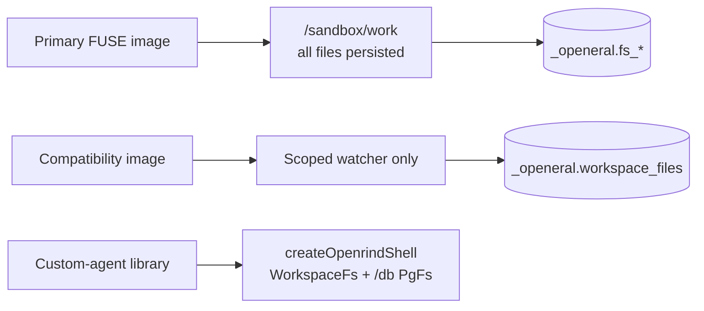

# CLAUDE.md

## Response Style

Use a relaxed ASD-STE100 style in replies and progress updates. Follow the main
writing principles. Strict compliance is not required.

- Use short sentences. Give each sentence one main idea.
- Prefer active voice and common words.
- Use consistent technical terms. Explain unfamiliar terms when needed.
- Avoid idioms, metaphors, filler, and unnecessary jargon.
- Do not change code, commands, paths, identifiers, or quoted text to fit this style.
- State facts, assumptions, uncertainty, and test limits clearly.
- Keep answers concise without losing necessary technical detail.

## Documentation Layout

- `README.md` is the end-user OpenShell flow. Keep package-manager commands out.
- `BUILD.md` is the contributor build, test, and local-gateway guide.
- `ARCHITECTURE.md` describes the implemented runtime split and security boundary.
- `FUSE.md` records alternatives and source research.
- `FUSE-DESIGN.md` is the detailed FUSE correctness contract.

## First-Time Setup

Read README's **Start Here** before running setup. Choose the requested path:

- Customer Claude launch: `openrind-shell` skill; Windows 11 Desktop, matched WSL
  assets, PostgreSQL, and the required Haloop route. Desktop starts Claude.
- Browser validation on Linux: `openrind-dev` skill and BUILD's **Real Linux
  Browser Test**. Use its isolated fixture; no database or provider keys needed.
- Web task in an already enabled owner: `openrind-browser` skill. Do not treat
  that skill as a host installer or a way to enable a normal Desktop sandbox.

`AGENTS.md` points to this file. `.agents/skills` and `.codex/skills` point to
`.claude/skills`. Keep one canonical copy. If a checkout does not preserve links,
read these canonical files directly instead of overwriting user configuration.

State the operating system, Docker context, selected runtime, and missing
prerequisites before setup. Desktop does not import repository `.env` files.
Never infer successful activation from an installed executable or a unit test.

Public names use **Openrind Shell** and `openrind-shell`. Historical source paths,
Cargo package names, legacy aliases, and the `_openeral` PostgreSQL schema remain
until an explicit compatibility migration exists.

## Runtime Split



- Primary FUSE requires external PostgreSQL and the patched OpenShell Docker driver.
- Compatibility supports optional PostgreSQL or sandbox-lifetime PGlite.
- `sync.ts` is compatibility-only. Never watch or mirror `/sandbox/work`.
- Claude uses native bash in both images. `/db` is custom-agent-only.
- Claude's primary HOME is `/sandbox/claude-home` on a named volume. Project files
  use `/sandbox/work` on FUSE. Browser pods receive neither mount.

## Browser Runtime

- `BROWSER-PODS.md` defines the provider-compatible target. The current package
  status is in `openrind-desktop/packages/browser-pods/README.md`.
- The initial path uses agent-browser v0.38.2's built-in Kernel provider against
  our Kernel-compatible broker. It is API emulation, not the Kernel cloud.
  Real Chromium runs in a separate sandbox. No browser belongs in the owner.
- The launcher supplies `KERNEL_ENDPOINT=http://127.0.0.1:19300` and a non-secret
  compatibility key. Real broker credentials use native provider injection.
  OpenShell clears Docker ENV for exec/SSH; do not rely on it for client setup.
- The real Linux fixture passed 13 checks. Normal Desktop browser activation
  remains disabled pending Desktop/Claude/FUSE and load tests. Unit and fake-CDP
  results alone do not prove client compatibility. Argide and artifacts are not
  implemented end to end.
- Use existing native exec, provider injection, and ForwardTcp. Browser pods
  need no additional OpenShell patch or custom TLS terminator. Never replace
  this path with local Chromium, public CDP, or vendor-domain interception.
- Preserve Control Chrome and user MCP configuration. Do not bump the FUSE contract
  or replace an active owner to retire the old managed MCP dependency.

## Build And Test

```bash
cd openeral-js
pnpm install
pnpm check

cd ..
cargo fmt --all --check
cargo test -p openeral-fused
cargo clippy -p openeral-fused --all-targets -- -D warnings

cd vendor/openshell
cargo fmt --all --check
cargo check -p openshell-cli -p openshell-driver-docker \
  -p openshell-policy -p openshell-supervisor-process
```

Docker and live tests:

```bash
docker build --pull=false -f Dockerfile.openrind-shell -t openrind-shell-fuse:local .
docker build --pull=false -f Dockerfile.openrind-shell-compat -t openrind-shell-compat:local .

DATABASE_URL='...' tests/test_sandbox_e2e.sh
DATABASE_URL='...' tests/test_setup_e2e.sh

DATABASE_URL='...' \
OPENSHELL_GATEWAY_ENDPOINT='http://127.0.0.1:18770' \
OPENRIND_SHELL_FUSE_E2E_IMAGE='openrind-shell-fuse:local' \
tests/fuse/test_openshell_e2e.sh
```

Do not rebuild NVIDIA's Community base to solve an image-resolution problem.

## Project Structure

```text
crates/openeral-fused/       primary PostgreSQL FUSE daemon
openeral-js/                 migrations, CLI, compatibility sync, just-bash library
sandboxes/openeral/          image scripts and shared policy
vendor/openshell/            pinned OpenShell FUSE capability patch
tests/fuse/                  POSIX conformance and real OpenShell FUSE E2E
.claude/skills/openrind-*/   repository operating skills
```

## Hard Rules

- Keep the supervisor-owned mount and critical-child lifecycle intact.
- Never give Claude `/dev/fuse`, mount syscalls, mount capability, or daemon choice.
- Never add a direct PostgreSQL dialing or TLS-disable fallback to the FUSE daemon.
- TypeScript owns migrations/import; Rust validates schema and volume state.
- Lease loss is terminal; a fenced process discards dirty state and exits.
- Preserve rename-replace, `O_TRUNC`, fsync, sparse-file, and open-unlinked semantics.
- Keep compatibility sync prefix-scoped and exclude credential/cache paths.
- Do not rename `_openeral` without a tested in-place data migration.
- Never hardcode credentials or print database URLs/provider keys.
- Ignore generated artifacts through `.gitignore`, not selective commit omission.
- Never delete, move, or overwrite user files without explicit permission.

## Commit Style

Use descriptive imperative commit subjects. Do not amend unless explicitly requested.
