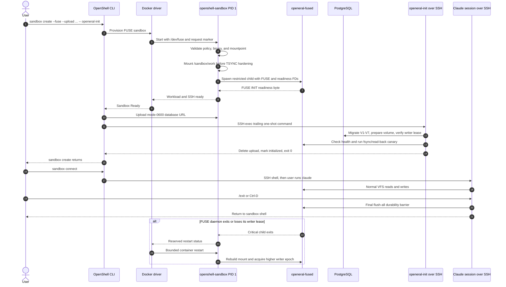
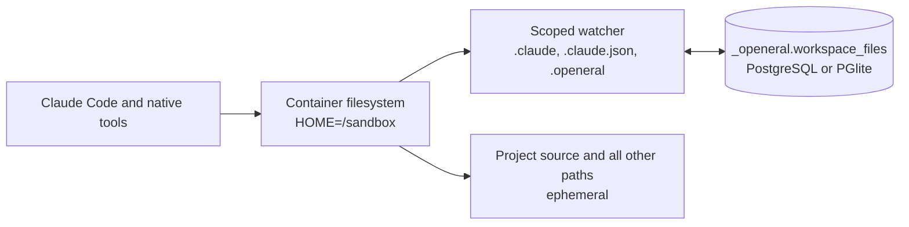

# OpenEral

Run Claude Code in an isolated OpenShell sandbox with a PostgreSQL-backed native
filesystem. In the primary runtime, Claude's home and project files live on one FUSE
mount at `/sandbox/work`; OpenShell owns the mount and keeps PostgreSQL traffic behind
its default-deny network policy.

## Runtime Status

| Runtime | Persistence | OpenShell requirement | Status |
|---|---|---|---|
| Primary FUSE image (`Dockerfile.openeral`) | All of `/sandbox/work` | Vendored Docker-driver build with `--fuse` | Implemented, source-build candidate |
| Compatibility image (`Dockerfile.openeral-compat`) | `.claude`, `.claude.json`, and `.openeral` only | Stock current OpenShell | Published as `ghcr.io/sandys/openeral/sandbox:just-bash` |

The FUSE capability is a default-off OpenShell patch pinned under
[`vendor/openshell`](./vendor/openshell). It is not in a released upstream OpenShell
version yet. Do not present the published `:just-bash` image as the FUSE runtime.

The primary image inherits NVIDIA's published Community base directly. OpenEral does
not rebuild that base image.

## Architecture At A Glance

The primary runtime keeps the privileged mount operation in OpenShell while the
filesystem implementation runs as an ordinary sandbox child. Claude reaches
PostgreSQL only through kernel filesystem calls; it does not receive `/dev/fuse`, a
mount capability, or a direct database network path.

```mermaid
flowchart LR
  subgraph control["Host and OpenShell control plane"]
    user["User"]
    cli["Patched OpenShell CLI<br/>sandbox create --fuse"]
    gateway["OpenShell gateway<br/>policy and provider control"]
    driver["Docker driver<br/>enable_fuse operator gate"]
  end

  subgraph sandbox["OpenShell sandbox container"]
    supervisor["openshell-sandbox<br/>PID 1"]
    workload["Managed workload<br/>sleep infinity"]
    ssh["SSH sessions<br/>init, shell, Claude"]
    claude["Claude Code<br/>HOME=/sandbox/work"]
    vfs["Linux VFS<br/>/sandbox/work"]
    fused["openeral-fused<br/>critical sandbox child"]
    runtime["/var/lib/openeral/runtime<br/>same-UID coordination"]
    proxy["OpenShell egress proxy<br/>binary-attributed policy"]
  end

  postgres[("External PostgreSQL<br/>normalized _openeral.fs_* tables")]

  user --> cli --> gateway --> driver --> supervisor
  supervisor --> workload
  supervisor --> ssh
  ssh --> claude --> vfs
  supervisor -->|"open /dev/fuse, mount, pass FDs"| fused
  vfs -->|"FUSE requests"| fused
  fused <-->|"health socket, DB readiness, init marker"| runtime
  fused -->|"HTTP CONNECT"| proxy
  proxy -->|"raw tunnel, end-to-end PostgreSQL TLS"| postgres
```



The supervisor mounts before applying its TSYNC mount-denying seccomp prelude, then
starts `openeral-fused` through the normal unprivileged `ProcessHandle` path. The
daemon inherits Landlock, child seccomp, the network namespace, proxy variables, TLS
roots, and two supervisor-selected descriptors: the FUSE channel and a readiness
channel. The compatibility image does not use this path.

## Primary FUSE Runtime

### Prerequisites

- Linux with Docker and `/dev/fuse`.
- The vendored OpenShell CLI, gateway, and supervisor built from this repository.
- Docker driver configuration with `enable_fuse = true`.
- An external PostgreSQL URL. PGlite is intentionally unsupported in this image.
- A configured Claude provider, such as `claude` or `aws`.

Build instructions for the patched OpenShell components are in [BUILD.md](./BUILD.md).

### Build The OpenEral Image

```bash
docker pull ghcr.io/nvidia/openshell-community/sandboxes/base:latest
docker build --pull=false -f Dockerfile.openeral -t openeral-fuse:local .
```

This builds only the OpenEral child image and its Rust daemon. It reuses the published
NVIDIA base.

### Create And Initialize

Point the patched CLI at the patched Docker gateway:

```bash
export OPENSHELL_BIN="$PWD/vendor/openshell/target/debug/openshell"
export OPENSHELL_GATEWAY_ENDPOINT="http://127.0.0.1:18770"
export OPENERAL_WORKSPACE="${OPENERAL_WORKSPACE:-openeral-demo}"
export DATABASE_URL="${DATABASE_URL:-${POSTGRES_URL:-}}"
```

Create a temporary database upload and initialize the sandbox:

```bash
db_file="$(mktemp /tmp/openeral-db-url-XXXXXX)"
trap 'rm -f "$db_file"' EXIT
printf '%s' "$DATABASE_URL" > "$db_file"
chmod 600 "$db_file"

"$OPENSHELL_BIN" \
  --gateway-endpoint "$OPENSHELL_GATEWAY_ENDPOINT" \
  sandbox create \
  --name "$OPENERAL_WORKSPACE" \
  --from openeral-fuse:local \
  --fuse \
  --upload "$db_file:/sandbox/db-url" \
  --provider claude \
  --auto-providers \
  --env "WORKSPACE_ID=$OPENERAL_WORKSPACE" \
  --no-tty \
  -- openeral-init

rm -f "$db_file"
trap - EXIT
```

`openeral-init` runs after OpenShell reports the sandbox Ready. It is a one-shot SSH
command that migrates PostgreSQL, prepares the normalized volume, verifies the writer
lease, performs an fsync/read-back canary through the mounted filesystem, configures
Claude, removes the uploaded URL, and exits.



OpenShell's trailing command is deliberately not a service: it is delivered over SSH
after Ready and exits. The supervisor-owned FUSE daemon is the long-lived critical
service and survives ordinary SSH disconnects and repeated Claude sessions.

For Supabase, use an IPv4-compatible pooler URL on port 5432 or 6543. The included
policy covers `*.pooler.supabase.com`; other database hosts need an exact policy entry
in a derived image. PostgreSQL TLS is mandatory.

### Start, Stop, And Resume Claude

Connect from the host:

```bash
"$OPENSHELL_BIN" \
  --gateway-endpoint "$OPENSHELL_GATEWAY_ENDPOINT" \
  sandbox connect "$OPENERAL_WORKSPACE"
```

Inside the sandbox, start Claude:

```bash
claude
```

Use `/exit` or `Ctrl+D` to stop Claude and return to the sandbox shell. The wrapper
flushes dirty FUSE data before it returns. Then:

```bash
claude       # start another session
claude -c    # continue the latest conversation
exit         # disconnect without deleting the sandbox
```

Reconnect later with the same `sandbox connect` command. The OpenShell supervisor and
FUSE daemon remain sandbox services; they are not tied to the SSH session.

### Persistence And Durability

- `HOME=/sandbox/work`, and all files below that mount are stored in PostgreSQL.
- `fsync`, `fdatasync`, `O_SYNC`, and `O_DSYNC` acknowledge only after commit.
- Ordinary writes use a bounded write-back cache and may be lost before a durability
  barrier. Claude's clean-exit wrapper calls `flush-all`.
- Dirty-source rename replacement and existing-file `O_TRUNC` replacement have
  synchronous ordering barriers to protect common safe-save patterns.
- A FUSE daemon exit is a critical-service failure. The Docker driver restarts the
  container, reconstructs the mount, and advances the PostgreSQL writer epoch.
- Open file descriptors do not survive a container restart.

Use the same `WORKSPACE_ID` in a replacement sandbox to mount the same volume. Before
deleting a sandbox, exit Claude cleanly:

```bash
"$OPENSHELL_BIN" \
  --gateway-endpoint "$OPENSHELL_GATEWAY_ENDPOINT" \
  sandbox delete "$OPENERAL_WORKSPACE"
```

### StringCost

Create or update a generic `stringcost` provider, then add
`--provider stringcost` to `sandbox create`. Initialization calls the presign endpoint
inside the sandbox. OpenShell resolves provider placeholders in the constrained HTTPS
request; raw Anthropic and StringCost keys are not written to the upload or session
environment.

## Published Compatibility Runtime

Use this when you need the published image, stock OpenShell, optional PostgreSQL, or
PGlite. It does not persist arbitrary project files.



This watcher is mutually exclusive with the primary FUSE runtime. It preserves only
the three documented prefixes; it is not a native whole-home filesystem.

```bash
export OPENERAL_WORKSPACE="${OPENERAL_WORKSPACE:-openeral-demo}"

openshell sandbox create \
  --name "$OPENERAL_WORKSPACE" \
  --from ghcr.io/sandys/openeral/sandbox:just-bash \
  --provider claude \
  --auto-providers \
  --env "WORKSPACE_ID=$OPENERAL_WORKSPACE" \
  -- openeral-init

openshell sandbox connect "$OPENERAL_WORKSPACE"
```

Inside the sandbox, run `claude`; stop with `/exit` or `Ctrl+D`; restart with
`claude`; continue with `claude -c`.

To add compatibility-mode PostgreSQL persistence, upload the URL to
`/sandbox/db-url` as shown in the FUSE flow, but omit `--fuse`. Only
`/sandbox/.claude/**`, `/sandbox/.claude.json`, and `/sandbox/.openeral/**` are synced.

## Useful Commands

Inside either runtime:

```bash
pg "SELECT now()"
openeral memory refresh --query "current project"
```

From the host:

```bash
openshell sandbox exec -n "$OPENERAL_WORKSPACE" -- pg "SELECT 1"
openshell sandbox exec -n "$OPENERAL_WORKSPACE" -- claude -p "Reply exactly: ok"
```

## Troubleshooting

**`--fuse` is unknown:** the CLI is an upstream/stock build. Use the vendored build or
the published compatibility runtime.

**FUSE request is rejected:** confirm the selected gateway uses the Docker driver,
`enable_fuse = true`, and the host exposes `/dev/fuse`. Other drivers reject FUSE in
v1.

**Initialization reports a CONNECT denial:** the PostgreSQL host/port is outside the
image policy. Add an exact endpoint and include both `/usr/bin/node` and
`/usr/local/bin/openeral-fused` as authorized binaries.

**Initialization cannot verify the writer lease:** another live sandbox is already
mounted with the same `WORKSPACE_ID`, or PostgreSQL became unreachable. One writable
mount per workspace is enforced by advisory lock and fencing epoch.

**The sandbox enters an error after repeated daemon crashes:** the Docker driver uses
a bounded `on-failure:5` policy for FUSE sandboxes. Inspect container/supervisor logs,
fix the datasource or daemon failure, then use explicit sandbox start/recreate.

Architecture and security details are in [ARCHITECTURE.md](./ARCHITECTURE.md). The
alternatives survey and implementation contract are [FUSE.md](./FUSE.md) and
[FUSE-DESIGN.md](./FUSE-DESIGN.md).
