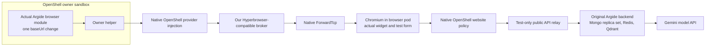

# Actual Argide Tests

Use the supplied Argide widget-eval kit. Do not copy its image, source bundle,
widget, or credentials into this repository. These tests need Linux x64 and the
browser-only host setup in [BUILD.md](../../../../../../BUILD.md#real-linux-browser-test).
They do not need PostgreSQL, FUSE, Haloop, a Hyperbrowser account, or a viewer.

Do not start here on an unprepared checkout. First complete BUILD's **Real Linux
Browser Test**, through its passing 17-check result. That supplies the host
dependency, matched native OpenShell binaries, and both public test images.
Then return here. The private kit is an additional input, not included in Git.
The commands below run on the host, not inside an existing owner sandbox.

There are two tests:

| Test | Actual application code | What it proves |
|---|---|---|
| `--argide` | The supplied compiled `backend-core` module and its original dependencies | Real create, initialization, VNC parsing, retained reconnect, 2 MiB upload, and stop through our provider API |
| `--argide --argide-widget` | The above plus the original Fastify backend image and widget bundle | A real model chooses and executes form actions through the widget in an OpenShell browser pod |

The module fixture calls the exported application functions. It does not
reimplement those functions. It adds one `baseUrl` option to the Hyperbrowser
constructor. `configure.mjs` verifies the original and changed bundle hashes.
This is configured compatibility, not an unchanged application claim.

The widget test uses the unmodified backend image. Its model calls run in the
host Docker stack, not the owner sandbox. The widget runs inside Chromium in a
separate OpenShell pod. The driver enters the chat request and approves actions
only on a controlled test page. It does not fill the form or click Submit.



## Supplied Kit Pin

- Outer archive: `Argide Harness-20261006T123344Z-1-001.zip`.
- Archive SHA-256: `6cd97c0e7b8fa18906feecc0592ef14a4caff24176b2ba7b44b8e92a889327a7`.
- Docker image ID observed after load: `sha256:1003120eff8e286bf787a9fc82f199266acdf03f25c192587c280c281ee1d0ec`.
- Original `backend-core/dist/index.js`: `521c43c805a45d88170c3f50f8a8d625b83690b14ff7a23bbccbe1ab0615bd5e`.
- Configured bundle: `44b72c49478e706ae7c7c5198809ecbef2935ccf9bb4c8c994525cda7c2541fd`.
- Original widget: `b0e44dbe2d5a6e82448b76d4bff3880d0d314198aecd27f4047014dc31844bfa`.
- Installed dependencies: Hyperbrowser SDK `0.91.0`, Playwright `1.59.1`.

## Prepare The Image

Use Bash on Linux x64. Check `unzip`, GNU `tar`, `sha256sum`, Docker Buildx, and
Docker Compose before this setup. Keep the same Docker context as the public
browser test. The additional Docker build context needs BuildKit. Do not use
a remote Docker daemon or a folder with real production credentials.

Run all following blocks from the repository root in the same Bash session.
Stop on any failed command. Set the actual absolute archive path, verify it,
then extract into a fresh directory. Leave the supplied archive unchanged:

```bash
ARGIDE_ARCHIVE='/absolute/path/Argide Harness-20261006T123344Z-1-001.zip'
printf '%s  %s\n' \
  '6cd97c0e7b8fa18906feecc0592ef14a4caff24176b2ba7b44b8e92a889327a7' \
  "$ARGIDE_ARCHIVE" | sha256sum --check -
ARGIDE_STAGE=$(mktemp -d /tmp/openrind-argide.XXXXXXXX)
unzip -p "$ARGIDE_ARCHIVE" 'Argide Harness/argide-widget-kit.tar.gz' | \
  tar --extract --gzip --file=- --directory="$ARGIDE_STAGE" \
    --warning=no-unknown-keyword --no-same-owner --no-same-permissions \
    --exclude='._*' --exclude='*/._*'
export ARGIDE_KIT="$ARGIDE_STAGE/share-external"
ARGIDE_FIXTURE=openrind-desktop/packages/browser-pods/test/live/argide
test -f "$ARGIDE_KIT/env/backend.env.example"
test -f "$ARGIDE_KIT/widget/dist/argide-b2b-widget.iife.js"
docker load --input "$ARGIDE_KIT/images/argide-backend.tar.gz"
ARGIDE_IMAGE=409010723028.dkr.ecr.us-east-1.amazonaws.com/argide-backend:sha-81af0f7a22afee8b42c80d7e1c0ff7b191bbd698
test "$(docker image inspect --format '{{.Id}}' "$ARGIDE_IMAGE")" = \
  'sha256:1003120eff8e286bf787a9fc82f199266acdf03f25c192587c280c281ee1d0ec'
docker build --pull=false --build-context "argide-kit=$ARGIDE_KIT" \
  -f "$ARGIDE_FIXTURE/Dockerfile.owner" \
  -t openrind-browser-owner:argide-e2e "$ARGIDE_FIXTURE"
```

The image check must exit 0. Stop on a hash mismatch; do not remove the check.
The build uses `openrind-browser-owner:e2e` by default. Use `--build-arg OWNER_IMAGE=...`
only for another browser fixture image built from this checkout.

Run the module test. It uses no model key:

```bash
BROWSER_OWNER_IMAGE=openrind-browser-owner:argide-e2e \
node openrind-desktop/packages/browser-pods/test/live/openshell-e2e.mjs --argide
```

Require 23 checks, `argide.json`, `result: passed`, and no cleanup error.
The 61-second wait is intentional. It proves retained sessions past the former
helper idle limit. Keep `LD_LIBRARY_PATH` set if BUILD's extracted Z3 setup needs it.

## Run The Real Widget And Model

Export a funded `GEMINI_API_KEY` in the host shell. Do not print it. The supplied
kit needs a real model key for this test. The compose file selects
`google/gemini-2.5-flash`; it does not silently fall back to another provider.
It delays background follow-up messages for one day. Stop the stack after testing.

This test makes billable model calls. Use an approved test key. It does not load
the repository `.env`. If the key is not already exported, enter it without
echoing it or placing its value in shell history:

```bash
read -r -s -p 'Gemini API key: ' GEMINI_API_KEY
printf '\n'
export GEMINI_API_KEY
```

Confirm that host loopback port 14000 and test bridge port 19302 are free. Do not
stop another service to free a port without approval. Use a new Compose project
so the seed cannot overwrite an existing application's data:

```bash
ARGIDE_PROJECT="openrind-argide-$(date +%s)-$$"
docker compose -p "$ARGIDE_PROJECT" -f "$ARGIDE_FIXTURE/compose.backend.yml" up -d
curl --fail --silent --show-error --retry 30 --retry-delay 2 \
  --retry-connrefused --retry-all-errors http://127.0.0.1:14000/api/ready
docker compose -p "$ARGIDE_PROJECT" -f "$ARGIDE_FIXTURE/compose.backend.yml" \
  exec -T mongo mongosh --quiet < "$ARGIDE_KIT/seed/seed.js"
curl -fsS http://127.0.0.1:14000/api/v2/public/products/prod_00000000-0000-4000-8000-000000000002/config
```

Readiness must return `status: ready`. Confirm `actionsEnabled` and
`screenContextEnabled` in the product response. Neither response tests the model key.
Then run:

```bash
BROWSER_OWNER_IMAGE=openrind-browser-owner:argide-e2e \
ARGIDE_WIDGET_BUNDLE="$ARGIDE_KIT/widget/dist/argide-b2b-widget.iife.js" \
ARGIDE_BACKEND_URL=http://127.0.0.1:14000 \
node openrind-desktop/packages/browser-pods/test/live/openshell-e2e.mjs \
  --argide --argide-widget
```

Require 28 checks, `argide.json`, `argide-widget.json`, a real screenshot at
`argide-widget.png`, and no cleanup error. The widget receipt must show backend
tool dispatch and `chat.finish`. The form must say
`Submitted: Openrind Real Agent | agent@example.test`.

The runner adds a narrow HTTP rule for the test website on the isolated Docker
bridge. It exposes only the form, widget bundle, and public Argide API routes.
It does not expose the dashboard, database, broker, gateway, or model keys.
It adds the rule to the fixture's initial pod policy before create. It keeps the native
policy and binary identity checks enabled. It does not hot-update policy on an
active browser. No production policy changes apply.

Stop only the fixture stack:

```bash
docker compose -p "$ARGIDE_PROJECT" -f "$ARGIDE_FIXTURE/compose.backend.yml" down
```

Keep `ARGIDE_KIT`, `ARGIDE_FIXTURE`, `ARGIDE_PROJECT`, and the key in this shell
until cleanup completes. Compose needs its variables even for `down`. The command
does not delete the archive or extracted kit. Anonymous datastore volumes can
remain; remove only this test project's data if the user requests it.

The live runner removes its own OpenShell resources. Evidence contains test
credentials and page contents. Keep the printed temporary directory private.

## If A Step Fails

| Symptom | Next check |
|---|---|
| Archive or source hash differs | Stop. Obtain the pinned kit or review the new code before changing a pin |
| `/opt/argide-test/consumer.mjs` is missing | Set `BROWSER_OWNER_IMAGE` to the derived Argide image, not the public owner fixture |
| Compose reports a missing variable | Use the same host shell; check variable presence without printing key values |
| Ready check fails | Inspect this project's backend and datastore status; verify replica-set initialization |
| Public product route fails | Run the supplied seed against this fresh test Mongo instance |
| Model call fails despite readiness | Check provider, funding, and private backend errors; do not silently change the selected model |
| Widget navigation or CDP attach fails | Retain the evidence and supervisor logs. The test rule must be in the initial pod policy; do not hot-update an active browser |
| Test passed but no dashboard remains | Expected. The fixture closes Chromium; it does not deploy the optional Auth0 dashboard |

Do not publish raw backend logs or `docker compose config` output. Both can
contain credentials or user content. Use `config --quiet` for syntax validation.

## Test Limits

This is one deterministic browser task, not a WebVoyager score or general site
compatibility result. The dashboard needs real Auth0 settings and is not tested.
No worker, populated knowledge base, S3 recording, voice, real website login,
Windows Desktop activation, Claude launch, or FUSE export is tested here.

The kit's empty knowledge base is intentional. Its optional OpenAI embedding and
resolution calls fail with placeholder keys in this Gemini setup. The browser
task still completes. Its Qdrant client also warns about the supplied server
version. Do not treat this result as a passing RAG or full application test.

Stage 0 still requires a trusted single-user host. The existing CLI forwards
expose host-loopback CDP listeners. This fixture does not remove that release gate.
