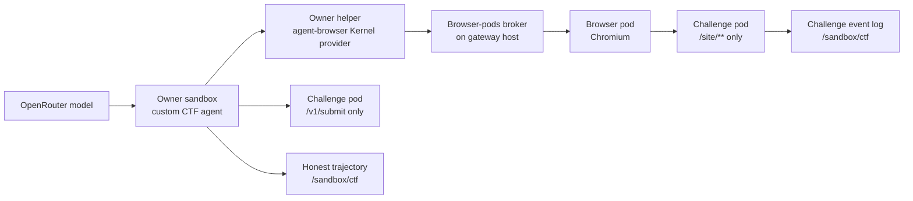

# Openrind CTF Runtime

This package runs two browser CTF tasks with Openrind Shell components. It does
not run Cyber-Zero, EnIGMA, Docker-in-Docker, or a simulated terminal.

The task services preserve the relevant public behavior of these browser tasks:

| Openrind task ID | Source challenge family | Browser interaction |
|---|---|---|
| `flag-command` | Cybench HTB `Flag Command` | Inspect a web terminal and call its same-origin API. |
| `glacier-exchange` | Cybench GLA `GlacierExchange` | Inspect the supplied wallet source and use a numeric overflow. |

The task services are independent Node.js implementations. A test run does not
need a Cyber-Zero checkout, a benchmark archive, an EnIGMA image, or Compose.

## Runtime Design



The browser pod can read only `/site/**`. The owner cannot read `/site/**`.
The owner can only submit a flag through `POST /v1/submit`. The browser and
the judge are separate routes in the challenge service.

The agent uses the unchanged `agent-browser` Kernel provider. It has only these
browser actions: `snapshot`, `get_title`, and same-origin `eval`. It records the
model request and response, the chosen action, the observed tool result, and the
flag judge result. A trajectory never claims an action that the tool did not run.

## Run The Live Test

Use Linux x64 with Docker. Follow the host checks and OpenShell build steps in
[BUILD.md](../../../BUILD.md#real-linux-browser-test) first. This test creates a
new local gateway, owner, two challenge sandboxes, and browser pods. It does not
use an existing Desktop sandbox or PostgreSQL FUSE owner.

Build the two test images from the repository root. Do not rebuild NVIDIA's base
image.

```bash
docker build --pull=false \
  -f openrind-desktop/packages/browser-pods/test/live/Dockerfile.owner \
  -t openrind-browser-owner:e2e .

docker build --pull=false \
  -f sandboxes/browser-pod/Dockerfile \
  --build-arg CHROMIUM_VERSION=154.0.8037.92-1~deb12u1 \
  -t openrind-browser-pod:e2e sandboxes/browser-pod

docker build --pull=false \
  -f sandboxes/ctf-challenge/Dockerfile \
  -t openrind-ctf-challenge:e2e .
```

Set `OPENROUTER_API_KEY` in your shell. Use a model that supports JSON-schema
responses. `OPENRIND_CTF_MODEL` changes the default `openai/gpt-4o-mini`.

```bash
node --env-file=.env \
  openrind-desktop/packages/browser-pods/test/live/openshell-e2e.mjs --ctf
```

The test passes only when both tasks have a browser request from the recorded
agent run and the separate judge accepts each submitted flag. It writes private
evidence to the printed temporary directory:

- `flag-command-trajectory.json`
- `glacier-exchange-trajectory.json`
- one challenge event log for each task
- the normal browser-pod evidence and diagnostics

The evidence contains model messages and task data. Do not publish it unchanged.

## Limits

- This is a developer fixture. It is not an enabled Desktop feature.
- The test uses a separate browser-pod owner, not the primary FUSE owner.
- The model can fail to solve a task. That result is recorded as a failed run.
  The test does not insert a known flag or replace a failed model action.
- The challenge services are test-only. They do not expose an Internet listener.
- The model key is uploaded only to the temporary owner sandbox for the test and
  is removed from the host test state after upload. Do not put the key in source,
  a task definition, or a command argument.
