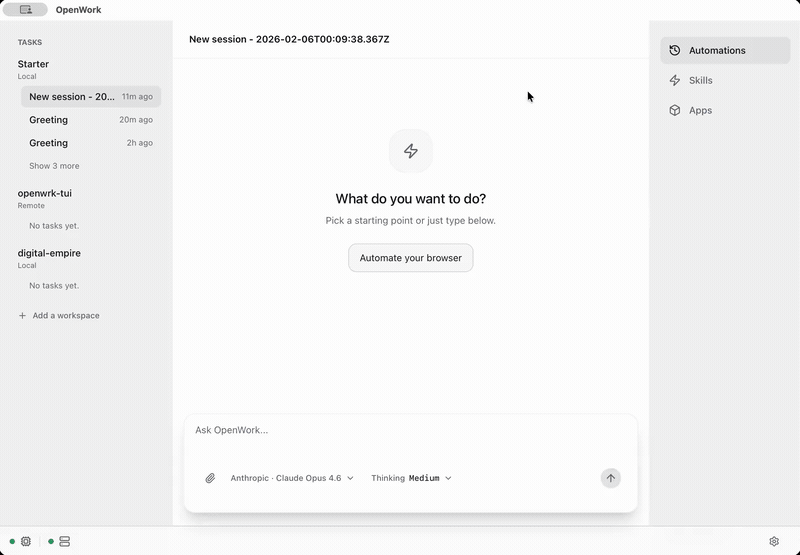

[](https://discord.gg/VEhNQXxYMB)

[English](../README.md) | 简体中文 | [其他语言](./README.md)

# Openrind Desktop
> Openrind Desktop 是 Claude Cowork/Codex（桌面应用）的开源替代品。

## 核心理念

- 本地优先，云端就绪：Openrind Desktop 一键在您的机器上运行。即时发送消息。
- 可组合：桌面应用、Slack/Telegram 连接器或服务器。选择适合的组件，无供应商锁定。
- 可弹出：Openrind Desktop 由 OpenCode 驱动，因此 OpenCode 能做的一切都可以在 Openrind Desktop 中使用，即使尚未提供 UI。
- 乐于分享：在 localhost 上单独开始，需要时显式选择加入远程共享。

<p align="center">
  
</p>

Openrind Desktop 围绕一个核心理念设计：让您可以轻松地将智能体工作流程作为可重复的、产品化的流程交付给您的团队。

> [!TIP]
> **正在寻找 [企业方案](https://openrind-desktoplabs.com/enterprise)？** [立即与我们的销售团队联系](https://calendar.app.google/86QpCENvhfEzDFLu5)
>
> 获得增强功能，包括功能优先级、SSO、SLA 支持、LTS 版本等。

## 其他界面
- **Openrind Desktop Orchestrator (CLI 主机)**：无需桌面 UI 即可运行 OpenCode + Openrind Desktop 服务器。
  - 安装：`npm install -g openrind-desktop-orchestrator`
  - 运行：`openrind-desktop start --workspace /path/to/workspace --approval auto`
  - 文档：[apps/orchestrator/README.md](../apps/orchestrator/README.md)

## 快速开始

从 [openrind-desktoplabs.com/download](https://openrind-desktoplabs.com/download) 下载桌面应用，获取最新的 [GitHub 发布版本](https://github.com/openrind/openrind-desktop/releases)，或按照下面的说明从源代码安装。

- macOS 和 Linux 下载可直接使用。
- Windows 访问目前通过 [openrind-desktoplabs.com/pricing#windows-support](https://openrind-desktoplabs.com/pricing#windows-support) 上的付费支持计划处理。
- 托管的 Openrind Desktop Cloud 工作节点在结账后从 Web 应用启动，然后通过桌面应用的 `Add a worker` -> `Connect remote` 连接。

## 为什么选择 Openrind Desktop

当前针对 opencode 的 CLI 和 GUI 都以开发者为中心。这意味着专注于文件差异、工具名称，以及在不依赖暴露某种形式的 CLI 的情况下难以扩展的功能。

Openrind Desktop 的设计目标是：

- **可扩展**：技能和 opencode 插件是可安装的模块。
- **可审计**：显示发生了什么、何时发生以及为什么发生。
- **权限控制**：访问特权流程。
- **本地/远程**：Openrind Desktop 可以在本地工作，也可以连接到远程服务器。

## 包含的功能

- **主机模式**：在您的计算机上本地运行 opencode
- **客户端模式**：通过 URL 连接到现有的 OpenCode 服务器。
- **会话**：创建/选择会话并发送提示。
- **实时流式传输**：SSE `/event` 订阅以获取实时更新。
- **执行计划**：将 OpenCode 待办事项呈现为时间线。
- **权限**：显示权限请求并回复（允许一次 / 始终允许 / 拒绝）。
- **模板**：保存并重新运行常见工作流程（本地存储）。
- **调试导出**：当需要提交 Bug 报告时，从设置 -> 调试中复制或导出运行时调试报告和开发者日志流。
- **技能管理器**：
  - 列出已安装的 `.opencode/skills` 文件夹
  - 将本地技能文件夹导入到 `.opencode/skills/<skill-name>`

## 技能管理器


## 适用于本地计算机或服务器


## 快速开始（开发者）

### 系统要求

- Node.js + `pnpm`
- Rust 工具链（用于 Tauri）：通过 `curl --proto '=https' --tlsv1.2 -sSf https://sh.rustup.rs | sh` 安装
- Tauri CLI：`cargo install tauri-cli`
- 已安装 OpenCode CLI 并在 PATH 中可用：`opencode`

### 本地开发前置条件（桌面版）

在运行 `pnpm dev` 之前，请确保以下各项已在您的 shell 中安装并启用：

- Node + pnpm（仓库使用 `pnpm@10.27.0`）
- **Bun 1.3.9+** (`bun --version`)
- Rust 工具链（用于 Tauri），使用来自当前 `rustup` 稳定版的 Cargo（支持 `Cargo.lock` v4）
- Xcode Command Line Tools (macOS)
- 在 Linux 上，安装 WebKitGTK 4.1 开发包，以便 `pkg-config` 可以解析 `webkit2gtk-4.1` 和 `javascriptcoregtk-4.1`

### 一分钟可用性检查

从仓库根目录运行：

```bash
git checkout dev
git pull --ff-only origin dev
pnpm install --frozen-lockfile

which bun
bun --version
pnpm --filter @openrind/desktop exec tauri --version
```

### 安装

```bash
pnpm install
```

Openrind Desktop 现在位于 `apps/app`（UI）和 `apps/desktop`（桌面外壳）。

### 运行（桌面版）

```bash
pnpm dev
```

`pnpm dev` 现在会自动启用 `OPENRIND_DESKTOP_DEV_MODE=1`，因此桌面开发使用隔离的 OpenCode 状态，而不是您的个人全局配置/身份验证/数据。

### 运行（仅 Web UI）

```bash
pnpm dev:ui
```

### Arch 用户：

```bash
sudo pacman -S --needed webkit2gtk-4.1
curl -fsSL https://opencode.ai/install | bash -s -- --version "$(node -e "const fs=require('fs'); const parsed=JSON.parse(fs.readFileSync('constants.json','utf8')); process.stdout.write(String(parsed.opencodeVersion||'').trim().replace(/^v/,''));")" --no-modify-path
```

## 架构（高级）

- 在**主机模式**下，Openrind Desktop 运行本地主机堆栈并将 UI 连接到它。
  - 默认运行时：`openrind-desktop`（通过 `openrind-desktop-orchestrator` 安装），负责编排 `opencode`、`openrind-desktop-server` 和可选的 `opencode-router`。
  - 回退运行时：`direct`，桌面应用直接生成 `opencode serve --hostname 127.0.0.1 --port <free-port>`。

当您选择项目文件夹时，Openrind Desktop 使用该文件夹在本地运行主机堆栈并连接桌面 UI。
这允许您完全在您的机器上运行智能体工作流程、发送提示并查看进度，而无需远程服务器。

- UI 使用 `@opencode-ai/sdk/v2/client` 来：
  - 连接到服务器
  - 列出/创建会话
  - 发送提示
  - 订阅 SSE 事件（用于从服务器向 UI 流式传输实时更新）
  - 读取待办事项和权限请求

## 文件夹选择器

文件夹选择器使用 Tauri 对话框插件。
功能权限在以下位置定义：

- `apps/desktop/src-tauri/capabilities/default.json`

## OpenCode 插件

插件是扩展 OpenCode 的**原生**方式。Openrind Desktop 现在通过技能选项卡读取和写入 `opencode.json` 来管理它们。

- **项目范围**：`<workspace>/opencode.json`
- **全局范围**：`~/.config/opencode/opencode.json`（或 `$XDG_CONFIG_HOME/opencode/opencode.json`）

您仍然可以手动编辑 `opencode.json`；Openrind Desktop 使用与 OpenCode CLI 相同的格式：

```json
{
  "$schema": "https://opencode.ai/config.json",
  "plugin": ["opencode-wakatime"]
}
```

## 常用命令

```bash
pnpm dev
pnpm dev:ui
pnpm typecheck
pnpm build
pnpm build:ui
pnpm test:e2e
```

## 故障排除

如果需要报告桌面或会话 Bug，请在提交 Issue 之前打开设置 -> 调试并导出运行时调试报告和开发者日志。

### Linux / Wayland (Hyprland)

如果 Openrind Desktop 在启动时因 WebKitGTK 错误（如 `Failed to create GBM buffer`）而崩溃，请在启动前禁用 dmabuf 或合成。尝试以下环境标志之一：

```bash
WEBKIT_DISABLE_DMABUF_RENDERER=1 openrind-desktop
```

```bash
WEBKIT_DISABLE_COMPOSITING_MODE=1 openrind-desktop
```

## 安全说明

- Openrind Desktop 默认隐藏模型推理和敏感工具元数据。
- 主机模式默认绑定到 `127.0.0.1`。

## 贡献

- 在进行更改之前，请查看 `AGENTS.md` 以及 `VISION.md`、`PRINCIPLES.md`、`PRODUCT.md` 和 `ARCHITECTURE.md` 以了解产品目标。
- 在仓库内工作之前，确保已安装 Node.js、`pnpm`、Rust 工具链和 `opencode`。
- 每次检出后运行一次 `pnpm install`，然后在打开 PR 之前使用 `pnpm typecheck` 加上 `pnpm test:e2e`（或目标脚本子集）验证您的更改。

## 面向团队和企业

有兴趣在您的组织中使用 Openrind Desktop？我们很乐意听取您的意见 — 请联系 [ben@openrindlabs.com](mailto:ben@openrindlabs.com) 讨论您的用例。

## 致谢

Openrind Desktop 基于 Different AI 的开源项目 [OpenWork](https://github.com/different-ai/openwork)。

## 许可证

MIT — 参见 `LICENSE`。
