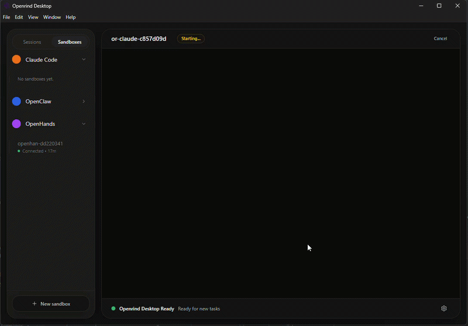
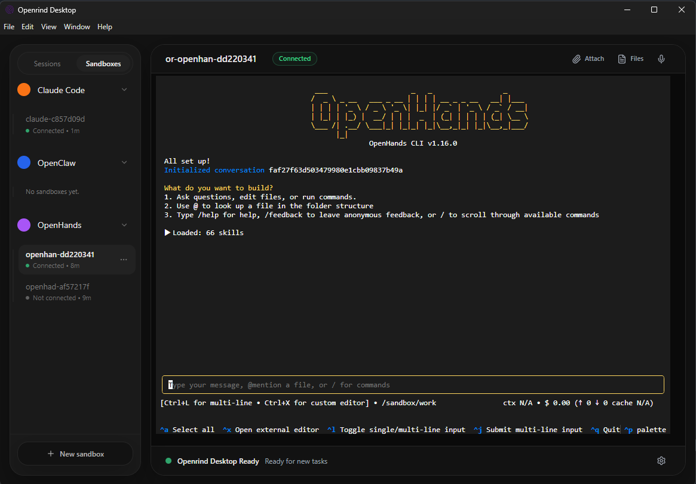
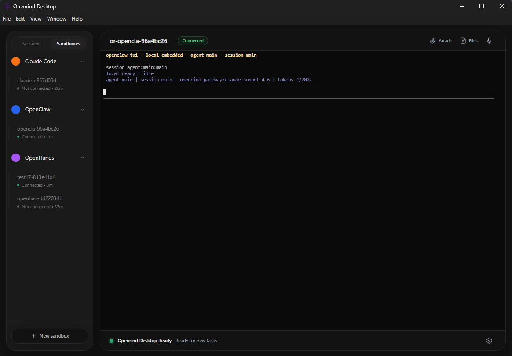
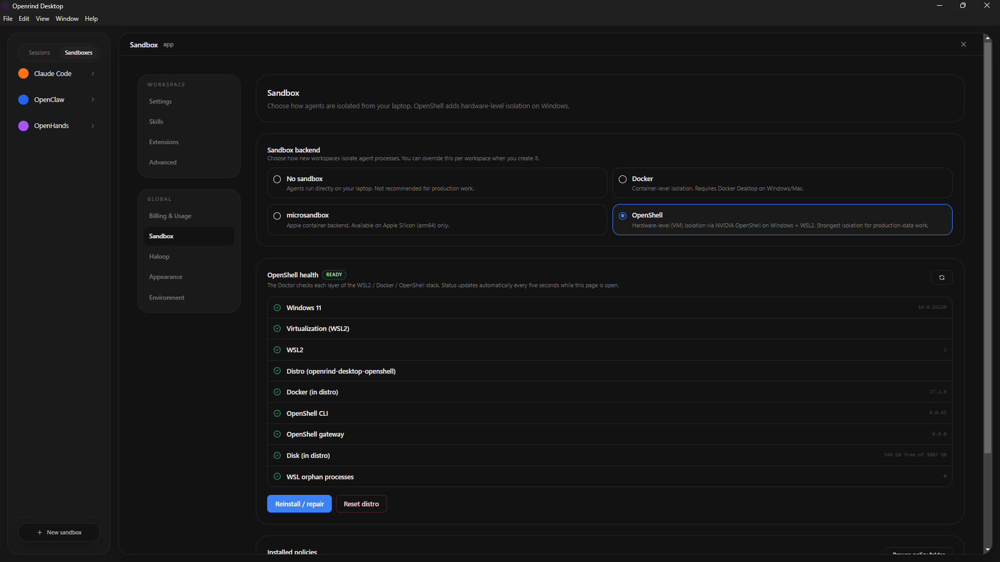

[](https://discord.gg/VEhNQXxYMB)

[English](../README.md) | 繁體中文 | [其他語言](./README.md)

# Openrind Desktop
> Openrind Desktop 是 Claude Cowork/Codex（桌面應用）的開源替代品。

## 核心理念

- 本地優先，雲端就緒：Openrind Desktop 一鍵在您的機器上運行。即時發送消息。
- 可組合：桌面應用、Slack/Telegram 連接器或伺服器。選擇適合的組件，無供應商鎖定。
- 可彈出：Openrind Desktop 由 OpenCode 驅動，因此 OpenCode 能做的一切都可以在 Openrind Desktop 中使用，即使尚未提供 UI。
- 樂於分享：在 localhost 上單獨開始，需要時顯式選擇加入遠端共享。

<p align="center">
  
</p>

Openrind Desktop 圍繞一個核心理念設計：讓您可以輕鬆地將智能體工作流程作為可重複的、產品化的流程交付給您的團隊。

> [!TIP]
> **正在尋找 [企業方案](https://openrind-desktoplabs.com/enterprise)？** [立即與我們的銷售團隊聯繫](https://calendar.app.google/86QpCENvhfEzDFLu5)
>
> 獲得增強功能，包括功能優先級、SSO、SLA 支援、LTS 版本等。

## 其他介面
- **Openrind Desktop Orchestrator (CLI 主機)**：無需桌面 UI 即可運行 OpenCode + Openrind Desktop 伺服器。
  - 安裝：`npm install -g openrind-desktop-orchestrator`
  - 運行：`openrind-desktop start --workspace /path/to/workspace --approval auto`
  - 文檔：[apps/orchestrator/README.md](../apps/orchestrator/README.md)

## 快速開始

從 [openrind-desktoplabs.com/download](https://openrind-desktoplabs.com/download) 下載桌面應用，獲取最新的 [GitHub 發布版本](https://github.com/openrind/openrind-shell/releases)，或按照下面的說明從原始碼安裝。

- macOS 和 Linux 下載可直接使用。
- Windows 訪問目前通過 [openrind-desktoplabs.com/pricing#windows-support](https://openrind-desktoplabs.com/pricing#windows-support) 上的付費支援計劃處理。
- 託管的 Openrind Desktop Cloud 工作節點在結帳後從 Web 應用啟動，然後通過桌面應用的 `Add a worker` -> `Connect remote` 連接。

## 為什麼選擇 Openrind Desktop

當前針對 opencode 的 CLI 和 GUI 都以開發者為中心。這意味著專注於檔案差異、工具名稱，以及在不依賴暴露某種形式的 CLI 的情況下難以擴展的功能。

Openrind Desktop 的設計目標是：

- **可擴展**：技能和 opencode 外掛程式是可安裝的模組。
- **可審計**：顯示發生了什麼、何時發生以及為什麼發生。
- **權限控制**：訪問特權流程。
- **本地/遠端**：Openrind Desktop 可以在本地工作，也可以連接到遠端伺服器。

## 包含的功能

- **主機模式**：在您的電腦上本地運行 opencode
- **客戶端模式**：通過 URL 連接到現有的 OpenCode 伺服器。
- **會話**：創建/選擇會話並發送提示。
- **即時流式傳輸**：SSE `/event` 訂閱以獲取即時更新。
- **執行計劃**：將 OpenCode 待辦事項呈現為時間線。
- **權限**：顯示權限請求並回覆（允許一次 / 始終允許 / 拒絕）。
- **模板**：保存並重新運行常見工作流程（本地存儲）。
- **調試導出**：當需要提交 Bug 報告時，從設定 -> 調試中複製或導出運行時調試報告和開發者日誌流。
- **技能管理器**：
  - 列出已安裝的 `.opencode/skills` 資料夾
  - 將本地技能資料夾導入到 `.opencode/skills/<skill-name>`

## OpenHands 與 OpenClaw 智能體沙箱

<p align="center">
  
</p>

<p align="center">
  
</p>

## 沙箱與工作區設定

<p align="center">
  
</p>

## 快速開始（開發者）

### 系統要求

- Node.js + `pnpm`
- Rust 工具鏈（用於 Tauri）：通過 `curl --proto '=https' --tlsv1.2 -sSf https://sh.rustup.rs | sh` 安裝
- Tauri CLI：`cargo install tauri-cli`
- 已安裝 OpenCode CLI 並在 PATH 中可用：`opencode`

### 本地開發前置條件（桌面版）

在運行 `pnpm dev` 之前，請確保以下各項已在您的 shell 中安裝並啟用：

- Node + pnpm（倉庫使用 `pnpm@10.27.0`）
- **Bun 1.3.9+** (`bun --version`)
- Rust 工具鏈（用於 Tauri），使用來自當前 `rustup` 穩定版的 Cargo（支援 `Cargo.lock` v4）
- Xcode Command Line Tools (macOS)
- 在 Linux 上，安裝 WebKitGTK 4.1 開發包，以便 `pkg-config` 可以解析 `webkit2gtk-4.1` 和 `javascriptcoregtk-4.1`

### 一分鐘可用性檢查

從倉庫根目錄運行：

```bash
git checkout dev
git pull --ff-only origin dev
pnpm install --frozen-lockfile

which bun
bun --version
pnpm --filter @openrind/desktop exec tauri --version
```

### 安裝

```bash
pnpm install
```

Openrind Desktop 現在位於 `apps/app`（UI）和 `apps/desktop`（桌面外殼）。

### 運行（桌面版）

```bash
pnpm dev
```

`pnpm dev` 現在會自動啟用 `OPENRIND_DESKTOP_DEV_MODE=1`，因此桌面開發使用隔離的 OpenCode 狀態，而不是您的個人全局配置/身份驗證/數據。

### 運行（僅 Web UI）

```bash
pnpm dev:ui
```

### Arch 用戶：

```bash
sudo pacman -S --needed webkit2gtk-4.1
curl -fsSL https://opencode.ai/install | bash -s -- --version "$(node -e "const fs=require('fs'); const parsed=JSON.parse(fs.readFileSync('constants.json','utf8')); process.stdout.write(String(parsed.opencodeVersion||'').trim().replace(/^v/,''));")" --no-modify-path
```

## 架構（高級）

- 在**主機模式**下，Openrind Desktop 運行本地主機堆疊並將 UI 連接到它。
  - 默認運行時：`openrind-desktop`（通過 `openrind-desktop-orchestrator` 安裝），負責編排 `opencode`、`openrind-desktop-server` 和可選的 `opencode-router`。
  - 回退運行時：`direct`，桌面應用直接生成 `opencode serve --hostname 127.0.0.1 --port <free-port>`。

當您選擇專案資料夾時，Openrind Desktop 使用該資料夾在本地運行主機堆疊並連接桌面 UI。
這允許您完全在您的機器上運行智能體工作流程、發送提示並查看進度，而無需遠端伺服器。

- UI 使用 `@opencode-ai/sdk/v2/client` 來：
  - 連接到伺服器
  - 列出/創建會話
  - 發送提示
  - 訂閱 SSE 事件（用於從伺服器向 UI 流式傳輸即時更新）
  - 讀取待辦事項和權限請求

## 資料夾選擇器

資料夾選擇器使用 Tauri 對話框外掛程式。
功能權限在以下位置定義：

- `apps/desktop/src-tauri/capabilities/default.json`

## OpenCode 外掛程式

外掛程式是擴展 OpenCode 的**原生**方式。Openrind Desktop 現在通過技能選項卡讀取和寫入 `opencode.json` 來管理它們。

- **專案範圍**：`<workspace>/opencode.json`
- **全局範圍**：`~/.config/opencode/opencode.json`（或 `$XDG_CONFIG_HOME/opencode/opencode.json`）

您仍然可以手動編輯 `opencode.json`；Openrind Desktop 使用與 OpenCode CLI 相同的格式：

```json
{
  "$schema": "https://opencode.ai/config.json",
  "plugin": ["opencode-wakatime"]
}
```

## 常用命令

```bash
pnpm dev
pnpm dev:ui
pnpm typecheck
pnpm build
pnpm build:ui
pnpm test:e2e
```

## 故障排除

如果需要報告桌面或會話 Bug，請在提交 Issue 之前打開設定 -> 調試並導出運行時調試報告和開發者日誌。

### Linux / Wayland (Hyprland)

如果 Openrind Desktop 在啟動時因 WebKitGTK 錯誤（如 `Failed to create GBM buffer`）而崩潰，請在啟動前禁用 dmabuf 或合成。嘗試以下環境標誌之一：

```bash
WEBKIT_DISABLE_DMABUF_RENDERER=1 openrind-desktop
```

```bash
WEBKIT_DISABLE_COMPOSITING_MODE=1 openrind-desktop
```

## 安全說明

- Openrind Desktop 默認隱藏模型推理和敏感工具元數據。
- 主機模式默認綁定到 `127.0.0.1`。

## 貢獻

- 在進行更改之前，請查看 `AGENTS.md` 以及 `VISION.md`、`PRINCIPLES.md`、`PRODUCT.md` 和 `ARCHITECTURE.md` 以了解產品目標。
- 在倉庫內工作之前，確保已安裝 Node.js、`pnpm`、Rust 工具鏈和 `opencode`。
- 每次檢出後運行一次 `pnpm install`，然後在打開 PR 之前使用 `pnpm typecheck` 加上 `pnpm test:e2e`（或目標腳本子集）驗證您的更改。

## 面向團隊和企業

有興趣在您的組織中使用 Openrind Desktop？我們很樂意聽取您的意見 — 請聯繫 [ben@openrindlabs.com](mailto:ben@openrindlabs.com) 討論您的用例。

## 致謝

Openrind Desktop 基於 Different AI 的開源專案 [OpenWork](https://github.com/different-ai/openwork)。

## 許可證

MIT — 參見 `LICENSE`。
